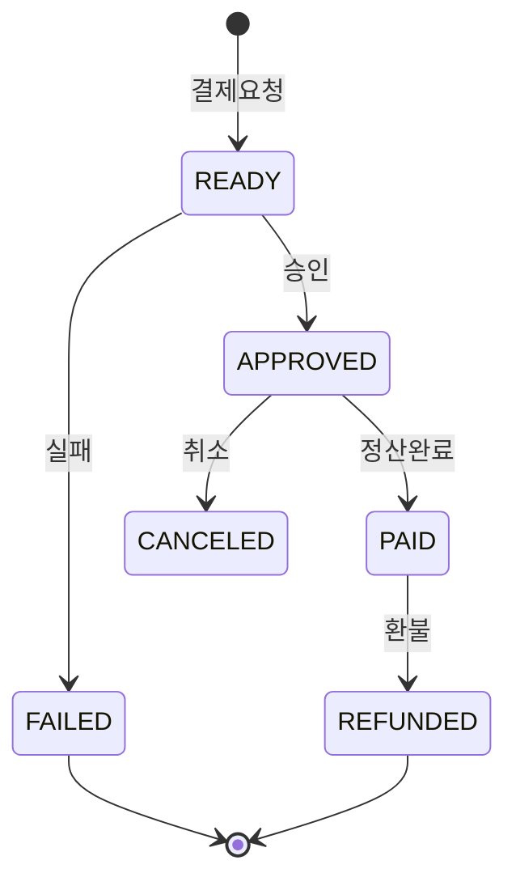

결제처럼 돈이 오가는 흐름은 상태를 가진다. 준비, 승인, 완료, 취소, 실패. 이걸 그냥 `status` 컬럼 하나에 문자열로 넣고 `UPDATE`로 바꾸기 시작하면, 머지않아 *완료된 결제가 다시 준비 상태로 돌아가거나*, *이미 취소된 건이 또 승인되는* 사고가 난다. 상태는 단순한 값이 아니라 **전이 규칙을 가진 머신**으로 다뤄야 한다.

## 핵심 개념: 상태 머신과 합법 전이

상태 머신은 *(상태 집합, 허용된 전이 집합)* 으로 정의된다. 핵심은 **"어떤 상태에서 어떤 상태로 갈 수 있는가"를 명시적으로 선언**하고, 그 외의 전이는 전부 거부하는 것이다.



이 그림에서 합법은 화살표가 있는 전이뿐이다. `PAID → READY`(역전이), `READY → PAID`(APPROVED 건너뛰기), `CANCELED → APPROVED`(이미 종료된 상태 재개) 같은 건 전부 불법이다. 단순 `UPDATE ... SET status='PAID'`는 이 불법 전이를 *아무 저항 없이* 수행한다. 그게 사고의 근원이다.

## 합법 전이만 허용하기

전이를 데이터가 아니라 **규칙**으로 박아둔다. 허용 맵을 선언하고, 전이 시점에 검사한다.

```java
public enum PayStatus {
    READY, APPROVED, PAID, CANCELED, REFUNDED, FAILED;

    private static final Map<PayStatus, Set<PayStatus>> ALLOWED = Map.of(
        READY,    Set.of(APPROVED, FAILED),
        APPROVED, Set.of(PAID, CANCELED),
        PAID,     Set.of(REFUNDED),
        CANCELED, Set.of(),   // 종료 상태
        REFUNDED, Set.of(),
        FAILED,   Set.of()
    );

    public boolean canMoveTo(PayStatus next) {
        return ALLOWED.get(this).contains(next);
    }
}
```

```java
@Transactional
public void transit(long payId, PayStatus next) {
    Payment p = paymentMapper.findByIdForUpdate(payId); // 비관 락
    if (!p.getStatus().canMoveTo(next)) {
        throw new IllegalStateTransitionException(p.getStatus(), next);
    }
    p.setStatus(next);
    paymentMapper.updateStatus(p);
}
```

여기서 두 가지가 핵심이다. 첫째, `findByIdForUpdate`로 **행을 잠그고** 읽는다. 둘째, 가드 검사와 업데이트가 같은 트랜잭션 안에 있다.

## 운영 함정

**1) 검사와 갱신 사이의 경쟁(check-then-act).** 두 요청이 동시에 `APPROVED` 결제를 읽고 둘 다 "PAID로 가도 된다"고 판단한 뒤 둘 다 UPDATE하면, 정산이 이중으로 일어난다. 가드는 애플리케이션 메모리에서만 하면 안 된다. 락(`SELECT ... FOR UPDATE`)으로 직렬화하거나, **조건부 UPDATE**로 DB가 전이를 보장하게 한다.

```sql
-- 현재 상태가 APPROVED일 때만 PAID로. 영향 행 0이면 불법 전이/경쟁.
UPDATE payment SET status = 'PAID'
WHERE id = #{id} AND status = 'APPROVED';
```

`affectedRows == 0`이면 누군가 먼저 상태를 바꿨거나 불법 전이라는 뜻이다. 이 한 줄이 락 없이도 원자적 가드가 된다.

**2) 외부 결제 게이트웨이 콜백의 중복·순서 역전.** 승인 콜백보다 취소 콜백이 먼저 도착할 수 있다. 콜백은 멱등하게 처리하고, 위의 조건부 UPDATE로 늦게 온 옛 전이를 자연스럽게 무시(영향 행 0)하게 만든다.

## 핵심 요약

- 상태는 값이 아니라 **(상태, 허용 전이) 머신**이다. 합법 전이만 선언하고 나머지는 거부.
- 단순 `SET status=...`는 역전이·건너뛰기를 막지 못한다.
- 동시성은 **조건부 UPDATE(`WHERE status=현재상태`)** 또는 행 락으로 원자적으로 막는다. 영향 행 0 = 불법/경쟁.
