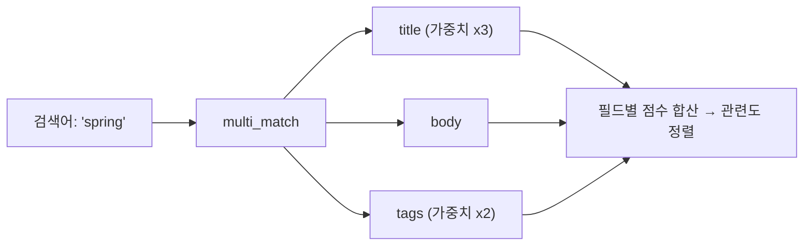

## 검색창 하나로 여러 필드를 뒤지고 싶다

실제 검색창은 보통 하나입니다. 그런데 사용자가 입력한 키워드는 **제목·본문·태그** 어디에 있든 잡혀야 하죠. 필드마다 `match`를 따로 거는 건 번거롭습니다. 이때 쓰는 게 **MultiMatch** 입니다.

## MultiMatch: 여러 필드 동시 매칭



```json
GET /posts/_search
{
  "query": {
    "multi_match": {
      "query": "spring",
      "fields": ["title^3", "body", "tags^2"]
    }
  }
}
```

`title^3`처럼 **`^숫자`로 가중치(boost)** 를 줍니다. 제목에 있는 게 본문에 있는 것보다 더 중요하다고 알려주는 거죠. `type`(best_fields, cross_fields 등)으로 점수 계산 방식도 바꿀 수 있습니다.

## 다중 정렬

관련도 점수 외에, 여러 기준으로 정렬해야 할 때가 있습니다. `sort`에 배열로 나열하면 **앞에서부터 우선순위**로 적용됩니다.

```json
GET /posts/_search
{
  "query": { "match": { "title": "spring" } },
  "sort": [
    { "pinned": "desc" },      // 1순위: 고정글 먼저
    { "_score": "desc" },      // 2순위: 관련도
    { "created_at": "desc" }   // 3순위: 최신순
  ]
}
```

정렬 대상 필드는 [doc_values가 있는 keyword/숫자/날짜](/posts/elasticsearch-doc-values-wildcard/)여야 한다는 점, 잊지 마세요.

## Query String — 한 문자열로 표현하는 검색

`query_string`은 `spring AND (boot OR mvc) -deprecated` 같은 **연산자 문법**을 한 문자열로 받습니다. 강력하지만, 사용자 입력에 그대로 노출하면 문법 오류로 검색이 깨질 수 있어 주의가 필요합니다(그런 경우 `simple_query_string`이 더 안전).

```json
{ "query": { "query_string": { "query": "spring AND boot", "fields": ["title", "body"] } } }
```

## Java에서 쓰기

Java에서는 **Elasticsearch Java API Client**로 동일한 쿼리를 타입 안전하게 작성합니다.

```java
SearchResponse<Post> response = client.search(s -> s
    .index("posts")
    .query(q -> q
        .multiMatch(mm -> mm
            .query("spring")
            .fields("title^3", "body", "tags^2")
        )
    )
    .sort(so -> so.field(f -> f.field("created_at").order(SortOrder.Desc))),
    Post.class
);

response.hits().hits().forEach(hit -> System.out.println(hit.source()));
```

람다(빌더) 스타일이라 JSON DSL과 구조가 거의 1:1로 대응됩니다. JSON으로 먼저 검증하고 Java로 옮기면 편합니다.

## 정리

- **multi_match**: 하나의 검색어로 여러 필드 동시 검색, `field^n`으로 가중치.
- **다중 정렬**: `sort` 배열로 우선순위 정렬(정렬 필드는 doc_values 필요).
- **query_string**: 연산자 문법 검색(사용자 입력엔 `simple_query_string` 권장).
- Java는 **Java API Client**의 빌더로 JSON DSL과 1:1 매핑해 작성.
