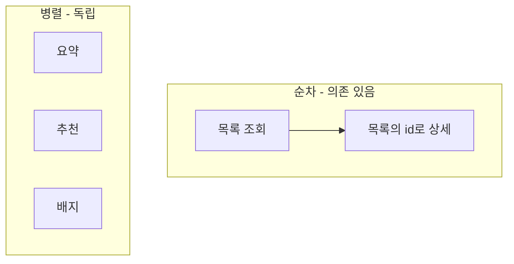

그 주의 일은 "여러 독립 영역으로 이뤄진 화면을 채우는 다중 데이터 호출"을 정리하는 거였다. 한 화면이 목록, 요약, 추천, 알림 배지 같은 **서로 독립적인 조각 여럿**으로 구성될 때, 이 데이터들을 순차로 불러올지 동시에 불러올지를 정해야 한다. 단일 비동기 응답이나 ID 묶음 조회 같은 주제와 달리, 여기선 **"독립적인 N개 호출의 오케스트레이션"** 자체가 주제다. 직관적으로는 병렬이 무조건 빨라 보이지만, 답은 그렇게 단순하지 않다.

## 핵심: 의존성과 워터폴

먼저 구분할 것은 **호출들 사이에 의존성이 있는가**다.



**의존이 있으면 순차밖에 없다.** A의 결과(예: 목록의 ID들)가 B의 입력이면 B는 A를 기다려야 한다. 문제는 *논리적으론 독립인데 코드가 순차로 짜여* 불필요하게 줄줄이 기다리는 경우다. 이걸 **워터폴(waterfall)**이라 한다. 각 호출이 100ms면 4개를 순차로 하면 400ms, 병렬이면 100ms다. 독립 호출의 워터폴은 순수한 낭비다.

## 병렬화: 독립 호출은 동시에

자바에서 독립 호출은 `CompletableFuture`로 동시에 띄우고 한 번에 모은다.

```java
public ScreenData assemble(Long userId) {
    var summary = CompletableFuture.supplyAsync(() -> service.summary(userId), pool);
    var recos   = CompletableFuture.supplyAsync(() -> service.recommend(userId), pool);
    var badges  = CompletableFuture.supplyAsync(() -> service.badges(userId), pool);

    CompletableFuture.allOf(summary, recos, badges).join();
    return new ScreenData(summary.join(), recos.join(), badges.join());
}
```

전체 지연은 **세 호출의 합이 아니라 가장 느린 하나**(max)로 줄어든다. 이게 병렬의 핵심 이득이다.

## 그런데 왜 순차가 나을 때가 있나

병렬이 항상 정답이 아닌 이유가 angle의 핵심이다.

**1) 서버 부하의 동시 스파이크.** 병렬 호출은 같은 순간 DB 커넥션·스레드를 N개 동시에 점유한다. 화면 하나가 5개를 병렬로 쏘고 동시 접속자가 많으면, **커넥션 풀이 순식간에 고갈**된다. 순차로 풀면 같은 작업이 시간축에 분산돼 풀에 가하는 압력이 낮다. 즉 병렬은 *개별 응답*은 빠르게 하지만 *시스템 처리량*엔 불리할 수 있다.

**2) 렌더링 안정성과 점진적 표시.** 무거운 조각을 다 모은 뒤 한 번에 그리면 첫 화면이 늦게 뜬다. 가벼운 핵심부터 순차로 채우면 사용자는 더 빨리 의미 있는 화면을 본다. 모든 걸 병렬로 모아 `allOf`로 막으면 **가장 느린 호출이 전체를 인질로 잡는다**.

**3) 부분 실패의 폭발.** 병렬에서 한 조각이 실패하면 `allOf().join()`이 통째로 예외를 던질 수 있다. "추천만 실패했는데 화면 전체가 죽는" 사태다.

## 부분 실패는 조각 단위로 격리

병렬을 쓰되 화면을 살리려면, 각 조각의 실패를 **그 조각 안에 가둬야** 한다.

```java
var recos = CompletableFuture
    .supplyAsync(() -> service.recommend(userId), pool)
    .exceptionally(ex -> {
        log.warn("recommend failed, degrade", ex);
        return List.of();              // 빈 결과로 폴백, 화면은 산다
    })
    .orTimeout(300, TimeUnit.MILLISECONDS); // 느린 조각이 전체를 인질로 잡지 못하게
```

핵심 원칙 두 가지: **타임아웃을 조각마다 건다(slowest 방어)**, **실패는 그 조각의 폴백으로 흡수한다(부분 degrade)**. 그래야 "추천 없는 화면"이 "죽은 화면"보다 낫다는 원칙이 성립한다.

## 운영 함정

**함정 1 — 공유 풀로 병렬화하다 데드락.** `CompletableFuture.supplyAsync`의 기본 실행자는 공용 `ForkJoinPool.commonPool()`이다. 여기서 또 블로킹 I/O를 하면 공용 풀이 막히고, 다른 병렬 작업까지 굶는다. **블로킹 호출용 별도 풀을 명시**해 격리해야 한다.

**함정 2 — 워터폴을 못 보고 "DB가 느리다"고 오진.** 논리적으로 독립인 호출들이 순차로 줄 서 있으면, 각 쿼리는 빠른데 화면만 느리다. 프로파일을 보면 개별 쿼리는 멀쩡하니 DB 탓을 하기 쉽다. 호출 타임라인(트레이스)을 보면 계단식 워터폴이 드러난다.

## 핵심 요약

- 호출 간 **의존이 있으면 순차**, 독립이면 병렬화로 지연을 `합 → max`로 줄인다.
- 병렬은 개별 응답을 빠르게 하지만 **동시 부하 스파이크·부분 실패 폭발** 위험이 있다.
- 병렬을 쓸 땐 **조각별 타임아웃 + 폴백 + 전용 풀**로 격리하라.

> **면접 한 줄 Q&A**
> Q. 화면 조각 5개를 다 병렬로 띄웠더니 동시 접속 시 커넥션 풀이 터진다. 어떻게?
> A. 병렬은 동시 자원 점유를 N배로 키운다. 가벼운 핵심은 순차로 먼저 채우고, 나머지만 제한된 전용 풀에서 타임아웃·폴백을 걸어 병렬화한다.
