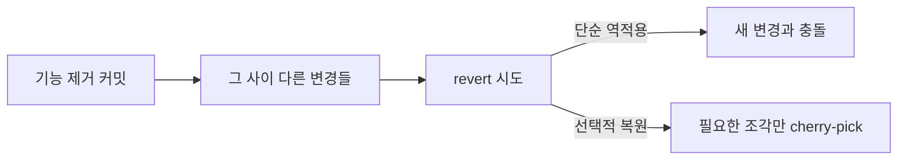

한 번 내렸던 기능을 다시 켜야 하는 일은 생각보다 자주 일어난다. 비즈니스 사정이 바뀌거나, 성급하게 제거했음을 뒤늦게 깨닫거나. 문제는 "지운 걸 되돌리면 끝"이 아니라는 점이다. 그 사이 코드도, 스키마도, 라이브러리도 흘러갔다. 복원은 **시간을 거슬러 올라가되 현재와 충돌하지 않게** 봉합하는 작업이다.

## 되살릴 것은 코드만이 아니다

기능 하나를 제거하면 보통 네 군데가 함께 사라진다.

1. **코드** — 컨트롤러·서비스·뷰
2. **라우트/엔드포인트** — URL 매핑, 메뉴 등록
3. **권한** — 그 메뉴에 걸려 있던 인가 규칙
4. **데이터/스키마** — 더는 안 쓴다고 드롭했거나 방치된 컬럼·테이블

복원할 때 이 넷이 다시 정합을 이뤄야 한다. 코드만 살리고 권한을 빠뜨리면 화면은 떠도 접근이 막히고, 라우트만 살리고 스키마를 안 보면 런타임에 컬럼 없음 예외가 터진다.

## revert와 새 변경의 충돌

가장 흔한 함정은 `git revert`로 옛 커밋을 되살릴 때 그 사이 같은 파일을 건드린 변경과 충돌하는 것이다. 제거 커밋을 그대로 뒤집으면, 제거 이후 그 영역에 추가된 코드가 함께 날아갈 수 있다.



안전한 길은 "제거 커밋을 통째로 역적용"하는 대신 **무엇을 살릴지 명시적으로 고르는 것**이다. 제거 시점의 코드를 참고용으로 꺼내 보되, 실제로는 현재 코드 위에 새로 얹는다고 생각한다. 이때 정적 분석과 컴파일이 1차 안전망이다.

```java
// 복원한 컨트롤러 — 시그니처가 현재 규약과 맞는지부터 확인
@GetMapping("/legacy/report")
public ResponseEntity<ReportView> report(
        @AuthenticationPrincipal AdminUser user,
        @ModelAttribute ReportQuery query) {
    if (!user.hasAuthority("REPORT_VIEW")) {   // 권한도 함께 복원
        return ResponseEntity.status(403).build();
    }
    return ResponseEntity.ok(reportService.build(query));
}
```

## 스키마가 바뀌었다면 데이터 정합부터

가장 위험한 건 데이터다. 기능을 내린 뒤 컬럼을 드롭했거나, 남은 데이터가 그 사이 다른 로직으로 오염됐을 수 있다. 컬럼을 다시 추가할 때 옛 데이터는 NULL이거나 기본값이다. 복원된 코드가 그 값을 신뢰하면 깨진다.

```sql
-- 컬럼 복원 + 안전한 기본값 백필
ALTER TABLE orders ADD COLUMN promo_code VARCHAR(32) NULL;
UPDATE orders SET promo_code = 'NONE'
 WHERE promo_code IS NULL AND created_at < '2024-10-01';
```

마이그레이션은 **앞으로만 가는** 게 원칙이다. 드롭을 되돌리는 게 아니라, "컬럼을 추가하는 새 마이그레이션"을 더한다. 그래야 환경마다 상태가 갈리지 않는다.

## 운영 함정

**라이브러리 버전 정합.** 제거 당시 쓰던 의존성이 그 사이 업그레이드됐다면, 복원한 코드가 사라진 API를 호출할 수 있다. 컴파일은 잡아주지만 시그니처만 같고 동작이 바뀐 경우(예: 기본 동작 변경)는 못 잡는다. 복원 코드는 반드시 회귀 테스트를 통과시킨 뒤 올린다.

**권한 회수 누락의 역방향.** 메뉴를 복원하면서 권한 데이터를 함께 넣지 않으면 운영자는 빈 화면을 본다. 코드·라우트·권한·데이터를 하나의 체크리스트로 묶어 동시에 올린다.

## 핵심 요약

- 기능 복원은 코드·라우트·권한·데이터 네 축을 함께 되살리는 일이다.
- revert를 통째로 역적용하지 말고 필요한 조각만 현재 위에 다시 얹는다.
- 스키마는 되돌리지 말고 새 마이그레이션으로 전진하며, 옛 데이터는 백필로 정합을 맞춘다.
