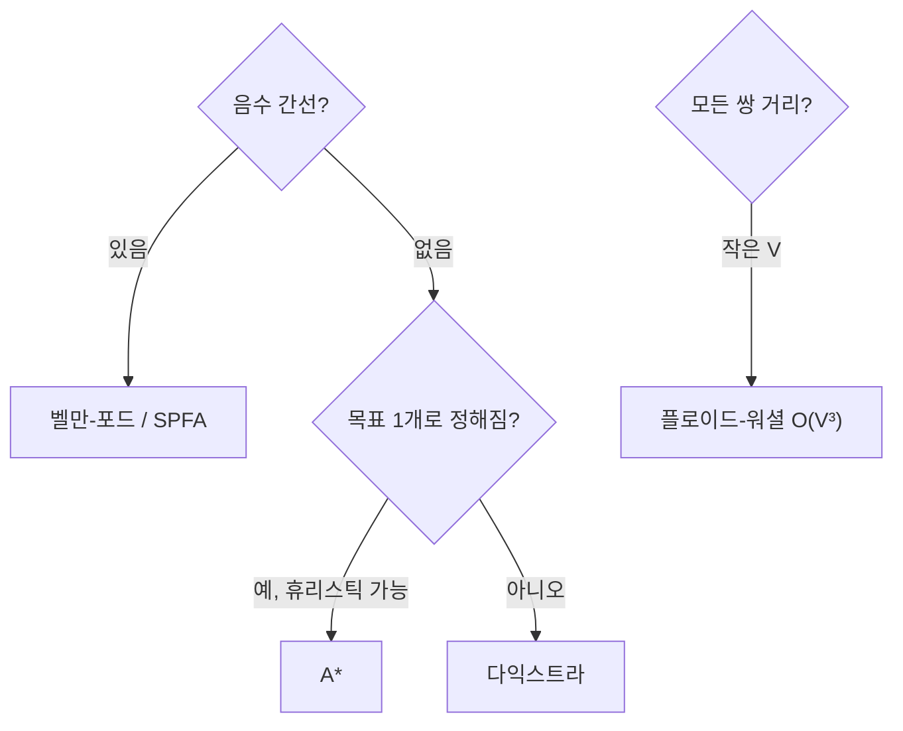

## 가중치가 붙는 순간, 게임이 달라진다

[BFS]()는 **간선마다 비용이 1로 같을 때**의 최단 경로였습니다. 그런데 도로엔 거리·정체가, 네트워크 링크엔 지연·대역폭이 붙습니다. 간선에 **가중치**가 생기면 "가까운 이웃 먼저"라는 단순 규칙이 깨집니다 — 한 칸짜리 비싼 간선보다 두 칸짜리 싼 간선이 더 짧을 수 있으니까요. 여기서 **거리 완화(relaxation)** 라는 핵심 도구가 등장합니다.

> **완화(relax)**: 지금까지 알던 `dist[v]`보다 `dist[u] + w(u,v)`가 더 짧으면 갱신. 모든 최단 경로 알고리즘은 "어떤 순서로, 몇 번 완화하느냐"의 차이일 뿐입니다.

$$\text{if } dist[u] + w(u,v) < dist[v]: \quad dist[v] \leftarrow dist[u] + w(u,v)$$

## 다익스트라 — "가장 가까운 미확정 정점은 더 줄지 않는다"

**다익스트라**는 그리디입니다. 아직 확정 안 된 정점 중 **현재 거리가 가장 작은 것**을 꺼내 확정하고, 그 이웃을 완화합니다. 핵심 통찰: 음수 간선이 없다면, 가장 가까운 미확정 정점의 거리는 **더 이상 줄어들 수 없다** — 그래서 바로 확정해도 안전합니다. 우선순위 큐(최소 힙)로 "가장 가까운 미확정"을 꺼내 $O(E \log V)$.

아래는 시작점에서 거리 지평선이 **가까운 정점부터 차례로** 확정(초록)되며 바깥으로 번지는 모습입니다.

<div class="sp11-dij" markdown="0">
<style>
.sp11-dij{margin:1.4rem 0;overflow-x:auto}
.sp11-dij svg{width:100%;max-width:560px;height:auto;display:block;margin:0 auto;font-family:inherit}
.sp11-dij .e{stroke:currentColor;opacity:.28;stroke-width:1.6}
.sp11-dij .w{fill:currentColor;font-size:10px;opacity:.65}
.sp11-dij .nd{fill:none;stroke:currentColor;stroke-width:1.8}
.sp11-dij .t{fill:currentColor;font-size:12px;font-weight:600}
.sp11-dij .ring{fill:#2f9e44;opacity:0}
.sp11-dij .s0{animation:sp11settle 6s ease-in-out infinite;animation-delay:0s}
.sp11-dij .s1{animation:sp11settle 6s ease-in-out infinite;animation-delay:1.1s}
.sp11-dij .s2{animation:sp11settle 6s ease-in-out infinite;animation-delay:2.2s}
.sp11-dij .s3{animation:sp11settle 6s ease-in-out infinite;animation-delay:3.3s}
.sp11-dij .s4{animation:sp11settle 6s ease-in-out infinite;animation-delay:4.2s}
@keyframes sp11settle{0%{opacity:0}5%{opacity:.8}88%{opacity:.8}95%{opacity:0}100%{opacity:0}}
</style>
<svg viewBox="0 0 520 230" role="img" aria-label="다익스트라가 시작 정점에서 거리가 가까운 정점부터 차례로 최단거리를 확정하며 바깥으로 퍼지는 애니메이션">
  <line class="e" x1="60" y1="120" x2="170" y2="60"/>
  <line class="e" x1="60" y1="120" x2="170" y2="180"/>
  <line class="e" x1="170" y1="60" x2="300" y2="80"/>
  <line class="e" x1="170" y1="180" x2="300" y2="80"/>
  <line class="e" x1="300" y1="80" x2="440" y2="130"/>
  <text class="w" x="105" y="80">2</text>
  <text class="w" x="105" y="165">1</text>
  <text class="w" x="240" y="60">5</text>
  <text class="w" x="230" y="145">3</text>
  <text class="w" x="380" y="95">2</text>
  <circle class="ring s0" cx="60"  cy="120" r="22"/>
  <circle class="ring s1" cx="170" cy="180" r="22"/>
  <circle class="ring s2" cx="170" cy="60"  r="22"/>
  <circle class="ring s3" cx="300" cy="80"  r="22"/>
  <circle class="ring s4" cx="440" cy="130" r="22"/>
  <circle class="nd" cx="60"  cy="120" r="22"/>
  <circle class="nd" cx="170" cy="60"  r="22"/>
  <circle class="nd" cx="170" cy="180" r="22"/>
  <circle class="nd" cx="300" cy="80"  r="22"/>
  <circle class="nd" cx="440" cy="130" r="22"/>
  <text class="t" x="60"  y="125" text-anchor="middle">S·0</text>
  <text class="t" x="170" y="65"  text-anchor="middle">2</text>
  <text class="t" x="170" y="185" text-anchor="middle">1</text>
  <text class="t" x="300" y="85"  text-anchor="middle">4</text>
  <text class="t" x="440" y="135" text-anchor="middle">6</text>
</svg>
</div>

확정 순서는 거리순(0→1→2→4→6)입니다. 위 S→아래(1)→위(2)→4→6. **음수 간선이 있으면 이 그리디가 깨집니다** — 이미 확정한 정점이 나중에 더 짧아질 수 있어서요. 그땐 벨만-포드를 써야 합니다.

```python
import heapq
def dijkstra(adj, s):                  # adj[u] = [(v, w), ...]
    dist = {s: 0}; pq = [(0, s)]
    while pq:
        d, u = heapq.heappop(pq)
        if d > dist.get(u, float('inf')): continue  # 낡은 항목 스킵
        for v, w in adj[u]:
            nd = d + w
            if nd < dist.get(v, float('inf')):
                dist[v] = nd
                heapq.heappush(pq, (nd, v))
    return dist
```

## 벨만-포드 — 느리지만 음수도 견딘다

음수 간선이 있으면 **벨만-포드**. 모든 간선을 $V-1$번 반복해 완화합니다 — 최단 경로는 정점을 최대 $V-1$개 거치니까요. $O(VE)$로 느리지만, **$V$번째에도 완화가 일어나면 음수 사이클**(돌수록 비용이 무한히 줄어듦)을 탐지합니다. 거리 벡터 라우팅(RIP)이 이 방식입니다.

## A* — 목표를 향한 직감을 더하다

다익스트라는 **목표 방향을 모른 채** 사방으로 균일하게 퍼집니다. **A\***는 여기에 "목표까지 남은 거리의 추정치"인 **휴리스틱 $h(n)$** 을 더해, $f(n) = g(n) + h(n)$ (이미 온 거리 + 남은 추정)이 작은 쪽을 우선 탐색합니다. 그래서 **목표 쪽으로 쏠려** 훨씬 적은 정점만 봅니다. $h$가 실제 거리를 **과대평가하지 않으면**(admissible) 최적해를 보장합니다.

아래 왼쪽(다익스트라)은 사방으로 균일 확산, 오른쪽(A*)은 목표를 향해 좁게 뻗습니다 — 같은 목표, 훨씬 적은 탐색.

<div class="sp11-astar" markdown="0">
<style>
.sp11-astar{margin:1.4rem 0;overflow-x:auto}
.sp11-astar svg{width:100%;max-width:600px;height:auto;display:block;margin:0 auto;font-family:inherit}
.sp11-astar .fr{fill:none;stroke:currentColor;stroke-width:1.4;opacity:.4}
.sp11-astar .t{fill:currentColor;font-size:11px;font-weight:600}
.sp11-astar .sub{fill:currentColor;font-size:9.5px;opacity:.6}
.sp11-astar .start{fill:#1971c2}
.sp11-astar .goal{fill:#e03131}
.sp11-astar .d-explore{fill:#1971c2;opacity:0;transform-origin:90px 90px;animation:sp11dij 5s ease-out infinite}
@keyframes sp11dij{0%{opacity:0;transform:scale(0)}10%{opacity:.18}80%{opacity:.18;transform:scale(1)}95%{opacity:0;transform:scale(1)}100%{opacity:0}}
.sp11-astar .a-explore{fill:#2f9e44;opacity:0;transform-origin:390px 90px;animation:sp11ast 5s ease-out infinite}
@keyframes sp11ast{0%{opacity:0;transform:scaleX(0)}10%{opacity:.22}80%{opacity:.22;transform:scaleX(1)}95%{opacity:0;transform:scaleX(1)}100%{opacity:0}}
</style>
<svg viewBox="0 0 600 200" role="img" aria-label="다익스트라는 사방으로 균일하게 탐색하고 A스타는 목표 방향으로 좁게 탐색하는 비교 애니메이션">
  <text class="sub" x="90" y="24" text-anchor="middle">다익스트라 — 무지향 확산</text>
  <circle class="d-explore" cx="90" cy="90" r="62"/>
  <circle class="start" cx="90" cy="90" r="7"/>
  <circle class="goal" cx="170" cy="120" r="7"/>
  <text class="t" x="90" y="80" text-anchor="middle">S</text>
  <text class="t" x="170" y="142" text-anchor="middle">G</text>
  <text class="sub" x="410" y="24" text-anchor="middle">A* — 목표 방향 집중</text>
  <ellipse class="a-explore" cx="450" cy="120" rx="70" ry="26" transform="rotate(20 390 90)"/>
  <circle class="start" cx="390" cy="90" r="7"/>
  <circle class="goal" cx="470" cy="120" r="7"/>
  <text class="t" x="390" y="80" text-anchor="middle">S</text>
  <text class="t" x="470" y="142" text-anchor="middle">G</text>
</svg>
</div>

게임의 길찾기, 지도 내비게이션이 A*를 쓰는 이유입니다. $h \equiv 0$이면 A*는 정확히 다익스트라가 됩니다.

## 한눈에 비교

| 알고리즘 | 음수 간선 | 시간 | 용도 |
|---------|----------|------|------|
| BFS | (무가중) | $O(V+E)$ | 가중치 없는 최단거리 |
| 다익스트라 | 불가 | $O(E \log V)$ | 단일 출발, 양수 가중치 (대부분) |
| 벨만-포드 | 가능 | $O(VE)$ | 음수 간선·음수 사이클 탐지 |
| A* | 불가 | 휴리스틱 의존 | 목표가 정해진 길찾기 |
| 플로이드-워셜 | 가능(음수사이클X) | $O(V^3)$ | 모든 쌍 최단거리 |



인터넷 라우팅의 **OSPF**가 바로 다익스트라(링크 상태)이고, 구형 **RIP**가 벨만-포드(거리 벡터)입니다. 네트워크 라우팅은 사실상 최단 경로 알고리즘의 분산 구현입니다.

## 프로덕션에서 마주치는 함정

| 함정 | 증상 | 해법 |
|------|------|------|
| 다익스트라에 음수 간선 | 틀린 최단거리(이미 확정한 게 더 짧아짐) | 벨만-포드/SPFA |
| 힙에 낡은(stale) 항목 | 같은 정점 여러 번 처리 | 꺼낼 때 `d > dist[u]`면 스킵 |
| `decrease-key` 직접 구현 | 복잡·버그 | 그냥 새 항목 push + 스킵 패턴 |
| A* 휴리스틱 과대평가 | 최적 아닌 경로 | admissible(≤실제) 보장, 격자=맨해튼/유클리드 |
| 플로이드를 큰 V에 | $O(V^3)$ 폭발 | V 작을 때만, 아니면 다익스트라 반복 |

## 면접/리뷰 단골 질문

- **Q. 다익스트라가 음수 간선에서 실패하는 이유?** → 확정한 정점이 나중에 더 짧아질 수 있어 그리디 가정이 깨짐. 벨만-포드로.
- **Q. 다익스트라 복잡도?** → 이진 힙 $O(E \log V)$. 피보나치 힙이면 이론상 $O(E + V\log V)$.
- **Q. A*와 다익스트라 관계?** → A*는 다익스트라 + 휴리스틱. $h=0$이면 동일. admissible이면 최적 보장.
- **Q. 음수 사이클은 어떻게 탐지?** → 벨만-포드에서 $V$번째 반복에도 완화가 일어나면 음수 사이클.
- **Q. 모든 쌍 최단거리?** → V 작으면 플로이드-워셜 $O(V^3)$, 크면 정점마다 다익스트라.

## 정리

- 모든 최단 경로는 **완화(relaxation)** 의 순서/횟수 문제다.
- **다익스트라**(양수, $O(E\log V)$, 그리디 확정), **벨만-포드**(음수 허용, $O(VE)$, 음수사이클 탐지), **A\***(휴리스틱으로 목표 지향), **플로이드-워셜**(모든 쌍, $O(V^3)$).
- 음수 간선 유무가 첫 갈림길. 목표가 하나로 정해지고 좋은 휴리스틱이 있으면 A*.
- OSPF=다익스트라, RIP=벨만-포드. 라우팅은 최단 경로의 분산판이다.

> [그래프 순회]()에서 출발한 그래프 3부작의 두 번째입니다. 다음은 "모든 정점을 가장 싸게 잇기" — [최소 신장 트리와 Union-Find]()입니다.
</content>
