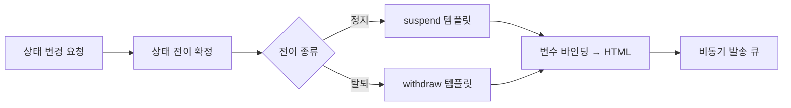

계정이 탈퇴하거나 정지될 때 안내 메일을 보내야 했다. 본문에 사용자 이름, 사유, 처리 일시가 들어가야 하니 고정 텍스트로는 안 된다. HTML 템플릿에 값을 끼워 렌더링하고, 그 결과를 발송한다. 단순해 보이지만 **상태 전이별 분기**와 **발송을 본 트랜잭션에서 떼어내는 일**이 핵심이다.

## 상태 전이가 메일 종류를 결정한다

계정 상태는 활성 → 정지, 활성 → 탈퇴처럼 전이한다. 전이마다 보낼 메일이 다르다. 이걸 if문 더미로 처리하면 상태가 늘 때마다 코드가 부풀고 빠뜨림이 생긴다. 전이를 명시적인 키로 다루고, 키마다 템플릿을 매핑한다.



## 템플릿 렌더링 — 변수 치환과 인코딩

템플릿 엔진(Thymeleaf, FreeMarker 등)에 모델을 넘기면 자리표시자를 실제 값으로 채워 HTML 문자열을 만든다. 직접 문자열을 이어 붙이지 않는 이유는 두 가지다. 첫째, 마크업과 로직이 섞이지 않는다. 둘째, 엔진이 **HTML 이스케이프를 자동 처리**해 준다. 사용자 이름에 `<` 같은 문자가 들어가도 깨지거나 주입되지 않는다.

```java
public enum MailTemplate {
    ACCOUNT_SUSPENDED("mail/account-suspended"),
    ACCOUNT_WITHDRAWN("mail/account-withdrawn");

    private final String view;
    MailTemplate(String view) { this.view = view; }
    public String view() { return view; }
}

public String render(MailTemplate tpl, Map<String, Object> vars) {
    Context ctx = new Context(Locale.KOREA);
    ctx.setVariables(vars);              // name, reason, processedAt ...
    return templateEngine.process(tpl.view(), ctx);
}
```

전이를 템플릿으로 매핑하는 부분도 한곳에 모은다.

```java
MailTemplate tpl = switch (transition) {
    case SUSPEND  -> MailTemplate.ACCOUNT_SUSPENDED;
    case WITHDRAW -> MailTemplate.ACCOUNT_WITHDRAWN;
};
String html = render(tpl, Map.of(
        "name", user.getName(),
        "processedAt", formatted(now)));
```

## 발송은 상태 변경 트랜잭션과 분리한다

가장 중요한 설계 판단이다. **메일 발송이 실패해도 상태 변경은 성공해야 한다.** 정지 처리는 비즈니스 결정이고, 메일은 통보일 뿐이다. SMTP 서버가 잠깐 죽었다고 정지 트랜잭션을 롤백하면 본말이 전도된다.

그래서 발송을 트랜잭션 커밋 *이후*로 미룬다. 스프링이라면 `@TransactionalEventListener(phase = AFTER_COMMIT)`가 정석이다.

```java
@Transactional
public void suspend(Long userId, String reason) {
    User user = userRepo.findById(userId).orElseThrow();
    user.suspend(reason);                          // 상태 변경 (DB)
    events.publish(new AccountSuspended(userId));  // 이벤트만 발행
}

@TransactionalEventListener(phase = AFTER_COMMIT)
public void onSuspended(AccountSuspended e) {
    mailSender.sendAsync(e.userId());              // 커밋 후 비동기 발송
}
```

커밋 전에 보내면, 발송은 성공했는데 트랜잭션이 롤백돼 "정지 안 됐는데 정지 메일을 받는" 모순이 생긴다. `AFTER_COMMIT`은 이 모순을 원천 차단한다.

## 운영 함정

**비동기 발송의 실패를 삼키지 마라.** 커밋 후 비동기로 보내면 실패가 메인 흐름에 안 보인다. 재시도 큐와 실패 로그를 둬야 "메일이 안 갔다"는 문의에 답할 수 있다. 적어도 발송 시도·결과를 기록한다.

**인코딩 헤더 누락.** HTML 본문은 보냈는데 `Content-Type: text/html; charset=UTF-8`을 빠뜨리면 한글이 깨지거나 태그가 그대로 노출된다. 멀티파트·본문 타입·문자셋을 메시지 빌드 시 명시한다.

## 핵심 요약

- 상태 전이를 키로 다루고 키마다 템플릿을 매핑하면 분기가 깔끔하다.
- 템플릿 엔진의 자동 이스케이프로 주입과 깨짐을 막는다.
- 메일 발송은 `AFTER_COMMIT`으로 본 트랜잭션과 분리하고, 실패는 재시도·로그로 보존한다.
