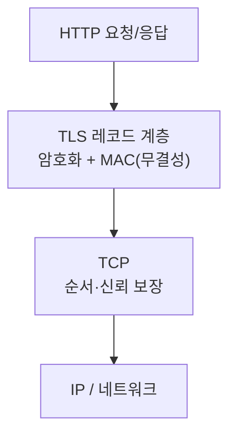

## "자물쇠 아이콘 하나에 담긴 세 가지 약속"

브라우저 주소창의 자물쇠는 세 가지를 보장합니다 — **기밀성**(중간에서 못 본다), **무결성**(중간에서 못 바꾼다), **인증**(상대가 진짜 그 서버다). TLS(Transport Layer Security)는 이 세 가지를 평문 [TCP]() 위에 얹는 얇은 층입니다. HTTPS = HTTP + TLS일 뿐입니다.

문제는 이걸 "암호화하니까 안전" 한 줄로 알면, 인증서 만료로 전 서비스가 멈추거나, 체인 누락으로 일부 클라이언트만 실패하거나, SNI/ALPN을 몰라 [HTTP/2]()가 안 잡히는 사고를 못 푼다는 점입니다. 이 글은 **핸드셰이크가 메시지 단위로 무슨 키를 어떻게 합의하는지**, 그리고 **인증서 체인이 왜 신뢰를 만드는지**까지 내려갑니다.

## TLS의 위치: TCP 위, HTTP 아래

TLS는 [계층]() 관점에서 TCP(신뢰적 바이트스트림) 위에서 동작합니다. TCP가 "순서대로 안 잃고" 날라주면, TLS는 그 위에서 "암호화·인증"을 더하고, 그 위에서 HTTP가 평문처럼 동작합니다. 그래서 애플리케이션은 TLS를 거의 의식하지 않습니다.



## 핵심 트릭: 비대칭으로 합의하고, 대칭으로 일한다

대칭키 암호(AES)는 빠르지만, **양쪽이 같은 키를 미리 공유**해야 합니다 — 처음 만난 서버와 어떻게? 비대칭키(공개키/개인키)는 이 문제를 풀지만 느립니다. TLS의 전략: **비대칭키로 "대칭키를 안전하게 합의"** 하고, 이후 **실제 데이터는 빠른 대칭키로** 암호화합니다. 두 세계의 장점만 취합니다.

현대(TLS 1.3)는 합의 방식으로 **(EC)DHE** — 키 교환마다 임시 키쌍을 쓰는 방식을 표준으로 합니다. 덕분에 **forward secrecy**(나중에 서버 개인키가 유출돼도, 과거에 녹음해 둔 트래픽은 복호화 불가)가 보장됩니다.

## 핸드셰이크를 움직임으로 보기 (TLS 1.3, 1-RTT)

ClientHello로 시작해, 단 한 번의 왕복(1-RTT) 만에 양쪽이 같은 세션 키를 갖고 암호화된 통신을 시작합니다. <span style="color:#1971c2;font-weight:600">파랑</span>은 클라이언트→서버, <span style="color:#2f9e44;font-weight:600">초록</span>은 서버→클라이언트입니다.

<div class="tls-hs" markdown="0">
<style>
.tls-hs{margin:1.4rem 0;overflow-x:auto}
.tls-hs svg{width:100%;max-width:700px;height:auto;display:block;margin:0 auto;font-family:inherit}
.tls-hs .col{stroke:currentColor;opacity:.3;stroke-width:1.6}
.tls-hs .lbl{fill:currentColor;font-size:12px;font-weight:600}
.tls-hs .sub{fill:currentColor;font-size:10px;opacity:.7}
.tls-hs .c2s{fill:#1971c2}
.tls-hs .s2c{fill:#2f9e44}
.tls-hs .m1{animation:tlsr 7s ease-in-out infinite}
.tls-hs .m2{animation:tlsl 7s ease-in-out infinite}
.tls-hs .m3{animation:tlsr 7s ease-in-out infinite}
.tls-hs .lock{opacity:0;animation:tlslock 7s ease-in-out infinite}
@keyframes tlsr{0%{transform:translateX(0);opacity:0}3%{opacity:1}14%{transform:translateX(440px);opacity:1}17%{opacity:0}100%{opacity:0}}
@keyframes tlsl{0%{transform:translateX(0);opacity:0}28%{opacity:0;transform:translateX(0)}31%{opacity:1}44%{transform:translateX(-440px);opacity:1}47%{opacity:0}100%{opacity:0}}
@keyframes tlslock{0%,55%{opacity:0}62%{opacity:1}100%{opacity:1}}
</style>
<svg viewBox="0 0 700 250" role="img" aria-label="TLS 1.3 핸드셰이크가 ClientHello, ServerHello+인증서+키, Finished 한 왕복으로 세션 키를 합의하고 암호화 통신을 시작하는 애니메이션">
  <line class="col" x1="120" y1="30" x2="120" y2="230"/>
  <line class="col" x1="580" y1="30" x2="580" y2="230"/>
  <text class="lbl" x="120" y="22" text-anchor="middle">Client</text>
  <text class="lbl" x="580" y="22" text-anchor="middle">Server</text>
  <text class="sub" x="350" y="56" text-anchor="middle">① ClientHello (지원 암호군 · 키 공유 · SNI · ALPN)</text>
  <rect class="c2s m1" x="112" y="64" width="16" height="12" rx="2"/>
  <text class="sub" x="350" y="120" text-anchor="middle">② ServerHello + Certificate + 키 + Finished</text>
  <rect class="s2c m2" x="572" y="128" width="16" height="12" rx="2"/>
  <text class="sub" x="350" y="184" text-anchor="middle">③ (인증서 검증) Finished</text>
  <rect class="c2s m3" x="112" y="192" width="16" height="12" rx="2" style="animation-delay:0s"/>
  <g class="lock">
    <rect x="320" y="206" width="60" height="26" rx="6" fill="none" stroke="#2f9e44" stroke-width="1.6"/>
    <text x="350" y="224" text-anchor="middle" font-size="11" fill="#2f9e44" font-weight="600">🔒 암호화</text>
  </g>
</svg>
</div>

TLS 1.2는 같은 일을 **2-RTT**로 했습니다(ServerHello 후 키 교환에 한 번 더 왕복). 1.3은 ClientHello에 미리 키 공유 후보를 실어 **1-RTT**로 줄였고, 재방문 시에는 이전 세션 정보를 활용해 **0-RTT**(첫 패킷에 데이터까지)도 가능합니다 — [QUIC/HTTP3]()의 빠른 연결이 이 위에 있습니다.

## 인증: "이 공개키가 진짜 그 서버 것"을 누가 보증하나

암호화만으로는 **중간자(MITM)** 를 못 막습니다 — 공격자와 안전하게 암호화하는 건 의미가 없으니까요. 그래서 **서버의 공개키가 진짜 그 도메인 소유자 것**임을 제3자(CA, 인증 기관)가 보증합니다. 이게 인증서입니다.

신뢰는 **체인**으로 이어집니다. 브라우저/OS에는 소수의 **루트 CA**가 미리 박혀 있고(트러스트 스토어), 루트가 중간 CA를 서명하고, 중간 CA가 서버 인증서를 서명합니다. 클라이언트는 서버 인증서 → 중간 → 루트까지 **서명을 거슬러 검증**해, 루트에 닿으면 신뢰합니다.

<div class="tls-chain" markdown="0">
<style>
.tls-chain{margin:1.4rem 0;overflow-x:auto}
.tls-chain svg{width:100%;max-width:680px;height:auto;display:block;margin:0 auto;font-family:inherit}
.tls-chain .box{fill:none;stroke:currentColor;stroke-width:1.6;opacity:.55}
.tls-chain .lbl{fill:currentColor;font-size:11.5px;font-weight:600}
.tls-chain .sub{fill:currentColor;font-size:9px;opacity:.55}
.tls-chain .ar{stroke:currentColor;opacity:.3;stroke-width:1.4;fill:none}
.tls-chain .chk{fill:#2f9e44}
.tls-chain .v1{animation:tlsv 5s ease-in-out infinite}
.tls-chain .v2{animation:tlsv 5s ease-in-out infinite 1.2s}
.tls-chain .v3{animation:tlsv 5s ease-in-out infinite 2.4s}
@keyframes tlsv{0%{opacity:0;transform:scale(.4)}10%{opacity:1;transform:scale(1)}80%{opacity:1}100%{opacity:0}}
</style>
<svg viewBox="0 0 660 130" role="img" aria-label="서버 인증서에서 중간 CA, 루트 CA까지 서명을 거슬러 검증해 신뢰에 도달하는 인증서 체인 애니메이션">
  <rect class="box" x="20"  y="45" width="150" height="44" rx="8"/>
  <text class="lbl" x="95" y="65" text-anchor="middle">서버 인증서</text>
  <text class="sub" x="95" y="80" text-anchor="middle">example.com</text>
  <rect class="box" x="255" y="45" width="150" height="44" rx="8"/>
  <text class="lbl" x="330" y="65" text-anchor="middle">중간 CA</text>
  <text class="sub" x="330" y="80" text-anchor="middle">서버 인증서 서명</text>
  <rect class="box" x="490" y="45" width="150" height="44" rx="8"/>
  <text class="lbl" x="565" y="65" text-anchor="middle">루트 CA</text>
  <text class="sub" x="565" y="80" text-anchor="middle">트러스트 스토어</text>
  <path class="ar" d="M170 67 H255" marker-end=""/>
  <path class="ar" d="M405 67 H490"/>
  <circle class="chk v1" cx="212" cy="40" r="7"/>
  <circle class="chk v2" cx="447" cy="40" r="7"/>
  <circle class="chk v3" cx="565" cy="30" r="7"/>
  <text class="sub" x="212" y="110" text-anchor="middle">서명 검증 ✓</text>
  <text class="sub" x="447" y="110" text-anchor="middle">서명 검증 ✓</text>
  <text class="sub" x="565" y="110" text-anchor="middle">루트 도달 ✓ 신뢰</text>
</svg>
</div>

> **현장 1위 사고: "중간 인증서 누락".** 서버가 **자기 인증서만** 내려보내고 중간 CA를 빠뜨리면, 중간 CA를 이미 캐시한 브라우저는 통과하지만 **그렇지 않은 클라이언트(일부 모바일·서버 간 호출)는 체인을 못 이어 실패**합니다. "어떤 기기에서만 SSL 오류"의 전형입니다. 서버는 **풀 체인(서버+중간)** 을 함께 제공해야 합니다.

## 핸드셰이크에 끼어드는 두 협상: SNI와 ALPN

한 IP/포트에 여러 도메인을 호스팅할 때(가상 호스팅·CDN), 서버는 "어느 도메인의 인증서를 줄지" 알아야 합니다. 그런데 그건 암호화 전에 정해야 하죠. 그래서 ClientHello가 **SNI(Server Name Indication)** 에 목적지 도메인을 (1.2에선 평문으로) 담습니다 — SNI가 틀리면 엉뚱한 인증서가 와서 실패합니다. 또 ClientHello의 **ALPN**으로 `h2`/`http/1.1`을 협상해 [HTTP 버전]()을 정합니다.

## mTLS: 서버뿐 아니라 클라이언트도 증명한다

기본 TLS는 **서버만** 인증합니다(클라이언트는 익명). **mTLS(상호 TLS)** 는 클라이언트도 인증서를 제시해 서로를 검증합니다. 사람이 아니라 **서비스 간 통신**에서 "이 호출자가 진짜 우리 서비스인지"를 보증하는 핵심 수단이라, [서비스 메시·zero trust]()의 토대가 됩니다.

## 디버깅

```bash
# 핸드셰이크·인증서 체인·협상된 버전/암호군을 직접 본다
openssl s_client -connect example.com:443 -servername example.com </dev/null

# 인증서 만료일·체인만 빠르게
echo | openssl s_client -connect example.com:443 2>/dev/null | openssl x509 -noout -dates -issuer -subject

# ALPN으로 h2가 협상되는지
openssl s_client -alpn h2 -connect example.com:443 </dev/null | grep -i alpn
```

`s_client`는 "체인이 끝까지 이어지나(`Verify return code: 0 (ok)`)", "어떤 TLS 버전·암호군이 잡혔나", "SNI를 줬을 때 올바른 인증서가 오나"를 한눈에 보여줘 **만료·체인·SNI** 세 사고를 가릅니다.

## 면접/리뷰 단골 질문

- **Q. 비대칭키가 있는데 왜 대칭키로 바꾸나?** → 비대칭은 느려서 데이터 암호화엔 부적합. 비대칭으로 대칭키를 *합의*만 하고, 데이터는 빠른 대칭키(AES)로 처리.
- **Q. forward secrecy가 뭐고 왜 중요?** → 매 세션 임시 키((EC)DHE)를 써서, 서버 개인키가 나중에 유출돼도 과거 트래픽은 복호화 불가. TLS 1.3은 이를 사실상 강제.
- **Q. 일부 클라이언트에서만 SSL 오류가 난다. 첫 의심은?** → 중간 인증서 누락(풀 체인 미제공). `openssl s_client`로 `Verify return code` 확인.
- **Q. TLS 1.3이 1.2보다 빠른 이유는?** → 핸드셰이크를 2-RTT→1-RTT로 줄이고, 재방문 시 0-RTT 지원 + 취약한 레거시 암호군 제거.

## 정리

- TLS = TCP 위, HTTP 아래에서 **기밀성·무결성·인증**을 더하는 층. HTTPS = HTTP+TLS.
- **비대칭으로 대칭키 합의 → 대칭키로 데이터** 처리. 1.3은 (EC)DHE로 **forward secrecy**를 기본화.
- 인증은 **인증서 체인**(서버→중간→루트 CA)으로 신뢰를 형성 — **중간 인증서 누락**이 최다 사고.
- 핸드셰이크에 **SNI**(어느 도메인) + **ALPN**(어느 HTTP 버전)이 함께 협상되고, **mTLS**는 서비스 간 신뢰의 토대.

> 다음 글: 이제 패킷이 사설망과 공인망을 넘나드는 [NAT와 사설망]()으로 이어집니다.
