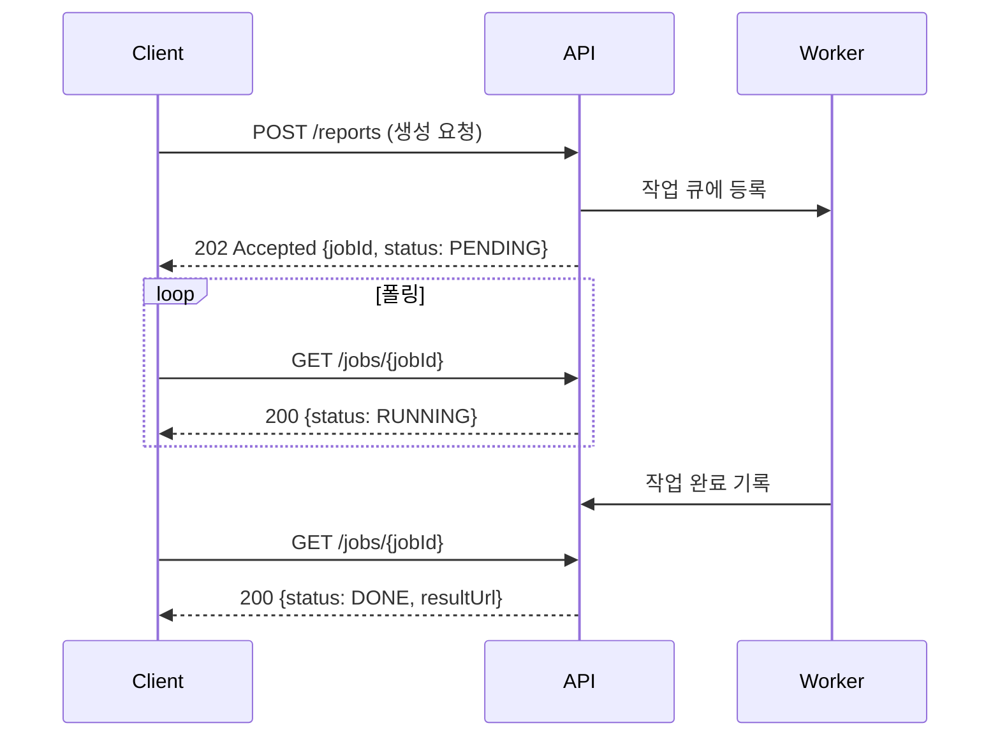

## 동기 요청이 무너지는 지점

대량 데이터 집계나 외부 시스템 호출처럼 응답까지 수십 초가 걸리는 처리를 다룬 주가 있었다. 핵심은 단순하다. **응답이 오래 걸리는 작업을 HTTP 요청-응답 사이클 안에서 끝내려 하면 안 된다.** 동기로 처리하면 클라이언트, 로드밸런서, WAS의 커넥션이 그 시간 내내 묶이고, 어디선가 타임아웃이 먼저 끊는다.

HTTP는 본래 짧은 요청-응답을 가정한다. 클라이언트의 read timeout, 프록시의 idle timeout, 톰캣 스레드 점유 — 이 셋이 동시에 적이 된다. 작업이 30초 걸리는데 게이트웨이 타임아웃이 10초면, 작업은 백엔드에서 계속 돌고 있는데 클라이언트는 504를 받는다. 사용자는 실패로 알고 재시도하고, 같은 작업이 중복으로 쌓인다.

## 핵심 개념 — 수락과 결과를 분리한다

해법은 "처리 완료"와 "요청 수락"을 분리하는 것이다. 서버는 작업을 큐에 넣고 **즉시** `202 Accepted`와 작업 ID를 반환한다. 클라이언트는 그 ID로 별도 엔드포인트를 폴링해 진행 상태를 확인한다.



왜 `202`인가. `200`은 "처리 완료", `201`은 "리소스 생성 완료"를 의미하지만 `202`는 "요청을 받아들였으나 아직 처리하지 않았다"는 정확한 시맨틱을 가진다. 응답에 상태 조회 URL(`Location` 헤더)을 같이 주면 클라이언트가 어디를 폴링할지 명확해진다.

## 코드 예시

```java
@RestController
@RequiredArgsConstructor
public class ReportController {

    private final JobService jobService;

    @PostMapping("/reports")
    public ResponseEntity<JobResponse> createReport(@RequestBody ReportRequest req) {
        String jobId = jobService.enqueue(req);           // 큐 등록만 하고 즉시 반환
        return ResponseEntity.accepted()                  // 202
                .header(HttpHeaders.LOCATION, "/jobs/" + jobId)
                .body(new JobResponse(jobId, JobStatus.PENDING));
    }

    @GetMapping("/jobs/{jobId}")
    public ResponseEntity<JobResponse> getStatus(@PathVariable String jobId) {
        return jobService.find(jobId)
                .map(ResponseEntity::ok)
                .orElse(ResponseEntity.notFound().build());
    }
}
```

워커는 `@Async`나 별도 스레드풀/메시지 큐 컨슈머로 처리하며, 상태를 저장소에 갱신한다.

```java
@Async("taskExecutor")
public void process(String jobId, ReportRequest req) {
    jobRepository.updateStatus(jobId, JobStatus.RUNNING);
    try {
        String resultUrl = heavyComputation(req);
        jobRepository.complete(jobId, resultUrl);
    } catch (Exception e) {
        jobRepository.fail(jobId, e.getMessage());        // 실패도 상태로 남긴다
    }
}
```

`@Async`를 쓸 때는 반드시 전용 `ThreadPoolTaskExecutor`를 정의하고 `@EnableAsync`를 켠다. 기본 `SimpleAsyncTaskExecutor`는 요청마다 스레드를 새로 만들어 풀링하지 않으므로 폭주에 무방비다.

## 운영 함정

**멱등성 부재로 인한 중복 작업.** 클라이언트가 네트워크 불안으로 POST를 재시도하면 같은 작업이 두 번 큐에 들어간다. 요청에 클라이언트가 만든 `Idempotency-Key`를 받아, 같은 키로 이미 등록된 작업이 있으면 새로 만들지 않고 기존 jobId를 돌려준다.

**무한 폴링과 좀비 작업.** 클라이언트가 일정 간격으로만 폴링하도록 응답에 `Retry-After`를 주고, 작업에는 TTL을 둔다. RUNNING 상태로 너무 오래 머문 작업은 실패로 강등하는 감시 로직이 없으면, 워커가 죽은 작업이 영원히 PENDING으로 남아 사용자를 기다리게 한다.

## 핵심 요약

- 오래 걸리는 작업은 동기 응답으로 끝내지 말고 **수락(202)과 결과(폴링)를 분리**한다.
- `202 Accepted` + 작업 ID + `Location` 헤더가 표준 패턴이다.
- 멱등성 키로 중복 등록을 막고, TTL과 상태 감시로 좀비 작업을 정리한다.

> **면접 한 줄**: "왜 200이 아니라 202를 쓰나?" → 200은 처리 완료를, 202는 "요청은 받았으나 처리는 아직"임을 뜻한다. 비동기 작업의 정확한 시맨틱이 202다.
