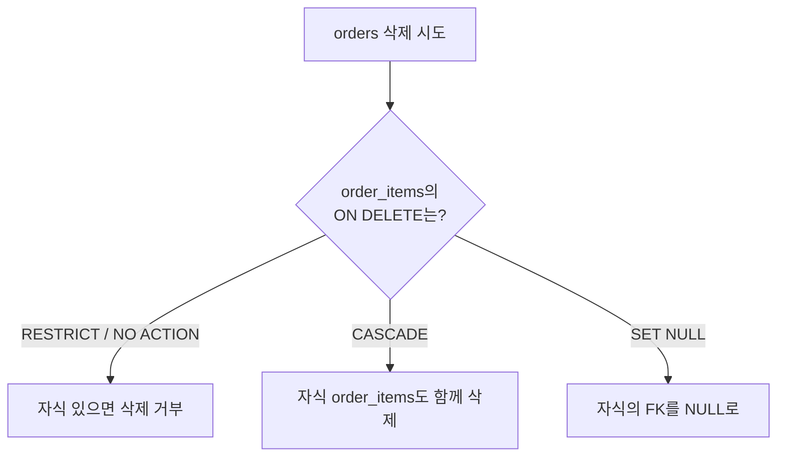

## 지웠는데 참조가 남았다

연관 데이터 삭제를 다룬 주가 있었다. 핵심 질문은 하나다. **부모 행을 지울 때 그 부모를 가리키던 자식 행들을 어떻게 할 것인가.** 그냥 두면 존재하지 않는 부모를 가리키는 **고아(orphan) 레코드**가 생기고, 따라 지우면 의도치 않은 대량 삭제가 일어날 수 있다.

이 선택을 코드가 매번 책임지면 어딘가는 빠뜨린다. 그래서 DB는 **외래키 제약**으로 참조 무결성을 엔진 차원에서 보장하는 장치를 제공한다.

## 핵심 개념 — 참조 무결성과 삭제 동작

외래키는 "이 컬럼 값은 반드시 부모 테이블에 존재해야 한다"는 제약이다. 이 제약이 있으면 DB는 부모가 삭제될 때 자식을 어떻게 처리할지 **referential action**으로 정해둘 수 있다.



- **RESTRICT / NO ACTION**: 자식이 하나라도 있으면 부모 삭제를 막는다. 가장 안전한 기본값.
- **CASCADE**: 부모를 지우면 자식이 자동으로 따라 삭제된다. 편하지만, 한 행 삭제가 수천 행을 지울 수 있다.
- **SET NULL**: 자식의 FK 컬럼을 NULL로 만든다. 관계가 선택적일 때만.

왜 엔진에 맡기나. 애플리케이션에서 "부모 지우기 전에 자식 먼저 지우기"를 코드로 하면, 그 사이 다른 트랜잭션이 자식을 추가하는 경쟁이 생긴다. FK 제약은 이를 **원자적으로** 보장한다.

## 코드 예시

```sql
CREATE TABLE orders (
    id          BIGINT PRIMARY KEY,
    customer_id BIGINT NOT NULL
);

CREATE TABLE order_items (
    id        BIGINT PRIMARY KEY,
    order_id  BIGINT NOT NULL,
    product   VARCHAR(100),
    CONSTRAINT fk_item_order
        FOREIGN KEY (order_id) REFERENCES orders(id)
        ON DELETE CASCADE          -- 주문 삭제 시 항목도 삭제
);
```

CASCADE를 쓰지 않는 경우, 부모 삭제 전에 자식을 명시적으로 정리하거나, RESTRICT로 막아 "정리 안 된 채 지우려 했음"을 즉시 에러로 드러낸다.

```sql
-- RESTRICT면 아래는 자식이 있을 때 외래키 위반으로 실패한다
DELETE FROM orders WHERE id = 100;
```

## 운영 함정

**무심한 CASCADE가 대량 삭제를 일으킨다.** "회원 탈퇴 시 회원만 지우려" 했는데, 회원 → 주문 → 주문항목 → 결제이력이 전부 CASCADE로 엮여 있으면 한 번의 DELETE가 수만 행을 지운다. 특히 운영 데이터(주문/결제)는 보존 의무가 있는 경우가 많아, **이력성 데이터에는 물리 삭제 대신 soft delete**(상태 컬럼)를 쓰고 부모와의 관계는 끊지 않는 편이 안전하다.

**FK 컬럼에 인덱스가 없으면 부모 삭제가 느려진다.** 부모를 지울 때 DB는 자식 테이블에서 "이 부모를 참조하는 행"을 찾아야 한다. 이때 자식의 FK 컬럼에 인덱스가 없으면 매번 풀스캔이 일어나 삭제·갱신이 급격히 느려진다. 일부 엔진은 FK를 만들어도 자동 인덱스를 만들어주지 않으니 직접 확인한다.

## 핵심 요약

- 외래키는 참조 무결성을 **엔진 차원**에서 보장한다. 고아 레코드를 코드로 막지 말고 제약으로 막는다.
- 삭제 동작은 RESTRICT(안전), CASCADE(편의·위험), SET NULL(선택 관계) 중 의도에 맞게 명시한다.
- 보존이 필요한 이력 데이터는 물리 삭제보다 soft delete를 고려하고, FK 컬럼에는 인덱스를 둔다.

> **면접 한 줄**: "ON DELETE CASCADE의 위험은?" → 한 행 삭제가 연쇄적으로 대량 삭제를 일으킬 수 있고, 보존해야 할 이력까지 사라질 수 있다. 편의보다 데이터 수명주기를 먼저 따져야 한다.
