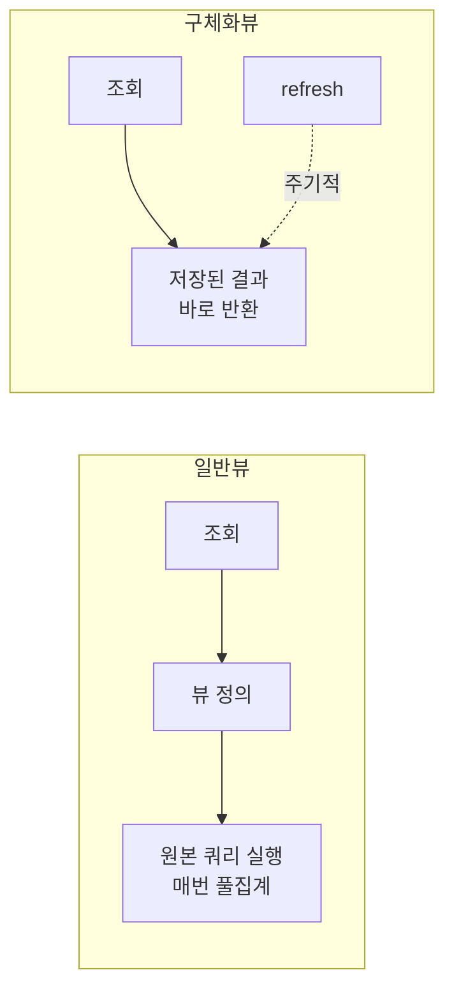

## 같은 무거운 계산을 매번 반복하지 마라

여러 테이블을 조인하고 집계해 보여주는 복잡한 조회를 다룬 주가 있었다. 핵심은 명확하다. **읽기 부하가 높고 결과가 자주 바뀌지 않는 무거운 쿼리는, 매번 계산하지 말고 미리 계산해 둔다.** 통계 대시보드처럼 수백만 행을 집계하는 쿼리를 매 요청마다 실행하면 DB CPU와 I/O가 그 한 화면에 잡아먹힌다.

일반 뷰(view)는 도움이 안 된다. 뷰는 쿼리에 붙인 이름일 뿐, 조회할 때마다 원본 쿼리를 그대로 실행한다. 필요한 건 결과 자체를 저장해 두는 **구체화 뷰(materialized view)** 또는 직접 만든 **요약 테이블**이다.

## 핵심 개념 — 저장된 결과 vs 매번 계산



구체화 뷰는 쿼리 결과를 **물리적으로 디스크에 저장**한다. 조회는 저장된 결과를 그대로 읽으므로 인덱스를 걸 수도 있고, 응답이 일정하게 빠르다. 대신 원본 데이터가 바뀌어도 자동으로 반영되지 않는다. `REFRESH`를 호출해야 갱신된다.

여기서 본질적 트레이드오프가 나온다. **신선도(freshness)와 성능의 교환.** 결과를 캐싱한 셈이므로, 갱신 사이에는 데이터가 낡는다(staleness). 핵심은 "이 화면이 얼마나 낡은 데이터를 허용하는가"를 정하는 것이다. 실시간 잔고는 안 되지만, "어제까지의 일별 매출 집계"는 하루 한 번 갱신으로 충분하다.

## 코드 예시

DB가 구체화 뷰를 지원하면:

```sql
CREATE MATERIALIZED VIEW daily_sales AS
SELECT product_id,
       DATE(created_at) AS sale_date,
       SUM(amount)      AS total_amount,
       COUNT(*)         AS order_count
FROM orders
GROUP BY product_id, DATE(created_at);

-- 조회 가속을 위해 구체화 뷰에도 인덱스를 건다
CREATE INDEX idx_daily_sales ON daily_sales(sale_date, product_id);

-- 갱신 (스케줄러로 주기 실행)
REFRESH MATERIALIZED VIEW daily_sales;
```

구체화 뷰가 없는 엔진이라면 **요약 테이블**을 직접 만들고 배치/스케줄러로 채운다.

```java
@Scheduled(cron = "0 10 0 * * *")   // 매일 0시 10분
public void refreshDailySales() {
    summaryMapper.truncate();        // 또는 upsert로 증분 반영
    summaryMapper.insertAggregatedFromOrders();
}
```

조회 측은 무거운 원본 쿼리 대신 요약 테이블만 단순 조회한다.

## 운영 함정

**갱신 중 잠금/공백.** 단순 `REFRESH`나 `TRUNCATE 후 INSERT`는 갱신하는 동안 조회를 막거나, 일시적으로 빈 결과를 노출할 수 있다. 무중단 조회가 필요하면 동시 갱신을 지원하는 옵션(예: 일부 엔진의 `REFRESH ... CONCURRENTLY`)을 쓰거나, 새 테이블을 채운 뒤 이름을 원자적으로 교체하는 방식을 쓴다.

**전체 재계산 비용 폭발.** 데이터가 커질수록 매번 전체를 다시 집계하는 비용이 커진다. 가능하면 **증분 갱신**(마지막 갱신 이후 변경분만 반영)으로 바꾼다. 갱신 자체가 무거워지면 미리 계산한 의미가 퇴색한다.

## 핵심 요약

- 일반 뷰는 매번 재실행한다. 결과를 저장하려면 **구체화 뷰** 또는 **요약 테이블**이다.
- 본질은 신선도와 성능의 교환이다. 화면이 허용하는 staleness만큼 갱신 주기를 정한다.
- 갱신 중 가용성과 전체 재계산 비용을 함께 설계한다 — 무중단 교체와 증분 갱신을 고려한다.

> **면접 한 줄**: "뷰와 구체화 뷰의 차이는?" → 뷰는 조회 시마다 원본 쿼리를 실행하는 별칭이고, 구체화 뷰는 결과를 물리적으로 저장해 둔다. 후자는 빠르지만 명시적 갱신이 필요하고 데이터가 낡을 수 있다.
