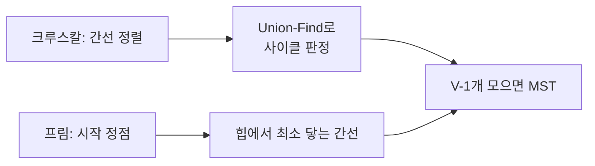

## 모든 점을 잇되, 가장 싸게

도시들을 광케이블로 전부 연결하되 총 비용을 최소로 하려면? 모든 정점을 사이클 없이 잇는 부분 그래프가 **신장 트리(spanning tree)** 이고, 그중 간선 가중치 합이 최소인 것이 **최소 신장 트리(MST)** 입니다. 정점 $V$개를 잇는 트리는 정확히 $V-1$개의 간선을 가집니다. 클러스터 네트워크 설계, 근사 클러스터링, 회로 배선이 전부 이 문제입니다.

MST의 토대는 **컷 정리(cut property)**: 그래프를 두 덩어리로 가르는 어떤 컷에서도, **그 컷을 건너는 가장 가벼운 간선은 반드시 어떤 MST에 포함**됩니다. 크루스칼과 프림은 이 정리를 다르게 활용할 뿐입니다.

## 크루스칼 — 싼 간선부터, 사이클만 피해서

**크루스칼**은 단순합니다. 모든 간선을 **가중치 오름차순**으로 정렬한 뒤, 싼 것부터 보며 **사이클을 만들지 않으면 채택**합니다. $V-1$개를 모으면 끝. 아래에서 간선이 가벼운 순으로 검사되며, 트리를 잇는 간선은 초록으로 채택, 사이클을 만드는 간선은 빨강으로 버려지는 걸 보세요.

<div class="mst12-kruskal" markdown="0">
<style>
.mst12-kruskal{margin:1.4rem 0;overflow-x:auto}
.mst12-kruskal svg{width:100%;max-width:540px;height:auto;display:block;margin:0 auto;font-family:inherit}
.mst12-kruskal .nd{fill:none;stroke:currentColor;stroke-width:1.8}
.mst12-kruskal .t{fill:currentColor;font-size:12px;font-weight:600}
.mst12-kruskal .w{fill:currentColor;font-size:11px;opacity:.7}
.mst12-kruskal .base{stroke:currentColor;opacity:.18;stroke-width:1.4}
.mst12-kruskal .acc{stroke:#2f9e44;stroke-width:3.4;opacity:0}
.mst12-kruskal .rej{stroke:#e03131;stroke-width:3;stroke-dasharray:5 4;opacity:0}
.mst12-kruskal .a1{animation:mst12show 7s ease-in-out infinite;animation-delay:.6s}
.mst12-kruskal .a2{animation:mst12show 7s ease-in-out infinite;animation-delay:1.6s}
.mst12-kruskal .a3{animation:mst12show 7s ease-in-out infinite;animation-delay:2.6s}
.mst12-kruskal .a4{animation:mst12show 7s ease-in-out infinite;animation-delay:4.2s}
.mst12-kruskal .r1{animation:mst12rej 7s ease-in-out infinite;animation-delay:3.6s}
@keyframes mst12show{0%{opacity:0}6%{opacity:.95}92%{opacity:.95}98%{opacity:0}100%{opacity:0}}
@keyframes mst12rej{0%{opacity:0}5%{opacity:.9}11%{opacity:.9}20%{opacity:0}100%{opacity:0}}
</style>
<svg viewBox="0 0 500 220" role="img" aria-label="크루스칼이 간선을 가중치 오름차순으로 검사해 사이클을 만들지 않는 간선만 채택하고 사이클 간선은 버리며 최소 신장 트리를 키우는 애니메이션">
  <line class="base" x1="80" y1="60" x2="240" y2="40"/>
  <line class="base" x1="80" y1="60" x2="120" y2="170"/>
  <line class="base" x1="240" y1="40" x2="400" y2="70"/>
  <line class="base" x1="120" y1="170" x2="300" y2="180"/>
  <line class="base" x1="240" y1="40" x2="300" y2="180"/>
  <line class="base" x1="300" y1="180" x2="400" y2="70"/>
  <line class="acc a1" x1="240" y1="40" x2="400" y2="70"/>
  <line class="acc a2" x1="80" y1="60" x2="240" y2="40"/>
  <line class="acc a3" x1="80" y1="60" x2="120" y2="170"/>
  <line class="rej r1" x1="240" y1="40" x2="300" y2="180"/>
  <line class="acc a4" x1="120" y1="170" x2="300" y2="180"/>
  <text class="w" x="160" y="38">2</text>
  <text class="w" x="92"  y="120">3</text>
  <text class="w" x="320" y="48">1</text>
  <text class="w" x="200" y="190">4</text>
  <text class="w" x="280" y="115">7</text>
  <text class="w" x="360" y="135">5</text>
  <circle class="nd" cx="80"  cy="60"  r="16"/>
  <circle class="nd" cx="240" cy="40"  r="16"/>
  <circle class="nd" cx="400" cy="70"  r="16"/>
  <circle class="nd" cx="120" cy="170" r="16"/>
  <circle class="nd" cx="300" cy="180" r="16"/>
  <text class="t" x="80"  y="65"  text-anchor="middle">A</text>
  <text class="t" x="240" y="45"  text-anchor="middle">B</text>
  <text class="t" x="400" y="75"  text-anchor="middle">C</text>
  <text class="t" x="120" y="175" text-anchor="middle">D</text>
  <text class="t" x="300" y="185" text-anchor="middle">E</text>
</svg>
</div>

여기서 "**사이클을 만드는가?**"를 빠르게 판정하는 게 관건입니다 — 두 정점이 이미 **같은 덩어리**에 속하면 잇는 순간 사이클입니다. 이걸 거의 $O(1)$에 답하는 자료구조가 **Union-Find**입니다.

## Union-Find — 분리 집합, 거의 상수 시간의 비밀

**Union-Find(분리 집합, DSU)** 는 두 연산만 합니다. `find(x)`(x가 속한 집합의 대표를 반환)와 `union(x, y)`(두 집합을 합침). 각 원소가 부모를 가리키는 숲(forest)으로, 같은 트리에 있으면 같은 집합입니다.

순진하게 하면 트리가 한 줄로 길어져 `find`가 $O(n)$이 됩니다. 두 가지 최적화가 이를 **거의 상수**로 만듭니다.

- **union by rank/size**: 항상 작은 트리를 큰 트리 밑에 붙여 높이 억제.
- **경로 압축(path compression)**: `find` 도중 거쳐 간 모든 노드를 **루트에 직접** 매답니다.

아래는 경로 압축의 마법입니다. 길게 늘어진 체인에서 `find(A)`를 호출하면, 거쳐 간 노드들이 전부 루트로 **납작하게** 재배치됩니다 — 다음 조회는 한 번에 끝.

<div class="mst12-pc" markdown="0">
<style>
.mst12-pc{margin:1.4rem 0;overflow-x:auto}
.mst12-pc svg{width:100%;max-width:520px;height:auto;display:block;margin:0 auto;font-family:inherit}
.mst12-pc .nd{fill:none;stroke:currentColor;stroke-width:1.8}
.mst12-pc .root{fill:#1971c2;opacity:.18;stroke:#1971c2;stroke-width:2}
.mst12-pc .t{fill:currentColor;font-size:12px;font-weight:600}
.mst12-pc .sub{fill:currentColor;font-size:10px;opacity:.6}
.mst12-pc .chain{stroke:currentColor;opacity:.5;stroke-width:1.8;animation:mst12fade 6s ease-in-out infinite}
@keyframes mst12fade{0%,40%{opacity:.5}55%,100%{opacity:0}}
.mst12-pc .flat{stroke:#1971c2;stroke-width:2.2;opacity:0;stroke-dasharray:3 3;animation:mst12flat 6s ease-in-out infinite}
@keyframes mst12flat{0%,42%{opacity:0}58%,95%{opacity:.75}100%{opacity:0}}
.mst12-pc .tok{fill:#f08c00;opacity:0;animation:mst12tok 6s ease-in-out infinite}
@keyframes mst12tok{0%{opacity:0;transform:translate(0,0)}5%{opacity:1;transform:translate(0,0)}18%{transform:translate(-70px,-50px)}31%{transform:translate(-140px,-100px)}40%{opacity:1;transform:translate(-200px,-140px)}50%{opacity:0;transform:translate(-200px,-140px)}100%{opacity:0}}
</style>
<svg viewBox="0 0 500 220" role="img" aria-label="Union-Find 경로 압축 — 길게 늘어진 체인에서 find 호출 시 거쳐 간 노드들이 모두 루트에 직접 연결되어 트리가 납작해지는 애니메이션">
  <line class="chain" x1="80" y1="40" x2="180" y2="90"/>
  <line class="chain" x1="180" y1="90" x2="280" y2="140"/>
  <line class="chain" x1="280" y1="140" x2="380" y2="190"/>
  <line class="flat" x1="80" y1="40" x2="280" y2="140"/>
  <line class="flat" x1="80" y1="40" x2="380" y2="190"/>
  <circle class="root" cx="80"  cy="40"  r="17"/>
  <circle class="nd" cx="180" cy="90"  r="17"/>
  <circle class="nd" cx="280" cy="140" r="17"/>
  <circle class="nd" cx="380" cy="190" r="17"/>
  <text class="t" x="80"  y="45"  text-anchor="middle">R</text>
  <text class="t" x="180" y="95"  text-anchor="middle">C</text>
  <text class="t" x="280" y="145" text-anchor="middle">B</text>
  <text class="t" x="380" y="195" text-anchor="middle">A</text>
  <text class="sub" x="430" y="195" text-anchor="middle">find(A)</text>
  <circle class="tok" cx="380" cy="190" r="7"/>
</svg>
</div>

두 최적화를 함께 쓰면 $m$번 연산의 총비용이 $O(m \cdot \alpha(n))$ — 여기서 $\alpha$는 **역 아커만 함수**로, 우주의 원자 수쯤 되는 $n$에서도 4 이하입니다. 사실상 상수입니다.

```python
parent = list(range(n)); rank = [0]*n
def find(x):
    while parent[x] != x:
        parent[x] = parent[parent[x]]   # 경로 압축(절반)
        x = parent[x]
    return x
def union(a, b):
    ra, rb = find(a), find(b)
    if ra == rb: return False            # 이미 같은 집합 = 사이클
    if rank[ra] < rank[rb]: ra, rb = rb, ra
    parent[rb] = ra
    if rank[ra] == rank[rb]: rank[ra] += 1
    return True
```

## 프림 — 한 덩어리를 키워나가기

**프림**은 다익스트라를 닮았습니다. 한 정점에서 시작해, **지금 트리에 닿는 가장 가벼운 간선**을 힙으로 골라 트리를 키웁니다. $O(E \log V)$. 간선이 빽빽한(dense) 그래프에선 프림이, 듬성한(sparse) 그래프에선 크루스칼이 흔히 유리합니다.

| | 크루스칼 | 프림 |
|---|---|---|
| 접근 | 간선 정렬 → 사이클 회피 | 정점 트리 확장 |
| 핵심 구조 | Union-Find | 우선순위 힙 |
| 시간 | $O(E \log E)$ | $O(E \log V)$ |
| 유리한 곳 | 희소 그래프 | 밀집 그래프 |



## 프로덕션에서 마주치는 함정

| 함정 | 증상 | 해법 |
|------|------|------|
| union by rank 없이 경로압축만 | 일부 입력서 느림 | 둘 다 적용(rank/size + 압축) |
| `find`에서 재귀 | 큰 입력 스택 오버플로 | 반복 + 절반 경로압축 |
| 비연결 그래프에 MST | $V-1$개 못 모음 | 최소 신장 **숲**(컴포넌트별) |
| 간선 가중치 동률 | MST가 유일하지 않음 | 타이브레이크 규칙 고정(재현성) |
| Union-Find로 "연결 끊기" 시도 | 불가(합치기 전용) | 삭제 필요하면 다른 구조(LCT 등) |

## 면접/리뷰 단골 질문

- **Q. MST 간선 수?** → 항상 $V-1$. 사이클 없이 모두 연결.
- **Q. 크루스칼이 사이클을 어떻게 빨리 판정?** → Union-Find. 두 끝점이 같은 집합이면 사이클 → 버림.
- **Q. Union-Find가 거의 O(1)인 이유?** → union by rank + 경로 압축 → $O(\alpha(n))$, 역 아커만은 사실상 ≤4.
- **Q. 크루스칼 vs 프림 선택?** → 희소면 크루스칼, 밀집이면 프림. 간선이 이미 정렬돼 있으면 크루스칼 유리.
- **Q. 컷 정리?** → 어떤 컷이든 그 컷을 건너는 최소 간선은 어떤 MST에 포함된다. 두 알고리즘의 정당성 근거.

## 정리

- **MST** = 모든 정점을 사이클 없이 잇는 최소 비용 트리($V-1$ 간선). 토대는 **컷 정리**.
- **크루스칼**(간선 정렬 + Union-Find로 사이클 회피) vs **프림**(힙으로 트리 확장). 희소↔밀집으로 선택.
- **Union-Find**는 union by rank + 경로 압축으로 **거의 상수**($\alpha(n)$). 연결성 판정의 만능 도구.
- 합치기 전용이라 "끊기"는 못 한다 — 동적 연결 끊김엔 다른 구조가 필요.

> [그래프 순회]()·[최단 경로]()에 이은 그래프 3부작의 마지막입니다. 여기서 쓴 "정렬 후 그리디"는 다음 [동적 계획법]()·[그리디]() 편에서 더 깊게 다룹니다.
</content>
