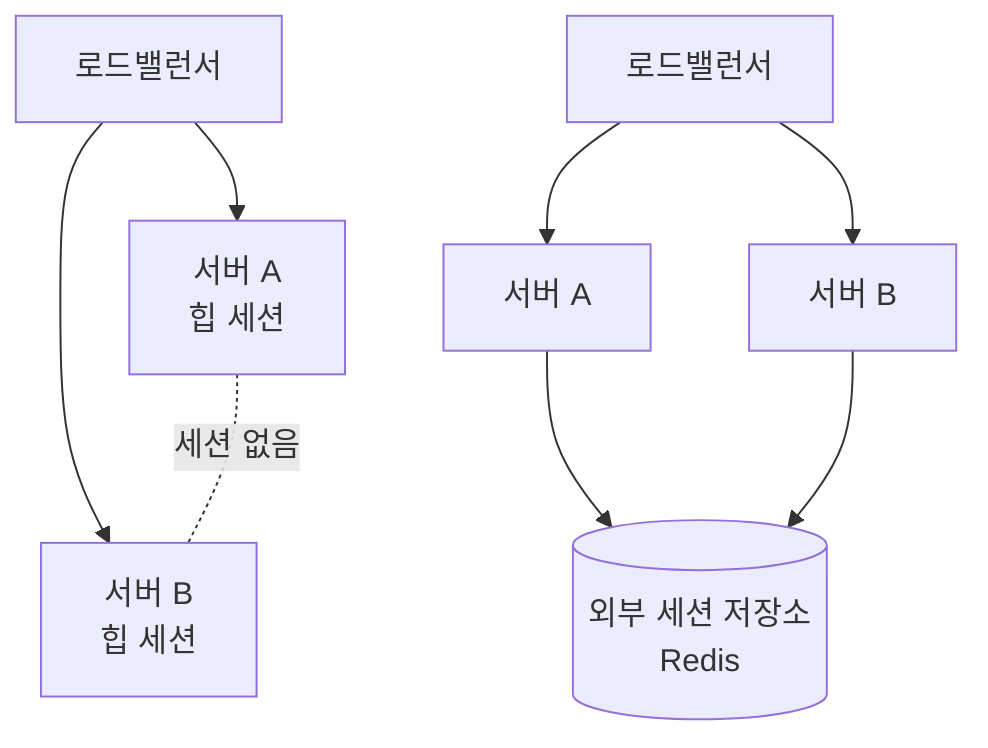

## 한 대일 땐 멀쩡하던 로그인이 풀린다

서버를 여러 대로 늘리는 작업을 다룬 주가 있었다. 그때 가장 먼저 터지는 게 세션이다. 핵심은 단순하다. **기본 세션은 그 서버의 메모리(JVM 힙) 안에만 존재한다.** 서버가 한 대일 땐 문제없지만, 두 대 이상으로 늘리고 로드밸런서가 요청을 분산하면, A서버에서 로그인한 사용자의 다음 요청이 B서버로 가는 순간 세션이 없어 로그인이 풀린다.

이건 "세션을 어디에 저장하느냐"의 문제다. 상태를 특정 인스턴스에 묶어두면 그 인스턴스가 곧 단일 장애점이자 확장의 벽이 된다.

## 핵심 개념 — 상태의 위치를 옮긴다



해법은 세 갈래다.

**1. Sticky Session.** 로드밸런서가 같은 클라이언트를 항상 같은 서버로 보낸다. 가장 쉽지만 근본 해법이 아니다. 그 서버가 죽으면 거기 묶인 모든 세션이 사라지고, 서버 간 부하가 고르지 않으며, 무중단 배포로 인스턴스를 교체할 때 세션이 끊긴다.

**2. 세션 복제(replication).** 모든 서버가 서로 세션을 복제한다. 서버 수가 늘수록 복제 트래픽이 제곱으로 늘어 확장성이 나쁘다.

**3. 외부 세션 저장소.** 세션을 JVM 힙이 아니라 모든 서버가 공유하는 외부 저장소(Redis 등)에 둔다. 서버는 상태를 갖지 않는 **stateless**가 되고, 어느 서버로 요청이 가든 같은 세션을 읽는다. 이게 정석이다.

왜 외부 저장소가 정답인가. 서버를 stateless하게 만들면 인스턴스를 자유롭게 늘리고 줄이고 교체할 수 있다. 죽은 서버의 세션도 저장소에 남아 있으므로 다른 서버가 이어받는다.

## 코드 예시 — Spring Session

Spring Session은 세션 저장 위치만 바꾼다. 애플리케이션 코드(`HttpSession` 사용부)는 그대로 둔 채 의존성과 설정만 추가한다.

```java
@Configuration
@EnableRedisHttpSession(maxInactiveIntervalInSeconds = 1800)
public class SessionConfig {
    // 이후 HttpSession 호출은 자동으로 Redis에 저장/조회된다
}
```

```java
@PostMapping("/login")
public String login(HttpServletRequest request, LoginForm form) {
    // 이 setAttribute가 힙이 아니라 Redis로 간다
    request.getSession().setAttribute("userId", authenticate(form));
    return "redirect:/";
}
```

세션 식별자(쿠키의 `SESSIONID`)는 그대로지만, 그 ID로 조회하는 실제 세션 데이터가 외부 저장소에 있다는 점만 달라진다.

## 운영 함정

**세션에 무거운 객체를 담는다.** 외부 저장소를 쓰면 세션 데이터는 매 요청 직렬화/역직렬화되어 네트워크를 탄다. 거대한 리스트나 전체 사용자 엔티티를 세션에 넣으면 모든 요청이 느려진다. 세션에는 식별자와 최소 상태만 담는다.

**세션 만료와 동시 갱신.** 외부 저장소의 TTL과 애플리케이션의 세션 타임아웃을 일치시키지 않으면, 한쪽은 만료로 보는데 다른 쪽은 살아 있는 불일치가 생긴다. 또한 한 사용자의 동시 요청이 같은 세션을 갱신하면 마지막 쓰기가 이긴다 — 동시성이 중요한 값은 세션이 아니라 DB에 둔다.

## 핵심 요약

- 기본 세션은 JVM 힙에 있어 인스턴스에 종속된다. 스케일아웃하면 세션이 사라진다.
- sticky session은 임시방편이다. 정석은 세션을 **외부 저장소**로 옮겨 서버를 stateless하게 만드는 것.
- 세션에는 최소 상태만 담고, TTL과 타임아웃을 일치시킨다.

> **면접 한 줄**: "서버를 늘리니 로그인이 풀린다. 왜?" → 세션이 각 서버의 힙에만 있어 다른 서버로 요청이 가면 세션이 없기 때문이다. 세션을 외부 저장소로 옮겨 모든 서버가 공유하면 해결된다.
