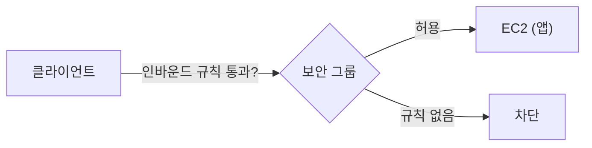
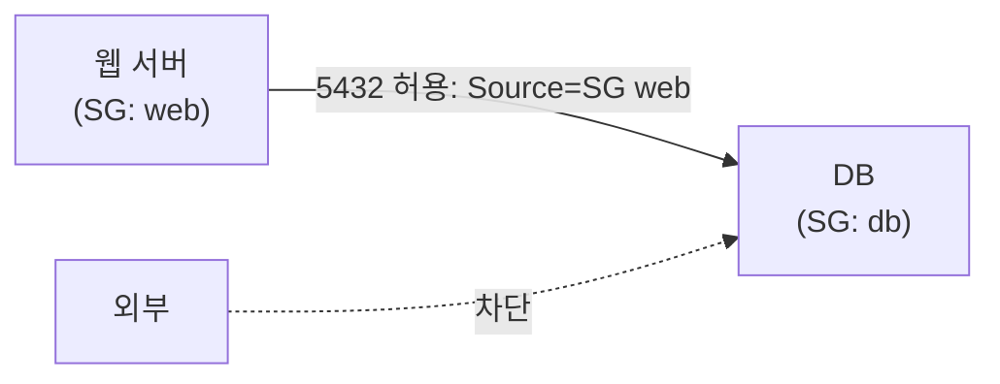

## "포트 열었는데 왜 접속이 안 되죠?"

EC2에 애플리케이션을 띄웠는데 외부에서 접속이 안 될 때, 십중팔구 **보안 그룹(Security Group)** 설정 문제입니다. AWS를 처음 쓰면 가장 자주 막히는 지점이라, 개념을 제대로 잡아두면 좋습니다.

## 보안 그룹 = 인스턴스 단위 가상 방화벽

보안 그룹은 EC2 인스턴스(정확히는 ENI) 앞단에서 트래픽을 통제하는 **가상 방화벽**입니다.

- **인바운드(Inbound)**: 들어오는 트래픽 규칙
- **아웃바운드(Outbound)**: 나가는 트래픽 규칙
- **허용(allow) 규칙만** 존재합니다. "차단" 규칙은 없고, 규칙에 없으면 기본 거부.
- **상태 저장(stateful)**: 인바운드로 허용된 요청의 응답은 아웃바운드 규칙과 무관하게 자동 허용됩니다.



## 핵심: 원본(Source) 개념

인바운드 규칙에서 가장 중요한 게 **Source(원본)** 입니다. "어디서 오는 트래픽을 허용할지"를 정합니다. 두 가지 방식이 있습니다.

### 1. IP 주소(CIDR) 기반

특정 IP 대역에서의 접근을 허용합니다.

- `0.0.0.0/0`: **모든 IP** (전 세계 누구나). HTTP(80)/HTTPS(443)엔 흔하지만, **SSH(22)에 이걸 열면 매우 위험**합니다.
- `123.45.67.89/32`: 특정 IP 하나만 (`/32`는 단일 IP).
- 회사 IP 대역 등 특정 CIDR만 허용.

```text
인바운드 예시
- HTTP   80   Source: 0.0.0.0/0        (웹은 전체 공개)
- SSH    22   Source: 123.45.67.89/32  (내 IP만!)
```

### 2. 다른 보안 그룹 참조

Source에 IP가 아니라 **다른 보안 그룹 ID**를 지정할 수 있습니다. 이게 강력합니다.

> 예: DB 보안 그룹의 인바운드(5432)의 Source를 **"웹 서버 보안 그룹"** 으로 지정 → "웹 서버 보안 그룹에 속한 인스턴스만" DB에 접근 허용.
{: .prompt-tip }



IP는 인스턴스가 늘거나 바뀌면 관리가 어렵지만, **보안 그룹 참조는 그룹 멤버십으로 동적으로 관리**되어 훨씬 견고합니다. 내부 통신(웹↔DB, 앱↔Redis 등)엔 이 방식이 정석입니다.

## 자주 하는 실수

- **SSH(22)를 `0.0.0.0/0`으로 개방** → 전 세계가 SSH를 시도. 반드시 내 IP/VPN 대역으로 제한.
- 인바운드만 보고 **아웃바운드를 잊음** → 단, 상태 저장이라 응답은 자동 허용되니 보통 문제 없음.
- 보안 그룹은 통과했는데 **OS 방화벽(iptables)** 이나 **네트워크 ACL**에서 막히는 경우도 있으니 함께 점검.

## 정리

- 보안 그룹 = 인스턴스 단위 **가상 방화벽**, 허용 규칙만, 상태 저장.
- 인바운드의 **Source**가 핵심: **CIDR**(IP 대역) 또는 **다른 보안 그룹 참조**.
- 내부 서비스 간 통신은 **보안 그룹 참조**가 IP보다 견고.
- **SSH를 전체 개방하지 말 것** — 단골 보안 사고 원인.
