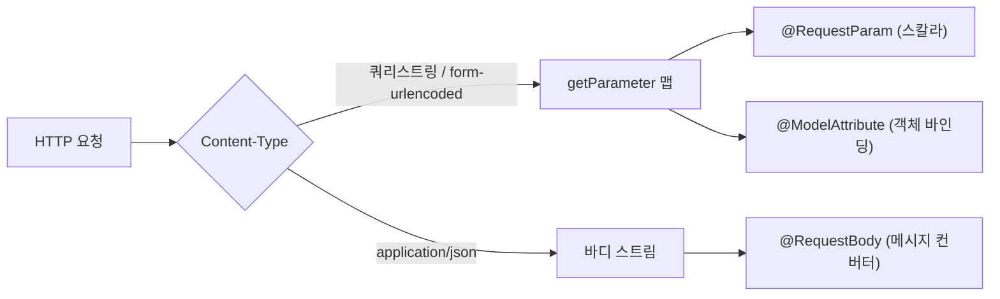

요청 파라미터를 다루다 보면 같은 데이터인데도 어떤 건 `@RequestParam`으로, 어떤 건 `@RequestBody`로 받아야 한다. 셋의 동작 원리를 모르면 "왜 null이 들어오지?"에서 시간을 태운다. 핵심은 **세 애너테이션이 서로 다른 위치에서 데이터를 꺼낸다**는 것이다.

## 셋은 어디서 값을 꺼내는가

Spring MVC는 `HandlerMethodArgumentResolver` 체인으로 파라미터를 해석한다. 애너테이션마다 담당 리졸버가 다르다.

- **`@RequestParam`** — 서블릿의 `request.getParameter()`를 읽는다. 이 메서드는 쿼리스트링과 `application/x-www-form-urlencoded` 바디를 **하나로 합쳐** 노출한다. 즉 `?q=hello`든 폼 전송이든 같은 통로다. 단일 스칼라(문자열, 숫자)에 쓴다.
- **`@ModelAttribute`** — 같은 파라미터 맵을 읽되, 객체의 setter/필드에 **이름으로 매핑**한다. `DataBinder`가 프로퍼티 단위로 형변환을 돌린다. 폼 데이터를 DTO로 묶을 때 쓴다.
- **`@RequestBody`** — 위 둘과 통로가 완전히 다르다. `HttpMessageConverter`가 **바디 스트림 전체**를 읽어 역직렬화한다. JSON이면 `MappingJackson2HttpMessageConverter`가 처리한다. 쿼리스트링은 쳐다보지 않는다.

여기서 가장 흔한 오해가 풀린다. `Content-Type: application/json`으로 보낸 JSON을 `@RequestParam`으로 받으려 하면 절대 안 들어온다. `getParameter()`는 JSON 바디를 파싱하지 않기 때문이다.



## 콘텐츠 타입 매칭

`@RequestBody`는 요청의 `Content-Type`을 보고 컨버터를 고른다. `consumes` 속성으로 제약을 걸 수 있고, 매칭되는 컨버터가 없으면 **415 Unsupported Media Type**이 난다. 반대로 `@RequestParam`/`@ModelAttribute`는 form 계열·쿼리만 다루므로 JSON 바디와는 본질적으로 무관하다.

## 코드 예시

```java
// 검색: 스칼라 파라미터
@GetMapping("/products")
public List<Product> search(
    @RequestParam(defaultValue = "") String keyword,
    @RequestParam(defaultValue = "0") int page) { ... }

// 폼 전송: 객체 바인딩
@PostMapping(value = "/products", consumes = MediaType.APPLICATION_FORM_URLENCODED_VALUE)
public Product create(@ModelAttribute ProductForm form) { ... }

// JSON API
@PostMapping(value = "/orders", consumes = MediaType.APPLICATION_JSON_VALUE)
public Order place(@RequestBody OrderRequest req) { ... }
```

## 바인딩 실패 시 무엇이 터지는가

형변환은 실패 지점이다. 애너테이션별로 예외가 다르다.

- `@RequestParam`에서 `int` 자리에 `"abc"` → `MethodArgumentTypeMismatchException` (기본 400).
- `required=true`(기본)인데 파라미터가 없으면 → `MissingServletRequestParameterException` (400).
- `@RequestBody` JSON 파싱 실패 → `HttpMessageNotReadableException` (400).
- `@ModelAttribute` 바인딩 오류는 예외가 아니라 `BindingResult`에 **쌓인다**. 그래서 바로 뒤에 `BindingResult` 파라미터를 두지 않으면, 오류가 있어도 메서드는 그냥 실행되고 필드만 비어 있다.

## 운영 함정

**함정 1 — `@ModelAttribute`의 조용한 실패.** `BindingResult`를 받지 않으면 바인딩 오류가 무시된다. 검증을 강제하려면 `@Valid`를 붙이고 `BindingResult`를 받아 직접 처리하거나, 받지 않아 `MethodArgumentNotValidException`이 나게 한다.

**함정 2 — `@RequestBody`로 받은 객체에 검증이 안 걸린다.** `@Valid` 없이 `@RequestBody`만 쓰면 JSON이 그대로 매핑된다. 입력 검증은 항상 `@Valid @RequestBody`처럼 명시해야 한다.

## 핵심 요약

- `@RequestParam`/`@ModelAttribute`는 `getParameter()`(쿼리+form) 통로, `@RequestBody`는 메시지 컨버터(바디 스트림) 통로다.
- JSON은 `@RequestBody`로만 받는다. `@RequestParam`으로는 절대 안 들어온다.
- 형변환·필수값 실패는 대부분 400이지만, `@ModelAttribute`는 예외 없이 `BindingResult`에 오류를 쌓으므로 검증을 명시적으로 트리거해야 한다.

> **면접 한 줄 Q&A**
> Q. JSON 바디를 `@RequestParam`으로 받으면?
> A. 안 받아진다. `getParameter()`는 JSON 바디를 파싱하지 않으므로 값은 null/기본값이 된다. JSON은 메시지 컨버터를 쓰는 `@RequestBody`로 받아야 한다.
