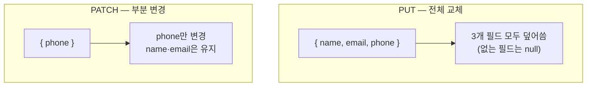

수정 API를 만들 때 가장 먼저 부딪히는 질문은 "클라이언트가 일부 필드만 보냈을 때 나머지를 어떻게 처리할 것인가"다. 이 결정이 곧 PUT과 PATCH의 차이이며, 잘못 구현하면 사용자가 건드리지도 않은 필드가 null로 날아간다.

## PUT — 전체 교체와 멱등성

PUT의 의미는 "이 URI의 리소스를 **요청 바디로 통째로 대체하라**"다. 따라서 PUT 요청은 리소스의 완전한 표현을 담아야 한다. 바디에 `phone`이 없으면, 그 의미는 "phone을 비워라"다.

PUT은 **멱등(idempotent)**하다. 같은 요청을 100번 보내도 결과 상태는 한 번 보낸 것과 같다. 전체를 같은 값으로 덮어쓰기 때문이다. 멱등성은 단순한 정의가 아니라 실용적 가치가 있다. 네트워크 타임아웃 후 클라이언트가 재시도해도 안전하다.

## PATCH — 부분 변경

PATCH는 "**바디에 명시된 부분만** 적용하라"다. 보내지 않은 필드는 손대지 않는다. PATCH는 명세상 멱등을 보장하지 않는다(예: "수량 +1" 같은 델타 연산이 가능하므로). 다만 우리가 흔히 쓰는 "보낸 필드를 그 값으로 세팅" 방식은 사실상 멱등하게 구현된다.



## null이냐, 미전송이냐 — 직렬화의 함정

PATCH 구현의 핵심 난점은 이것이다. 클라이언트가 `{"phone": null}`을 보냈다 — "전화번호를 지워라"인가, "phone 필드를 안 건드린다"인가? 일반 DTO로 받으면 **둘을 구분할 수 없다**. 미전송 필드도 역직렬화 후 null이고, 명시적 null도 null이기 때문이다.

해결책은 "값이 들어왔는지" 자체를 표현하는 타입을 쓰는 것이다. Java라면 `Optional`이나 별도 래퍼, 혹은 들어온 키만 담은 Map으로 받는다.

```java
public class UserPatchRequest {
    // 미전송이면 Optional 자체가 null, 값이 오면 Optional.of(...) / Optional.empty()
    private Optional<String> name;
    private Optional<String> phone;
}

@PatchMapping("/users/{id}")
public User patch(@PathVariable Long id, @RequestBody Map<String, Object> changes) {
    User user = repo.find(id);
    if (changes.containsKey("name"))  user.setName((String) changes.get("name"));
    if (changes.containsKey("phone")) user.setPhone((String) changes.get("phone")); // null이면 지우기
    return repo.save(user);
}
```

`containsKey`로 **"키의 존재"**와 **"값이 null"**을 분리하는 것이 핵심이다.

## 운영 함정

**함정 1 — PATCH인데 PUT처럼 구현.** DTO를 받아 그대로 엔티티에 매핑하면, 클라이언트가 일부만 보내도 나머지 필드가 DTO 기본값(보통 null)으로 덮인다. 사용자가 이름만 바꿨는데 이메일이 사라진다. PATCH는 반드시 "들어온 필드만" 반영해야 한다.

**함정 2 — 동시 수정 충돌.** 두 클라이언트가 같은 리소스를 PATCH하면 나중 요청이 앞 요청을 모르고 덮을 수 있다. `If-Match` + ETag 또는 버전 컬럼으로 낙관적 락을 걸어 충돌을 감지하라.

## 핵심 요약

- PUT은 전체 교체이며 멱등하다. 바디는 리소스의 완전한 표현이어야 한다.
- PATCH는 부분 변경이며, 보내지 않은 필드는 건드리지 않는다.
- PATCH의 진짜 난제는 "null 전송"과 "필드 미전송"의 구분이다. `Optional`/Map+`containsKey`로 해결한다.

> **면접 한 줄 Q&A**
> Q. PATCH로 `{"phone": null}`이 왔다. 어떻게 처리하나?
> A. 일반 DTO로는 미전송과 구분이 안 되므로, 키 존재 여부를 보존하는 구조(Map+containsKey, Optional)로 받아 "키가 있으면 null로 지운다"를 명시적으로 처리한다.
