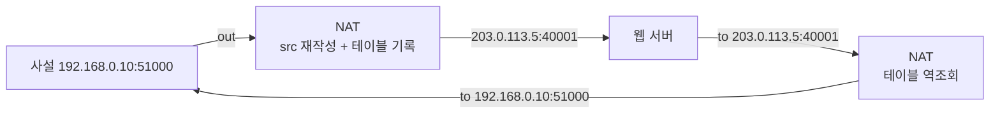

## "공인 IP는 한 개인데, 집 안 기기는 열 개"

집 공유기에 노트북·폰·TV·콘솔이 다 붙어 있어도, ISP가 준 공인 IP는 보통 **한 개**입니다. 그런데 다들 동시에 인터넷이 됩니다. 이걸 가능하게 하는 게 **NAT(Network Address Translation)** 입니다.

NAT는 단순한 "주소 바꿔치기"가 아닙니다. IPv4 주소 고갈을 20년 넘게 버티게 한 핵심 기술이자, 동시에 **P2P·화상통화·게임이 그렇게 고생하는 근본 원인**이며, AWS에서 사설 서브넷이 인터넷에 나가는 유일한 통로(NAT Gateway)이기도 합니다. 이 글은 NAT의 **변환 테이블**을 들여다보고, 왜 어떤 NAT는 P2P가 되고 어떤 건 절대 안 되는지까지 내려갑니다.

## NAPT 변환 테이블: NAT의 심장

집에서 쓰는 NAT는 정확히는 **NAPT(Network Address Port Translation)**, 흔히 PAT라 부릅니다. 핵심은 **포트 번호로 여러 내부 호스트를 구분**한다는 것입니다.

내부 호스트가 패킷을 내보내면 NAT는 ① 출발지 주소·포트를 자신의 공인 IP·새 포트로 **재작성**하고 ② 그 매핑을 **변환 테이블에 기록**합니다. 응답이 돌아오면 그 테이블을 역조회해 원래 내부 호스트로 되돌립니다.

<div class="nat-tr" markdown="0">
<style>
.nat-tr{margin:1.4rem 0;overflow-x:auto}
.nat-tr svg{width:100%;max-width:720px;height:auto;display:block;margin:0 auto;font-family:inherit}
.nat-tr .bx{fill:none;stroke:currentColor;stroke-width:1.6;opacity:.5}
.nat-tr .lbl{fill:currentColor;font-size:11.5px;font-weight:600}
.nat-tr .sub{fill:currentColor;font-size:9.5px;opacity:.6}
.nat-tr .mono{font-family:ui-monospace,Menlo,monospace;font-size:9.5px;fill:currentColor}
.nat-tr .wire{stroke:currentColor;opacity:.25;stroke-width:1.4}
.nat-tr .out{fill:#1971c2;animation:natout 5s linear infinite}
.nat-tr .ret{fill:#2f9e44;opacity:0;animation:natret 5s linear infinite}
.nat-tr .row{opacity:0;animation:natrow 5s linear infinite}
.nat-tr .relbl{opacity:0;animation:natrelbl 5s linear infinite}
@keyframes natout{0%{transform:translateX(0);opacity:0}5%{opacity:1}40%{transform:translateX(270px);opacity:1}48%{transform:translateX(290px);opacity:0}100%{opacity:0}}
@keyframes natrow{0%{opacity:0}22%{opacity:0}30%{opacity:1}100%{opacity:1}}
@keyframes natrelbl{0%{opacity:0}30%{opacity:0}38%{opacity:1}100%{opacity:1}}
@keyframes natret{0%{opacity:0}55%{opacity:0;transform:translateX(290px)}60%{opacity:1}95%{transform:translateX(0);opacity:1}100%{opacity:0}}
</style>
<svg viewBox="0 0 700 250" role="img" aria-label="내부 호스트의 출발지 주소·포트를 NAT가 공인 주소로 재작성하고 변환 테이블에 기록한 뒤, 응답을 역변환해 되돌리는 과정 애니메이션">
  <rect class="bx" x="20"  y="30" width="120" height="50" rx="8"/>
  <text class="lbl" x="80" y="52" text-anchor="middle">내부 호스트</text>
  <text class="mono" x="80" y="68" text-anchor="middle">192.168.0.10:51000</text>
  <rect class="bx" x="290" y="30" width="120" height="50" rx="8"/>
  <text class="lbl" x="350" y="58" text-anchor="middle">NAT (공유기)</text>
  <rect class="bx" x="560" y="30" width="120" height="50" rx="8"/>
  <text class="lbl" x="620" y="52" text-anchor="middle">웹 서버</text>
  <text class="mono" x="620" y="68" text-anchor="middle">93.184.216.34:443</text>
  <line class="wire" x1="140" y1="55" x2="290" y2="55"/>
  <line class="wire" x1="410" y1="55" x2="560" y2="55"/>
  <rect class="out" x="150" y="46" width="14" height="14" rx="2"/>
  <rect class="ret" x="150" y="46" width="14" height="14" rx="2"/>
  <text class="sub" x="215" y="40" text-anchor="middle">src 51000</text>
  <text class="relbl" x="485" y="40" text-anchor="middle" style="fill:#f08c00;font-weight:600;font-size:9.5px">src→203.0.113.5:40001</text>
  <rect class="bx row" x="220" y="120" width="280" height="90" rx="8"/>
  <text class="lbl row" x="360" y="140" text-anchor="middle">변환 테이블 (conntrack)</text>
  <text class="mono row" x="240" y="162">내부              →  공인(변환)</text>
  <text class="mono row" x="240" y="180" style="fill:#1971c2">192.168.0.10:51000</text>
  <text class="mono row" x="392" y="180">→</text>
  <text class="mono row" x="410" y="180" style="fill:#f08c00">203.0.113.5:40001</text>
  <text class="mono row" x="240" y="198" style="opacity:.55">프로토콜 TCP · 상태 ESTABLISHED · TTL</text>
</svg>
</div>

이 테이블 덕분에 NAT 뒤의 모든 기기가 **같은 공인 IP를 공유**하면서도, 응답이 엉뚱한 기기로 가지 않습니다. 구분자는 **NAT가 새로 배정한 포트 번호**(위에서 40001)입니다. 포트가 16비트라 이론상 한 공인 IP로 6만여 개의 동시 흐름을 다중화할 수 있습니다.



## NAT는 한 종류가 아니다 — P2P의 운명을 가르는 분류

NAT가 **응답 패킷을 받아들이는 조건**이 얼마나 까다로운지에 따라 동작이 갈립니다. 이 분류가 화상통화·게임의 P2P 성공률을 결정합니다.

| 유형 | 매핑 재사용 | 외부에서 들어오는 패킷 허용 조건 | P2P |
|------|-------------|-------------------------------|-----|
| **Full-cone** | 같은 내부 (IP:port) → 항상 같은 공인 포트 | 누구든 그 공인 포트로 보내면 통과 | 쉬움 |
| **Restricted-cone** | 〃 | **내가 먼저 보낸 적 있는 IP**에서 온 것만 | 가능 |
| **Port-restricted** | 〃 | 내가 먼저 보낸 **IP:port**에서 온 것만 | 가능 |
| **Symmetric** | **목적지마다 다른 공인 포트** 배정 | 그 목적지에서 온 것만 | **거의 불가** |

> **왜 symmetric NAT에서 P2P가 막히나.** symmetric NAT는 *목적지가 다르면 외부 포트도 다르게* 배정합니다. 그래서 STUN 서버에 물어 알아낸 내 공인 포트가, 실제 상대에게 보낼 때는 **다른 포트로 바뀝니다.** 상대가 STUN으로 안 포트는 이미 무효 — 구멍이 안 뚫립니다. 통신사 모바일망·기업망이 흔히 이 유형이라, WebRTC가 TURN 릴레이로 폴백하는 이유가 됩니다.

## NAT 트래버설: 막힌 문에 구멍 뚫기 (홀 펀칭)

서버는 공인 IP로 가만히 기다리면 되지만, NAT 뒤 두 피어가 **서로** 직접 연결하려면 문제가 생깁니다. 둘 다 사설망 안이라 상대가 먼저 들어올 수 없습니다. 해법이 **홀 펀칭**입니다. 공개된 **랑데부(STUN) 서버**로 서로의 공인 (IP:port)를 알아낸 뒤, **동시에** 서로에게 패킷을 쏘아 각자의 NAT에 "나간 적 있음" 매핑을 만들어 구멍을 뚫습니다.

<div class="nat-hp" markdown="0">
<style>
.nat-hp{margin:1.4rem 0;overflow-x:auto}
.nat-hp svg{width:100%;max-width:680px;height:auto;display:block;margin:0 auto;font-family:inherit}
.nat-hp .bx{fill:none;stroke:currentColor;stroke-width:1.6;opacity:.5}
.nat-hp .lbl{fill:currentColor;font-size:11px;font-weight:600}
.nat-hp .sub{fill:currentColor;font-size:9.5px;opacity:.6}
.nat-hp .wire{stroke:currentColor;opacity:.25;stroke-width:1.4;fill:none}
.nat-hp .q{fill:#1971c2;animation:nathpq 5s ease-in-out infinite}
.nat-hp .pa{fill:#f08c00;opacity:0;animation:nathppa 5s ease-in-out infinite}
.nat-hp .pb{fill:#f08c00;opacity:0;animation:nathppb 5s ease-in-out infinite}
.nat-hp .direct{stroke:#2f9e44;stroke-width:2.5;fill:none;opacity:0;stroke-dasharray:6 4;animation:nathpd 5s ease-in-out infinite}
@keyframes nathpq{0%{opacity:0}5%{opacity:1}20%{opacity:1}25%{opacity:0}100%{opacity:0}}
@keyframes nathppa{0%{opacity:0}30%{opacity:0;transform:translate(0,0)}35%{opacity:1}55%{transform:translate(360px,90px);opacity:1}60%{opacity:0}100%{opacity:0}}
@keyframes nathppb{0%{opacity:0}30%{opacity:0;transform:translate(0,0)}35%{opacity:1}55%{transform:translate(-360px,-90px);opacity:1}60%{opacity:0}100%{opacity:0}}
@keyframes nathpd{0%{opacity:0}65%{opacity:0}75%{opacity:.9}95%{opacity:.9}100%{opacity:0}}
</style>
<svg viewBox="0 0 680 230" role="img" aria-label="두 피어가 STUN 서버로 서로의 공인 주소를 알아낸 뒤 동시에 패킷을 쏘아 NAT에 구멍을 뚫고 직접 연결되는 홀 펀칭 애니메이션">
  <rect class="bx" x="20" y="150" width="130" height="48" rx="8"/>
  <text class="lbl" x="85" y="170" text-anchor="middle">피어 A (NAT 뒤)</text>
  <rect class="bx" x="530" y="150" width="130" height="48" rx="8"/>
  <text class="lbl" x="595" y="170" text-anchor="middle">피어 B (NAT 뒤)</text>
  <rect class="bx" x="275" y="14" width="130" height="44" rx="8"/>
  <text class="lbl" x="340" y="34" text-anchor="middle">STUN 서버</text>
  <text class="sub" x="340" y="50" text-anchor="middle">공인 주소 알려줌</text>
  <line class="wire" x1="120" y1="150" x2="300" y2="58"/>
  <line class="wire" x1="560" y1="150" x2="380" y2="58"/>
  <circle class="q" cx="130" cy="145" r="6"/>
  <rect class="pa" x="78" y="168" width="14" height="12" rx="2"/>
  <rect class="pb" x="588" y="168" width="14" height="12" rx="2"/>
  <path class="direct" d="M150 178 Q340 130 530 178"/>
  <text class="sub" x="340" y="150" text-anchor="middle" style="fill:#2f9e44;font-weight:600">직접 연결(구멍 뚫림)</text>
</svg>
</div>

이게 안 되면(symmetric NAT 등) **TURN 서버가 트래픽을 중계**합니다 — 직접 연결 실패 시의 보험입니다. WebRTC의 ICE는 이 후보들(직접/STUN/TURN)을 순서대로 시도합니다.

## 디버깅: 변환 테이블을 직접 보라

NAT 문제는 추측하지 말고 테이블을 봐야 합니다. 리눅스에서 NAT는 netfilter의 **conntrack**이 상태를 추적합니다.

```bash
# NAT 규칙(어떤 트래픽이 MASQUERADE/SNAT/DNAT 되는지)
sudo iptables -t nat -L -n -v

# 살아있는 변환(연결 추적) 테이블 — 실제 매핑이 여기 있다
sudo conntrack -L | head
# tcp  6 431999 ESTABLISHED src=192.168.0.10 dst=93.184.216.34
#   sport=51000 dport=443 src=93.184.216.34 dst=203.0.113.5
#   sport=443 dport=40001 ...

# 현재 추적 중인 연결 수 / 한도
sysctl net.netfilter.nf_conntrack_count net.netfilter.nf_conntrack_max
```

> **프로덕션 함정 — conntrack 테이블 고갈.** 트래픽이 폭증하면 `nf_conntrack_count`가 `nf_conntrack_max`에 닿고, 그 순간 새 연결이 **조용히 드롭**됩니다(`nf_conntrack: table full, dropping packet` 로그). 증상은 "간헐적 연결 실패"라 원인 찾기가 고약합니다. AWS **NAT Gateway**도 동시 연결·포트 배정에 한도가 있어, 한 목적지로 동시 연결이 폭주하면 `ErrorPortAllocation`이 납니다 → 목적지를 분산하거나 NAT GW를 늘립니다.

## AWS에서의 NAT: 사설 서브넷의 유일한 바깥문

AWS VPC에서 사설 서브넷의 인스턴스(예: 내부 DB·배치 서버)는 공인 IP가 없어 인터넷에 직접 못 나갑니다. 그런데 OS 패치·외부 API 호출은 해야 하죠. 이때 **NAT Gateway**가 공인 서브넷에 놓여 **아웃바운드만** 대신 내보내고 응답을 받아 돌려줍니다.

- **왜 아웃바운드 전용인가**: 외부에서 *먼저* 들어오는 연결은 막아 사설 자원을 보호하면서, 안에서 시작한 연결의 응답만 통과시킵니다(상태 추적). NAT의 본질이 곧 보안 경계가 됩니다.
- **포트포워딩(DNAT)** 은 반대 방향: 외부 → 내부 특정 호스트로 들여보내기. 집 공유기의 "포트 개방", AWS에선 로드 밸런서/타깃 그룹이 그 역할을 합니다.

자세한 서브넷·라우팅 테이블 배치는 [VPC 글](), 인바운드 차단 규칙은 [방화벽·보안그룹 글]()에서 다룹니다. NAT가 사설/공인 주소를 다루는 토대는 [IP 주소·서브넷팅](), 변환 후 패킷이 길을 찾는 과정은 [라우팅]()에 있습니다.

## 면접/리뷰 단골 질문

- **Q. NAT 하나로 어떻게 수백 대가 동시에 인터넷을 쓰나?** → NAPT가 **포트 번호로 흐름을 구분**해 다중화한다. 응답은 변환 테이블 역조회로 원래 호스트에 돌아간다.
- **Q. symmetric NAT에서 P2P가 왜 안 되나?** → 목적지마다 외부 포트를 다르게 배정해서, STUN으로 알아낸 포트가 실제 상대에게 보낼 땐 무효가 된다 → 홀 펀칭 실패 → TURN 릴레이로 폴백.
- **Q. 간헐적 연결 실패, NAT가 의심된다. 첫 확인은?** → `nf_conntrack_count` vs `max`, AWS면 NAT GW의 `ErrorPortAllocation`/연결 수 메트릭. 테이블 고갈이면 새 연결만 드롭된다.
- **Q. NAT는 방화벽인가?** → 부수효과로 인바운드를 막지만, 보안 기능이 아니다. 명시적 방화벽/보안그룹과 함께 써야 한다.

## 정리

- NAT(정확히 **NAPT**)는 **포트로 흐름을 구분**해 공인 IP 하나에 수많은 사설 호스트를 다중화한다 — 변환 테이블이 심장.
- NAT 유형(cone/symmetric)이 **P2P 성공 여부**를 가른다. symmetric은 홀 펀칭 실패 → STUN/TURN으로 보완.
- 리눅스는 **conntrack**으로 상태 추적 → **테이블 고갈**이 간헐적 드롭의 단골 원인.
- AWS **NAT Gateway**는 사설 서브넷의 **아웃바운드 전용** 통로. 인바운드는 포트포워딩(DNAT)/LB가 담당.

> 다음 글: NAT 뒤에서 여러 서버로 트래픽을 고르게 나누는 [로드 밸런싱]()으로 이어집니다.
