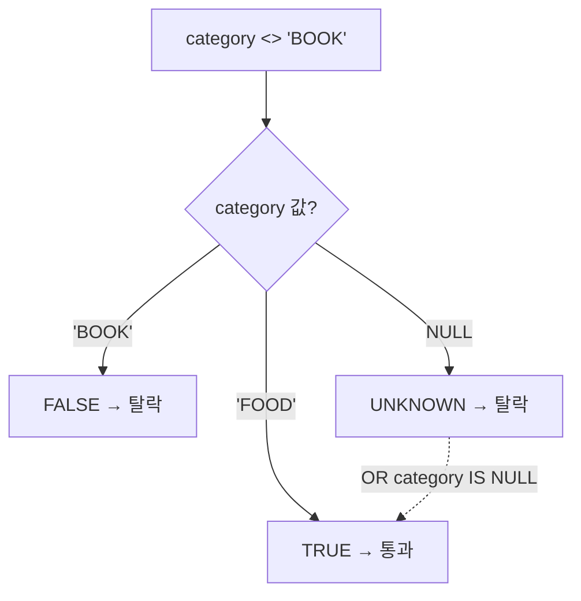

검색 화면에 "특정 태그를 **포함하지 않는** 항목만 보기" 같은 부정 필터를 붙이는 일이 있다. 단순해 보이지만, 이 옵션을 켠 사용자가 "분명히 있어야 할 행이 안 나온다"고 신고하는 일이 잦다. 원인은 거의 항상 NULL이다. 부정 조건과 NULL이 만나면 SQL은 우리가 기대한 집합을 돌려주지 않는다.

## 핵심 개념 — SQL은 삼치 논리다

SQL의 비교 결과는 참/거짓 둘이 아니라 **참(TRUE)·거짓(FALSE)·알 수 없음(UNKNOWN)** 세 가지다. NULL은 "값이 없음"이 아니라 "값을 모름"으로 취급되기 때문이다. 그래서 `category = 'BOOK'`은 `category`가 NULL이면 FALSE가 아니라 UNKNOWN을 낸다. 그리고 WHERE 절은 **TRUE인 행만** 통과시킨다. UNKNOWN과 FALSE는 똑같이 탈락한다.

부정 조건에서 이게 함정이 된다. 사용자가 "category가 'BOOK'이 아닌 것"을 원한다고 하자.

```sql
SELECT * FROM product WHERE category <> 'BOOK';
```

`category`가 NULL인 행은 `NULL <> 'BOOK'` → UNKNOWN → 탈락한다. 하지만 사용자의 머릿속에서 "category가 비어 있는 상품"은 분명히 "BOOK이 아닌 상품"이다. SQL의 논리와 사람의 직관이 갈라지는 지점이다.

`NOT IN`은 더 위험하다. 부분집합에 NULL이 섞이면 결과 전체가 비기도 한다.

```sql
-- 서브쿼리 결과에 NULL이 하나라도 있으면
SELECT * FROM product
WHERE category NOT IN (SELECT excluded_category FROM rule);
```

`x NOT IN (a, b, NULL)`은 `x<>a AND x<>b AND x<>NULL`로 풀린다. 마지막 항이 UNKNOWN이므로 AND 전체가 절대 TRUE가 되지 못한다. 즉 **단 한 행도 통과하지 못한다.** "필터를 켰더니 결과가 0건"이라는 제보의 전형적 원인이다.

## NULL을 의도적으로 포함시키기

해결의 출발점은 "이 부정 필터에서 NULL 행을 결과에 **넣을 것인가 뺄 것인가**"를 명시적으로 결정하는 것이다. 대부분의 사용자 직관은 "넣는다"이다.

```sql
-- NULL(미분류) 상품도 'BOOK 아님'에 포함시키고 싶을 때
SELECT * FROM product
WHERE category <> 'BOOK' OR category IS NULL;
```

`NOT LIKE`도 동일하다. "이 키워드를 제목에 포함하지 않는 글"을 찾는다면:

```sql
SELECT * FROM post
WHERE title NOT LIKE '%sale%' OR title IS NULL;
```

`NOT IN`은 가능하면 `NOT EXISTS`로 바꾼다. `NOT EXISTS`는 NULL에 휘둘리지 않고 행 단위로 평가하기 때문에 위 같은 전멸이 일어나지 않는다.

```sql
SELECT p.* FROM product p
WHERE NOT EXISTS (
  SELECT 1 FROM rule r WHERE r.excluded_category = p.category
);
```



## 운영 함정

**함정 1 — 컬럼이 NOT NULL이라 방심한다.** 지금은 NOT NULL이라 문제가 없어도, 조인된 테이블의 컬럼이나 LEFT JOIN으로 늘어난 NULL은 다른 얘기다. LEFT JOIN 뒤의 부정 필터는 매칭되지 않은 쪽이 전부 NULL이라 통째로 사라진다.

**함정 2 — `COALESCE`로 덮으면 인덱스가 죽는다.** `WHERE COALESCE(category,'') <> 'BOOK'`처럼 컬럼을 함수로 감싸면 일반 인덱스를 못 탄다. 데이터가 커지면 풀스캔이 된다. `OR ... IS NULL`로 풀어 쓰거나, 함수 기반 인덱스를 따로 만든다.

## 핵심 요약

- WHERE는 TRUE인 행만 통과시키고, NULL 비교는 UNKNOWN이라 부정 조건에서 행이 조용히 누락된다.
- `NOT IN (… NULL …)`은 결과를 통째로 비울 수 있다 — `NOT EXISTS`로 바꾼다.
- 부정 필터를 만들 때는 "NULL 행을 포함할지"를 반드시 명시적으로 설계하고, 포함이라면 `OR col IS NULL`을 더한다.

**면접 한 줄 Q&A** — Q. `WHERE col NOT IN (1, 2, NULL)`의 결과는? A. NULL 때문에 항상 UNKNOWN이 되어 한 행도 반환되지 않는다. `NOT EXISTS`나 NULL 제거가 필요하다.
