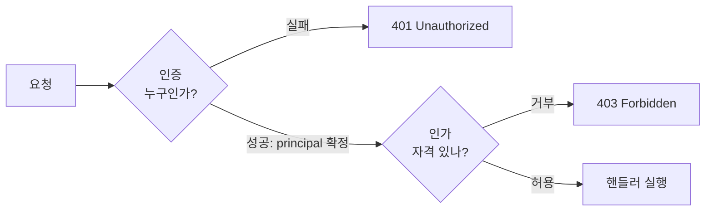

권한별로 보이는 화면과 가능한 동작이 갈리는 기능을 만들다 보면, 코드 곳곳에 "로그인했나?"와 "이걸 할 자격이 있나?"가 뒤엉킨다. 이 둘을 분리하지 못하면 보안 구멍은 항상 그 경계의 틈에서 생긴다. 핵심은 **인증과 인가는 완전히 다른 질문**이라는 것이다.

## 두 개의 다른 질문

- **인증(Authentication)** — "너는 **누구**인가?" 자격 증명(아이디/비밀번호, 토큰, 세션)을 검증해 신원을 확정한다. 결과물은 "확인된 주체(principal)"다.
- **인가(Authorization)** — "그 신원이 **이 행동을 할 자격**이 있는가?" 확정된 신원을 전제로, 자원과 동작에 대한 접근을 허용/거부한다.

순서가 중요하다. 인가는 인증을 **전제**한다. 신원이 없으면 권한을 따질 대상이 없다. 그래서 파이프라인은 항상 인증 → 인가 순이다.



여기서 HTTP 상태 코드도 갈린다. **401 Unauthorized**는 사실 "인증 실패"(이름이 헷갈리게 지어졌다). **403 Forbidden**은 "인증은 됐는데 권한이 없음"이다. 401은 "로그인해라", 403은 "로그인은 했지만 넌 안 된다"다.

## RBAC — 역할로 권한을 묶는다

사용자마다 권한을 일일이 부여하면 관리가 폭발한다. RBAC(Role-Based Access Control)는 사이에 **역할(Role)** 계층을 둔다. 사용자 → 역할 → 권한. 사용자에겐 역할만 주고, 권한은 역할에 묶는다. 신규 입사자에게 "MANAGER 역할"만 주면 그 역할의 모든 권한이 따라온다.

```java
public enum Role { USER, MANAGER, ADMIN }

// 인가 판단: 신원(인증 결과)을 받아 자격만 따진다
public boolean canDeleteOrder(Principal who, Order order) {
    if (who.hasRole(Role.ADMIN)) return true;
    if (who.hasRole(Role.MANAGER) && order.getOwnerTeam().equals(who.getTeam())) return true;
    return false; // 그 외 거부
}
```

인가 로직은 "이미 누구인지 안다"를 전제로 자격만 계산한다. 신원 확인은 끼어들지 않는다 — 그게 분리다.

## 코드 예시 — 인터셉터로 인가 일괄 검사

컨트롤러마다 권한 검사를 복붙하면 누락이 생긴다. 횡단 관심사로 인터셉터에 모은다.

```java
public class AuthorizationInterceptor implements HandlerInterceptor {
    @Override
    public boolean preHandle(HttpServletRequest req, HttpServletResponse res, Object handler) {
        Principal who = (Principal) req.getAttribute("principal"); // 인증 단계가 채워둔 신원
        if (who == null) { res.setStatus(401); return false; }      // 인증 실패

        RequireRole anno = ((HandlerMethod) handler).getMethodAnnotation(RequireRole.class);
        if (anno != null && !who.hasRole(anno.value())) {
            res.setStatus(403); return false;                       // 인가 실패
        }
        return true;
    }
}
```

인증은 앞 단계(필터/별도 인터셉터)가 끝내 `principal`을 심어두고, 이 인터셉터는 인가만 본다. 책임이 깔끔히 나뉜다.

## 운영 함정

**함정 1 — UI에서만 숨기고 서버 인가를 빼먹기.** 버튼을 안 보이게 하는 건 인가가 아니다. 클라이언트는 위조 가능하므로, 모든 권한 검사는 **반드시 서버에서** 한다. 화면 제어는 UX, 서버 검사는 보안이다.

**함정 2 — 소유권(자원 단위) 인가 누락.** "MANAGER면 주문 삭제 가능"까지만 검사하고 "**자기 팀** 주문인가"를 빠뜨리면, 매니저가 남의 자원을 건드린다. 역할(coarse) + 자원 소유(fine) 두 층을 모두 검사하라.

## 핵심 요약

- 인증은 "누구인가", 인가는 "무엇이 가능한가"다. 인가는 인증을 전제한다.
- 401은 인증 실패, 403은 인가 실패다.
- RBAC로 사용자–역할–권한을 분리하고, 인가는 인터셉터/AOP에 모아 누락을 막는다.

> **면접 한 줄 Q&A**
> Q. 401과 403의 차이는?
> A. 401은 신원이 확인되지 않은(인증 실패) 경우, 403은 신원은 확인됐으나 그 동작을 할 권한이 없는(인가 실패) 경우다.
