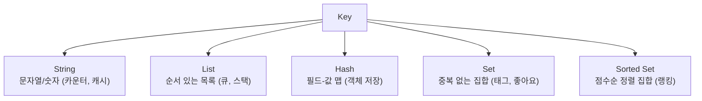

## 캐시 한 번 써보려다 빠진 Redis

처음 Redis를 접한 건 "DB 부하 줄이려고 캐시 좀 얹자"였습니다. 그런데 알고 보니 Redis는 단순 캐시를 넘어 **다양한 자료구조를 다루는 인메모리 데이터 저장소**였고, 랭킹·세션·큐·분산 락 같은 데도 두루 쓰이더라고요.

## 왜 빠른가: 인메모리 + 단일 스레드

- **인메모리**: 데이터를 디스크가 아닌 **메모리(RAM)** 에 둡니다. 디스크 I/O가 없으니 읽기/쓰기가 마이크로초 단위로 빠릅니다.
- **단일 스레드 이벤트 루프**: 명령을 한 번에 하나씩 순차 처리합니다. 의외로 이게 장점인데, **락 경합·컨텍스트 스위칭이 없어** 단순하고 빠르며, 각 명령이 원자적으로 실행됩니다. (네트워크 I/O 등 일부는 멀티스레드로 보강)

> 단일 스레드라서, `KEYS *`처럼 오래 걸리는 명령 하나가 전체를 멈출 수 있습니다. 무거운 명령을 운영에서 함부로 쓰면 안 되는 이유입니다.
{: .prompt-warning }

## 핵심은 "자료구조 서버"

Redis가 단순 key-value와 다른 점은 **값(value)의 타입이 다양**하다는 것입니다.



대표 자료구조와 쓰임새:

- **String**: 캐시 값, 조회수 카운터(`INCR`)
- **List**: 작업 큐, 최근 목록
- **Hash**: 객체(사용자 프로필 등)를 필드 단위로
- **Set**: 중복 제거, 태그, 교집합/합집합 연산
- **Sorted Set(ZSet)**: 점수 기반 **랭킹 보드**(실시간 순위)

```bash
INCR  post:42:views            # String 카운터
LPUSH queue:email "job1"        # List 큐
HSET  user:1 name "park" age 30 # Hash 객체
ZADD  ranking 1500 "alice"      # Sorted Set 랭킹
ZREVRANGE ranking 0 9 WITHSCORES # 상위 10명
```

이 외에도 Stream(메시지 스트림), Bitmap, HyperLogLog(근사 카운트), Geo(좌표) 등이 있습니다.

## TTL — 만료 시간

키에 만료 시간을 줄 수 있어 캐시·세션에 딱입니다.

```bash
SET session:abc "userdata" EX 3600   # 1시간 뒤 자동 삭제
TTL session:abc                       # 남은 시간 확인
```

## 어디에 쓰나

- **캐시**: DB 앞단 캐싱(가장 흔함)
- **세션 저장소**: 분산 서버 간 세션 공유
- **랭킹/리더보드**: Sorted Set
- **작업 큐 / 메시지**: List, Stream
- **분산 락**: `SET key val NX EX`

## 정리

- Redis = **인메모리 + (대체로) 단일 스레드**라서 빠르고 원자적.
- 단순 key-value가 아니라 **자료구조 서버**(String/List/Hash/Set/ZSet 등).
- **TTL**로 캐시·세션 관리가 쉽다.
- 무거운 명령(`KEYS *` 등)은 단일 스레드를 막으니 주의.
- 다음 글에선 인메모리인 Redis가 데이터를 어떻게 **영속화**하는지(RDB/AOF) 다룹니다.
