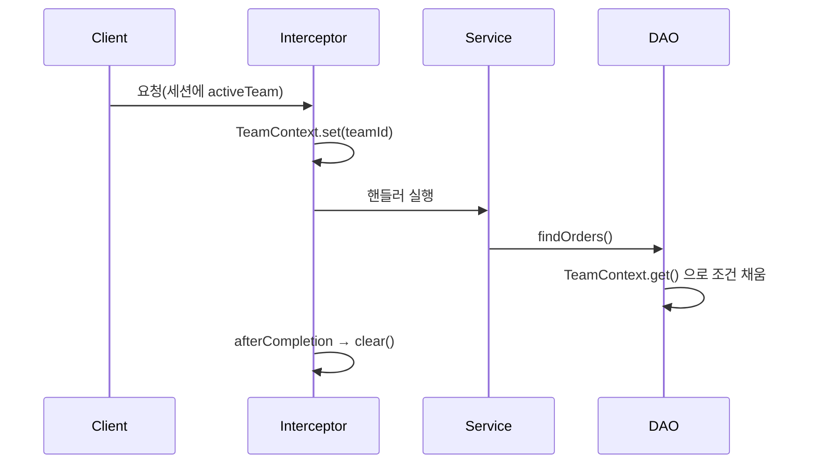

한 사용자가 여러 팀에 속하고, 화면 상단에서 활성 팀을 바꾸면 그 순간부터 모든 목록·통계·생성이 그 팀 기준으로 동작해야 한다. 이 "현재 팀"을 어떻게 서비스·DAO 계층 끝까지 전달할 것인가가 문제다. 메서드 파라미터로 일일이 나르는 방법은 곧 한계에 부딪힌다. 핵심은 **요청 스코프 컨텍스트를 한 곳에서 채우고, 전 계층이 암묵적으로 읽게 하는 것**이다.

## 왜 파라미터 전달이 무너지는가

`teamId`를 컨트롤러 → 서비스 → DAO로 손수 넘기면, 호출 경로가 깊어질수록 모든 시그니처가 오염된다. 더 위험한 건 누락이다. 새 쿼리를 추가하면서 `teamId` 조건 하나만 빼먹으면 **다른 팀 데이터가 새어 나간다.** 인가가 아니라 데이터 격리의 문제이므로 조용히 터지고, 발견이 늦다. 그래서 "현재 팀"은 비즈니스 인자가 아니라 **요청의 횡단 관심사(cross-cutting concern)**로 다뤄야 한다.

## 핵심 개념 — 인터셉터에서 채우고 ThreadLocal로 흘린다

서블릿 기반 동기 모델에서 하나의 HTTP 요청은 하나의 스레드가 끝까지 처리한다. 따라서 요청 진입점에서 ThreadLocal에 컨텍스트를 심으면, 같은 스레드에서 도는 서비스·DAO가 파라미터 없이 그 값을 읽을 수 있다.

```java
public final class TeamContext {
    private static final ThreadLocal<Long> CURRENT = new ThreadLocal<>();

    public static void set(Long teamId) { CURRENT.set(teamId); }
    public static Long get() {
        Long v = CURRENT.get();
        if (v == null) throw new IllegalStateException("team context not set");
        return v;
    }
    public static void clear() { CURRENT.remove(); }
}
```

인터셉터에서 세션의 활성 팀을 읽어 채우고, 요청이 끝나면 **반드시** 정리한다.

```java
public class TeamContextInterceptor implements HandlerInterceptor {
    @Override
    public boolean preHandle(HttpServletRequest req, HttpServletResponse res, Object h) {
        Long teamId = (Long) req.getSession().getAttribute("activeTeamId");
        TeamContext.set(teamId);
        return true;
    }
    @Override
    public void afterCompletion(HttpServletRequest req, HttpServletResponse res, Object h, Exception e) {
        TeamContext.clear(); // 정리 누락 시 스레드풀 오염
    }
}
```

이제 DAO는 파라미터 없이 컨텍스트를 읽는다.

```java
public List<Order> findOrders() {
    return orderMapper.selectByTeam(TeamContext.get());
}
```



## 운영 함정

**함정 1 — ThreadLocal 정리 누락에 의한 스레드풀 오염.** WAS는 스레드를 재사용한다. `clear()`를 빼먹으면 다음 요청이 같은 스레드를 받았을 때 **이전 사용자의 팀 값**을 그대로 읽는다. 데이터 유출로 직결된다. 정리는 `finally`에 해당하는 `afterCompletion`에서 예외 여부와 무관하게 수행한다.

**함정 2 — 비동기·자식 스레드로 새면 컨텍스트가 안 따라간다.** `@Async`나 별도 스레드풀에 작업을 넘기면 ThreadLocal은 복사되지 않는다. 이 경우엔 진입 시점의 값을 명시적으로 캡처해 작업에 넘기거나, `TaskDecorator`로 전파를 설정해야 한다. "어디까지가 한 요청 스레드인가"를 항상 의식한다.

## 핵심 요약

- 런타임에 바뀌는 활성 컨텍스트는 비즈니스 파라미터가 아니라 요청 스코프 횡단 관심사로 본다.
- 인터셉터에서 한 번 채우고 ThreadLocal로 전 계층이 읽게 하면 누락에 의한 데이터 격리 사고를 막는다.
- ThreadLocal은 반드시 `remove()`로 정리한다. 안 하면 스레드 재사용으로 이전 요청 값이 새어 나간다.

**면접 한 줄 Q&A** — Q. ThreadLocal을 쓸 때 가장 흔한 사고는? A. 스레드풀 환경에서 `remove()` 누락으로 이전 요청의 값이 다음 요청에 노출되는 것.
