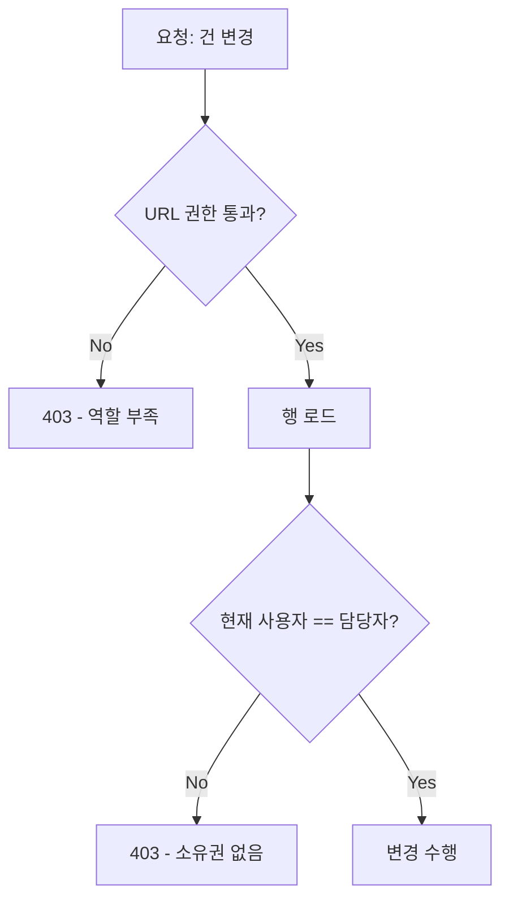

"이 건은 담당자만 상태를 바꿀 수 있다." 흔한 요구지만, 여기엔 일반적인 권한 모델과 다른 결이 있다. 누가 이 화면에 들어올 수 있느냐(URL 권한)가 아니라, **이 특정 데이터 행의 소유자가 누구냐**에 따라 변경 허용이 갈린다. 이걸 행 단위(row-level) 도메인 인가라 부른다.

## 핵심 개념 — URL 권한과 행 소유권은 다른 축이다

전형적인 접근제어는 "역할(role)이 이 엔드포인트를 호출할 수 있는가"를 본다. 이건 데이터와 무관하다. 반면 행 소유권 인가는 "이 사용자가 **이 행의 담당자인가**"를 본다. 둘은 직교한다. 영업 역할이라 화면엔 들어오지만, 남의 담당 건은 못 바꿔야 한다.

또 하나 중요한 분리는 **조회와 변경**이다. 팀원 모두가 건을 볼 수는 있어도(read), 옮기거나 닫는 변경(write)은 담당자만 가능한 경우가 많다. 따라서 단일 권한 플래그가 아니라 동작별로 갈라서 강제해야 한다.

## 강제 위치 — 서비스 계층이 진실의 원천이다

행 소유권은 데이터를 읽어야 알 수 있으므로, 데이터에 가장 가까운 **서비스 계층**에서 검사하는 게 자연스럽다. 변경 직전에 현재 사용자와 행의 담당자를 비교한다.

```java
@Transactional
public void reassign(Long orderId, Long newOwnerId, Long currentUserId) {
    Order order = orderMapper.selectById(orderId);
    if (order == null) throw new NotFoundException();
    if (!order.getOwnerId().equals(currentUserId)) {
        throw new AccessDeniedException("담당자만 변경할 수 있다");
    }
    order.setOwnerId(newOwnerId);
    orderMapper.update(order);
}
```

선언적으로 쓰고 싶다면 Spring Security의 `@PreAuthorize`에 SpEL을 넣을 수 있다. 다만 이 방식은 권한 판단을 위해 행을 한 번 읽어야 하므로, 메서드 진입 전에 빈을 통해 소유권을 조회하게 된다.

```java
@PreAuthorize("@ownership.isOwner(#orderId, principal.id)")
public void close(Long orderId) { ... }
```

선택 기준은 명확하다. 트랜잭션 안에서 이미 읽은 엔티티를 그대로 검사에 쓸 수 있으면 서비스 계층 검사가 단순하고 쿼리도 한 번 덜 나간다. 여러 엔드포인트가 같은 소유권 규칙을 공유하고 그 규칙을 선언적으로 드러내고 싶으면 `@PreAuthorize`가 깔끔하다.



## 운영 함정

**함정 1 — 화면 비활성화를 인가로 착각한다.** 담당자가 아니면 버튼을 회색 처리하는 건 UX일 뿐, 인가가 아니다. 클라이언트는 누구나 API를 직접 호출할 수 있다. **서버 측 강제 없이 비활성화만 있으면 인가가 없는 것이다.** 비활성화는 서버 검사 위에 얹는 보조 장치다.

**함정 2 — 조회 권한으로 변경까지 통과시킨다.** "볼 수 있으면 바꿀 수 있다"고 묶으면, 같은 팀원이 남의 건을 변경하게 된다. read 권한과 write 권한, 그리고 그 write의 소유권 조건을 각각 분리해 강제한다.

## 핵심 요약

- 역할 기반 URL 권한과 행 소유권 인가는 직교하는 두 축이다. 둘 다 통과해야 한다.
- 소유권은 데이터를 읽어야 판단되므로 서비스 계층에서 변경 직전에 강제하는 게 자연스럽다.
- 화면 버튼 비활성화는 인가가 아니다. 인가는 항상 서버에서 강제한다.

**면접 한 줄 Q&A** — Q. "본인이 작성한 글만 삭제 가능"은 RBAC로 충분한가? A. 아니다. 역할만으로는 행 소유자를 구분 못 한다. 행 단위 소유권 검사를 서버에서 별도로 해야 한다.
