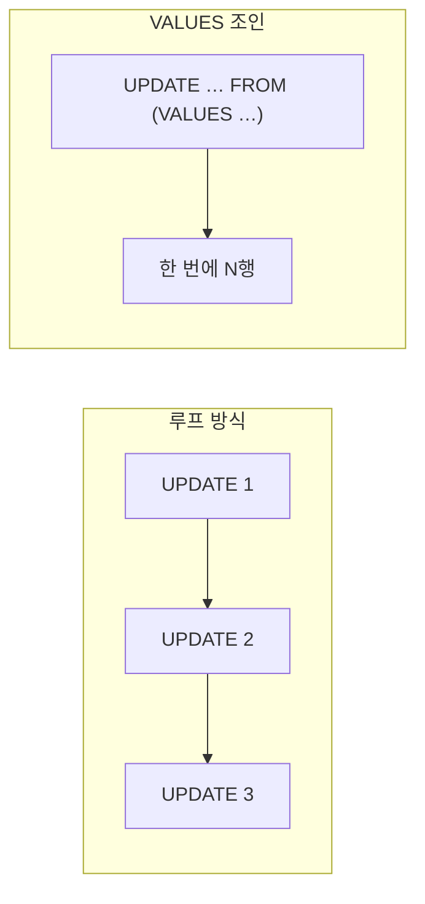

목록 화면에서 여러 행의 순서나 상태를 드래그로 바꾼 뒤 저장하면, 행마다 **서로 다른 값**으로 갱신해야 한다. 가장 흔한 구현은 행 수만큼 UPDATE를 도는 것이다. 100건이면 UPDATE 100번. 이걸 단일 쿼리로 줄이는 핵심 기법이 **VALUES 조인 UPDATE**다.

## 왜 1건씩 루프가 느린가

UPDATE를 N번 보내면 매번 SQL 파싱·플랜·네트워크 왕복·로깅이 발생한다. 같은 트랜잭션이라도 라운드트립 횟수가 곧 지연이다. 배치 모드로 묶어도 서버에서는 결국 N개의 명령으로 실행된다. 더 나은 접근은 갱신할 데이터 자체를 **인라인 테이블로 만들어** 대상 테이블과 조인하고, 서버가 한 번의 명령으로 전부 처리하게 하는 것이다.

## 핵심 개념 — VALUES를 가상 테이블로 쓴다

`VALUES (...), (...)` 구문은 행 리터럴의 집합을 즉석 테이블처럼 만든다. 이걸 `FROM` 절에 두고 대상 테이블과 키로 조인하면, 각 대상 행이 자기 짝의 새 값을 가져간다.

```sql
-- PostgreSQL
UPDATE product AS p
SET sort_order = v.new_order,
    status     = v.new_status
FROM (VALUES
    (101, 1, 'ACTIVE'),
    (102, 2, 'ACTIVE'),
    (103, 3, 'HIDDEN')
) AS v(id, new_order, new_status)
WHERE p.id = v.id;
```

세 행이 각기 다른 `sort_order`와 `status`로 한 번에 갱신된다. MySQL이라면 같은 발상을 `JOIN`으로 표현한다.

```sql
UPDATE product p
JOIN (
    SELECT 101 AS id, 1 AS new_order UNION ALL
    SELECT 102, 2 UNION ALL
    SELECT 103, 3
) v ON v.id = p.id
SET p.sort_order = v.new_order;
```

MyBatis에서는 `<foreach>`로 VALUES 목록을 생성한다.

```xml
<update id="bulkUpdateOrder">
  UPDATE product AS p
  SET sort_order = v.new_order
  FROM (VALUES
    <foreach collection="items" item="it" separator=",">
      (#{it.id}, #{it.order})
    </foreach>
  ) AS v(id, new_order)
  WHERE p.id = v.id
</update>
```



## 타입과 실행계획 주의

VALUES 리터럴의 타입은 추론된다. PostgreSQL에서 첫 행으로 타입이 정해지므로, 숫자처럼 보이는 ID를 문자열로 바인딩하거나 NULL이 섞이면 타입 불일치나 캐스팅 오류가 난다. 필요하면 첫 행에 명시적 캐스트를 둔다: `(101::bigint, 1::int)`. 그리고 조인 키(`p.id`)에 인덱스가 있어야 인덱스 조인으로 풀린다. 인덱스가 없으면 대상 테이블 전체를 스캔하므로 행이 많아질수록 루프보다 더 느려질 수 있다.

## 운영 함정

**함정 1 — 락 범위가 한 트랜잭션에 묶인다.** 단일 UPDATE이므로 영향받는 모든 행이 한 번에 잠긴다. 수만 행을 한 방에 갱신하면 락 보유 시간이 길어지고 다른 트랜잭션이 대기한다. 너무 크면 수천 건 단위 청크로 나눠 여러 번 커밋한다.

**함정 2 — 매칭 안 된 ID는 조용히 무시된다.** WHERE 조인이라 VALUES에 있지만 대상에 없는 ID는 아무 일도 안 일어난다. "분명 보냈는데 안 바뀐 행"이 생긴다. 갱신 후 영향받은 행 수를 보낸 건수와 대조해 검증한다.

## 핵심 요약

- 행마다 다른 값으로 다건 갱신할 때 1건씩 루프 대신 `UPDATE … FROM (VALUES …)` 조인으로 단일 쿼리화한다.
- 조인 키 인덱스와 VALUES 리터럴 타입을 챙겨야 인덱스 조인으로 빠르게 돈다.
- 단일 트랜잭션 락 범위가 커지므로 대량이면 청크로 분할한다.

**면접 한 줄 Q&A** — Q. 100개 행을 서로 다른 값으로 갱신할 때 가장 효율적 방법은? A. VALUES 집합을 대상 테이블과 조인하는 단일 UPDATE. 라운드트립과 파싱 비용을 한 번으로 줄인다.
