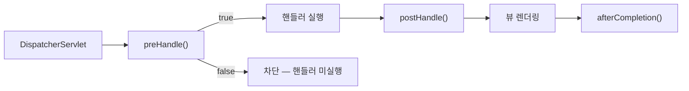

화면마다 권한이 다른 기능을 여러 개 만들다 보면, 컨트롤러 메서드 첫 줄마다 "이 사람이 이걸 할 수 있나?" 검사가 복붙된다. 한 곳을 고치면 다른 곳은 잊는다. 이건 전형적인 **횡단 관심사(cross-cutting concern)**이며, 비즈니스 로직에서 떼어내야 한다.

## 왜 인터셉터인가 — 실행 생명주기

권한 검사는 "핸들러가 실행되기 **전에** 통과 여부를 결정"하는 일이다. Spring MVC의 `HandlerInterceptor`는 정확히 그 자리에 있다. `DispatcherServlet`이 핸들러를 찾은 뒤, 실행 직전에 끼어든다.

- **`preHandle`** — 핸들러 실행 전. `false`를 반환하면 **체인이 끊겨 핸들러가 실행되지 않는다.** 권한 검사의 자리.
- **`postHandle`** — 핸들러 실행 후, 뷰 렌더링 전.
- **`afterCompletion`** — 응답 완료 후. 정리/로깅용.

필터(Filter)와의 차이도 핵심이다. 필터는 서블릿 컨테이너 레벨이라 `HandlerMethod`를 모른다. 인터셉터는 "어떤 컨트롤러 메서드가 매핑됐는지"를 알기에, **메서드에 붙은 애너테이션을 읽어** 권한을 판단할 수 있다.



## 코드 예시 — 애너테이션 기반 인터셉터

메서드에 필요한 권한을 선언하고, 인터셉터가 읽어 검사한다.

```java
@Target(ElementType.METHOD)
@Retention(RetentionPolicy.RUNTIME)
public @interface RequirePermission { String value(); }

public class PermissionInterceptor implements HandlerInterceptor {
    @Override
    public boolean preHandle(HttpServletRequest req, HttpServletResponse res, Object handler) {
        if (!(handler instanceof HandlerMethod hm)) return true; // 정적 리소스 등은 통과
        RequirePermission anno = hm.getMethodAnnotation(RequirePermission.class);
        if (anno == null) return true;                           // 검사 불필요한 핸들러

        Principal who = (Principal) req.getAttribute("principal");
        if (who == null || !who.hasPermission(anno.value())) {
            res.setStatus(who == null ? 401 : 403);
            return false;                                        // 차단
        }
        return true;
    }
}

@Configuration
public class WebConfig implements WebMvcConfigurer {
    public void addInterceptors(InterceptorRegistry registry) {
        registry.addInterceptor(new PermissionInterceptor())
                .addPathPatterns("/admin/**")
                .excludePathPatterns("/admin/login");
    }
}
```

컨트롤러는 이제 깨끗하다.

```java
@RequirePermission("ORDER_DELETE")
@DeleteMapping("/admin/orders/{id}")
public void delete(@PathVariable Long id) { orderService.delete(id); } // 권한 코드 없음
```

## AOP라는 대안

뷰/HTTP 맥락 없이 **서비스 메서드 진입 자체**를 막고 싶다면 AOP가 낫다. `@Around` 어드바이스로 메서드 호출 전 권한을 검사하면, 컨트롤러를 거치지 않는 내부 호출에도 일관되게 적용된다. 인터셉터는 HTTP 요청 경계, AOP는 메서드 호출 경계라는 차이로 선택한다.

## 운영 함정

**함정 1 — 경로 패턴 누락/오설정.** `addPathPatterns`가 너무 좁으면 보호해야 할 URL이 빠지고, 너무 넓으면 정적 리소스·로그인 페이지까지 막혀 무한 리다이렉트가 난다. `excludePathPatterns`로 로그인·에러 경로를 반드시 빼라.

**함정 2 — 인터셉터에서 자원 단위 검사 한계.** 인터셉터는 요청 진입 시점이라 "이 주문이 이 사람 것인가" 같은 자원 소유 검사는 자원을 아직 조회하기 전이라 어렵다. 역할 단위는 인터셉터, 자원 소유 단위는 서비스 계층에서 — 두 층으로 나눠 검사한다.

## 핵심 요약

- 권한 검사는 횡단 관심사다. `preHandle`이 `false`면 핸들러가 실행되지 않으므로 차단 지점으로 적합하다.
- 인터셉터는 `HandlerMethod`를 알기에 메서드 애너테이션 기반 권한 선언이 가능하다 — 필터로는 못 한다.
- 역할(coarse)은 인터셉터/AOP에, 자원 소유(fine)는 서비스 계층에 둔다.

> **면접 한 줄 Q&A**
> Q. 권한 검사를 Filter 대신 Interceptor에 두는 이유는?
> A. 인터셉터는 매핑된 `HandlerMethod`에 접근할 수 있어 컨트롤러 메서드에 붙은 권한 애너테이션을 읽어 판단할 수 있다. 필터는 핸들러를 모른다.
