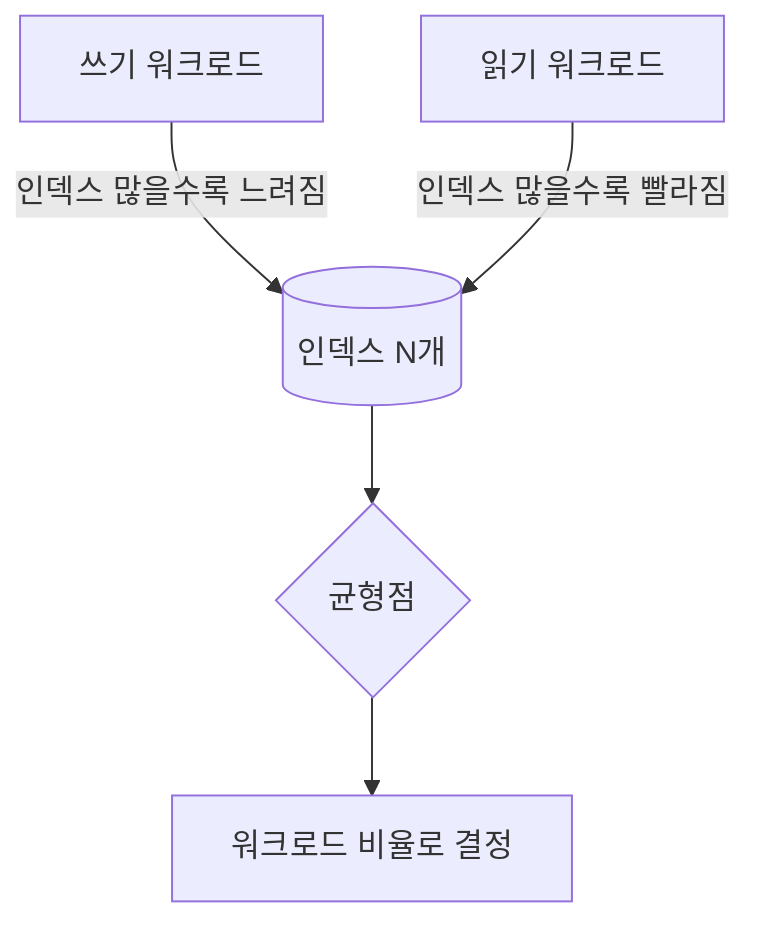

조회도 잦고 변경도 잦은 기능을 다루다 보면, 인덱스를 추가해 조회를 살리니 입력이 느려지는 상황을 만난다. 이건 설정 실수가 아니라 **읽기와 쓰기가 본질적으로 상충**하기 때문이다. 두 경로를 같은 잣대로 최적화하려 하면 둘 다 어중간해진다.

## 인덱스는 왜 읽기를 돕고 쓰기를 늦추는가

인덱스(보통 B+Tree)는 컬럼 값을 **정렬된 보조 구조**로 따로 유지한다.

- **읽기**: 정렬돼 있으니 이진 탐색으로 `O(log N)`에 원하는 행을 찾는다. 풀스캔 `O(N)`을 피한다.
- **쓰기**: INSERT/UPDATE/DELETE마다 테이블뿐 아니라 **관련된 모든 인덱스도 같이 갱신**해야 한다. 정렬을 유지하려 노드 분할(page split)이 일어나고, 디스크 쓰기가 늘어난다. 인덱스가 5개면 INSERT 한 번에 구조 6개(테이블+인덱스 5)를 건드린다.

즉 인덱스는 "읽기 비용을 쓰기 시점으로 당겨오는" 거래다. 읽기에서 아낀 시간을 쓰기에서 미리 지불한다.



## 워크로드별 최적화

핵심은 "이 테이블은 읽기가 잦은가, 쓰기가 잦은가"를 먼저 보는 것이다.

- **읽기 우세(read-heavy)** — 카탈로그, 게시글 조회처럼 SELECT가 압도적. 인덱스를 적극 추가하고, 자주 함께 조회되는 컬럼은 **커버링 인덱스**로 묶어 테이블 접근(랜덤 I/O)까지 없앤다. 비정규화·캐시·읽기 전용 복제본도 읽기 경로 전용 무기다.
- **쓰기 우세(write-heavy)** — 로그, 이벤트 적재처럼 INSERT가 압도적. 인덱스를 최소로 유지한다. 꼭 필요한 조회는 별도 테이블/배치로 분리하거나, 적재 후 비동기로 인덱싱한다.

```sql
-- 읽기 우세: 검색 + 정렬을 한 인덱스로 커버
CREATE INDEX idx_product_search
    ON product (category_id, status, created_at DESC);

-- 이 쿼리는 인덱스만으로 해결(커버링) — 테이블 랜덤 접근 없음
SELECT id, name, created_at
FROM product
WHERE category_id = 10 AND status = 'ON_SALE'
ORDER BY created_at DESC
LIMIT 20;
```

읽기를 빠르게 하려고 인덱스를 붙였다면, 그 인덱스가 **WHERE + ORDER BY + SELECT 컬럼을 모두 덮는지** 확인해 효과를 극대화한다.

## CQRS — 경로를 아예 분리하기

상충이 심하면 모델 자체를 나눈다. CQRS(Command Query Responsibility Segregation)는 쓰기 모델과 읽기 모델을 분리한다. 쓰기는 정규화된 테이블에 빠르게 적재하고, 읽기는 조회에 최적화된 별도 뷰/테이블(비정규화·집계 완료)에서 가져온다. 둘 사이는 동기화로 잇는다. 복잡도가 오르므로 정말 상충이 클 때만 쓴다.

## 운영 함정

**함정 1 — "혹시 몰라서" 인덱스 남발.** 안 쓰이는 인덱스는 읽기에 기여하지 않으면서 모든 쓰기를 느리게 하고 저장공간만 먹는다. `sys`/통계로 미사용 인덱스를 주기적으로 찾아 제거하라.

**함정 2 — 읽기 최적화가 쓰기 핫스팟을 만든다.** 비정규화로 같은 데이터를 여러 곳에 복제하면, 한 번의 변경이 여러 테이블 UPDATE로 번진다. 읽기를 위한 비정규화는 쓰기 증폭(write amplification)을 대가로 한다는 걸 계산에 넣어라.

## 핵심 요약

- 인덱스는 읽기 비용을 쓰기 시점으로 옮기는 거래다. 공짜 가속이 아니다.
- 테이블의 읽기/쓰기 비율을 먼저 파악하고, 읽기 우세엔 커버링 인덱스·캐시, 쓰기 우세엔 인덱스 최소화로 간다.
- 상충이 극심하면 CQRS로 읽기·쓰기 모델을 분리하되, 동기화 복잡도를 감수한다.

> **면접 한 줄 Q&A**
> Q. 인덱스를 늘렸더니 입력이 느려졌다. 왜인가?
> A. INSERT/UPDATE마다 테이블과 함께 모든 인덱스의 정렬 구조를 갱신해야 하기 때문이다. 인덱스는 읽기를 빠르게 하는 대신 쓰기 비용을 더한다.
