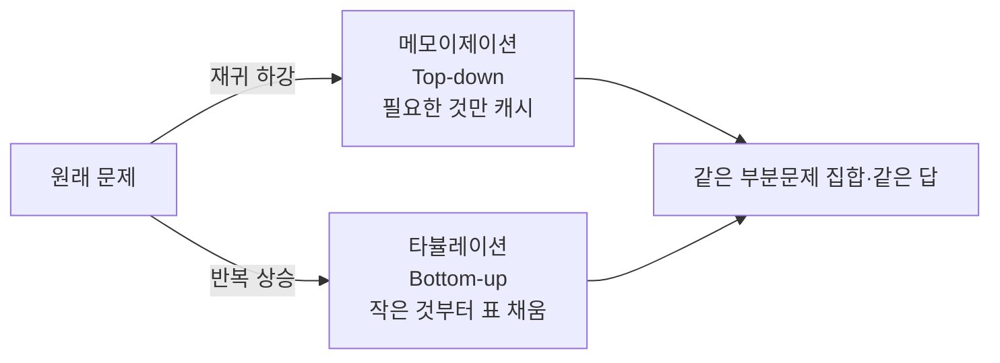

## 지수에서 다항으로 — 마법이 아니라 기억이다

피보나치를 재귀로 그냥 짜면 `fib(n)`을 구하는 데 $O(2^n)$이 듭니다. `fib(50)`이면 약 10억 번. 그런데 똑같은 문제를 동적계획법(Dynamic Programming, DP)으로 풀면 $O(n)$입니다. 무엇이 달라졌을까요? 알고리즘이 더 똑똑해진 게 아니라, **같은 부분문제를 두 번 계산하지 않기로** 했을 뿐입니다.

DP가 성립하려면 문제가 두 성질을 가져야 합니다.

- **최적 부분구조(optimal substructure)**: 큰 문제의 최적해가 작은 부분문제의 최적해로 조립된다.
- **중복 부분문제(overlapping subproblems)**: 같은 부분문제가 재귀 과정에서 **반복해서** 등장한다.

이 둘이 있으면, 부분문제의 답을 한 번 구해 **저장(기억)** 해두고 재사용하면 됩니다. ([분할정복]()은 부분문제가 겹치지 *않을* 때 쓰는 사촌입니다 — 거기선 저장할 게 없습니다.)

## 중복 부분문제를 눈으로 보기

`fib(5)`의 재귀 호출 트리를 펼치면 `fib(2)`가 세 번, `fib(3)`이 두 번 등장합니다. 이 중복을 **메모이제이션**으로 잘라내면(한 번 계산한 노드는 캐시에서 즉시 반환) 트리가 가지치기됩니다. 아래에서 빨간 노드가 "캐시 히트로 더 내려가지 않는" 지점입니다.

<div class="dp13-memo" markdown="0">
<style>
.dp13-memo{margin:1.4rem 0;overflow-x:auto}
.dp13-memo svg{width:100%;max-width:680px;height:auto;display:block;margin:0 auto;font-family:inherit}
.dp13-memo .lbl{fill:currentColor;font-size:11px;font-weight:600}
.dp13-memo .sub{fill:currentColor;font-size:9.5px;opacity:.6}
.dp13-memo .edge{stroke:currentColor;opacity:.3;stroke-width:1.3;fill:none}
.dp13-memo .node{fill:none;stroke:currentColor;stroke-width:1.6;opacity:.6}
.dp13-memo .hit{fill:#e03131;opacity:0;animation:dp13hit 5s ease-in-out infinite}
.dp13-memo .cut{stroke:#e03131;stroke-width:1.6;opacity:0;stroke-dasharray:4 3;animation:dp13cut 5s ease-in-out infinite}
@keyframes dp13hit{0%,40%{opacity:0}55%,100%{opacity:.85}}
@keyframes dp13cut{0%,45%{opacity:0}60%,100%{opacity:.6}}
</style>
<svg viewBox="0 0 680 260" role="img" aria-label="피보나치 재귀 호출 트리에서 중복되는 부분문제가 메모이제이션 캐시 히트로 가지치기되는 애니메이션">
  <line class="edge" x1="340" y1="34" x2="220" y2="92"/>
  <line class="edge" x1="340" y1="34" x2="460" y2="92"/>
  <line class="edge" x1="220" y1="104" x2="130" y2="162"/>
  <line class="edge" x1="220" y1="104" x2="310" y2="162"/>
  <line class="edge" x1="130" y1="174" x2="70"  y2="226"/>
  <line class="edge" x1="130" y1="174" x2="190" y2="226"/>
  <circle class="node" cx="340" cy="22"  r="18"/><text class="lbl" x="340" y="26" text-anchor="middle">f(5)</text>
  <circle class="node" cx="220" cy="98"  r="18"/><text class="lbl" x="220" y="102" text-anchor="middle">f(4)</text>
  <circle class="node" cx="460" cy="98"  r="18"/><text class="lbl" x="460" y="102" text-anchor="middle">f(3)</text>
  <circle class="node" cx="130" cy="168" r="18"/><text class="lbl" x="130" y="172" text-anchor="middle">f(3)</text>
  <circle class="node" cx="310" cy="168" r="18"/><text class="lbl" x="310" y="172" text-anchor="middle">f(2)</text>
  <circle class="node" cx="70"  cy="232" r="18"/><text class="lbl" x="70"  y="236" text-anchor="middle">f(2)</text>
  <circle class="node" cx="190" cy="232" r="18"/><text class="lbl" x="190" y="236" text-anchor="middle">f(1)</text>
  <circle class="hit" cx="460" cy="98"  r="18"/>
  <circle class="hit" cx="310" cy="168" r="18"/>
  <line class="cut" x1="460" y1="116" x2="460" y2="150"/>
  <line class="cut" x1="310" y1="186" x2="310" y2="220"/>
  <text class="sub" x="540" y="170" text-anchor="middle" fill="#e03131">캐시 히트 →</text>
  <text class="sub" x="540" y="184" text-anchor="middle" fill="#e03131">재계산 안 함</text>
</svg>
</div>

같은 부분문제 수는 `fib`의 경우 고작 `n+1`개. 그래서 각 부분문제를 한 번씩만 풀면 $O(n)$이 됩니다. **DP의 시간 복잡도 = (부분문제 개수) × (한 부분문제를 푸는 비용)** 이라는 공식이 여기서 나옵니다.

## Top-down vs Bottom-up — 같은 표를 거꾸로 채울 뿐

DP를 구현하는 두 방식은 본질이 같습니다. **무엇을 어떤 순서로 채우느냐**만 다릅니다.



| | 메모이제이션 (Top-down) | 타뷸레이션 (Bottom-up) |
|---|---|---|
| 흐름 | 재귀 + 캐시 | 반복문으로 표를 작은 것부터 |
| 계산 범위 | **필요한 부분문제만** | 표 전체(불필요한 칸도) |
| 장점 | 점화식 그대로 직관적 | 함수호출 오버헤드·스택 없음 |
| 함정 | 깊은 재귀 → 스택 오버플로 | 채우는 **순서(의존성)** 를 직접 보장 |

```python
# 0/1 배낭 — bottom-up. dp[i][w] = i번째까지 고려, 용량 w일 때 최대 가치
def knapsack(weights, values, W):
    n = len(weights)
    dp = [[0] * (W + 1) for _ in range(n + 1)]
    for i in range(1, n + 1):
        for w in range(W + 1):
            dp[i][w] = dp[i-1][w]                       # i번째 안 담음
            if weights[i-1] <= w:                        # 담을 수 있으면
                cand = dp[i-1][w - weights[i-1]] + values[i-1]
                dp[i][w] = max(dp[i][w], cand)           # 담는 게 이득이면 갱신
    return dp[n][W]
```

## 표가 채워지는 방향이 곧 점화식이다

DP에서 가장 중요한 직관은 **각 칸이 어떤 칸에 의존하는가**입니다. 편집 거리(두 문자열을 같게 만드는 최소 삽입·삭제·교체 횟수)는 각 칸이 **위·왼쪽·대각선** 세 칸에서 만들어집니다. 아래는 표가 좌상단부터 채워지며 의존 화살표가 흐르는 모습입니다.

<div class="dp13-grid" markdown="0">
<style>
.dp13-grid{margin:1.4rem 0;overflow-x:auto}
.dp13-grid svg{width:100%;max-width:560px;height:auto;display:block;margin:0 auto;font-family:inherit}
.dp13-grid .sub{fill:currentColor;font-size:10px;opacity:.6}
.dp13-grid .cellbox{fill:none;stroke:currentColor;stroke-width:1.2;opacity:.4}
.dp13-grid .fill{fill:#1971c2;opacity:0}
.dp13-grid .dep{stroke:#f08c00;stroke-width:2;fill:none;opacity:0;marker-end:url(#dp13arr)}
.dp13-grid .f0{animation:dp13f 6s linear infinite;animation-delay:0s}
.dp13-grid .f1{animation:dp13f 6s linear infinite;animation-delay:.5s}
.dp13-grid .f2{animation:dp13f 6s linear infinite;animation-delay:1s}
.dp13-grid .f3{animation:dp13f 6s linear infinite;animation-delay:1.5s}
.dp13-grid .f4{animation:dp13f 6s linear infinite;animation-delay:2s}
.dp13-grid .f5{animation:dp13f 6s linear infinite;animation-delay:2.5s}
.dp13-grid .f6{animation:dp13f 6s linear infinite;animation-delay:3s}
.dp13-grid .f7{animation:dp13f 6s linear infinite;animation-delay:3.5s}
.dp13-grid .f8{animation:dp13f 6s linear infinite;animation-delay:4s}
@keyframes dp13f{0%{opacity:0}6%{opacity:.7}100%{opacity:.7}}
.dp13-grid .dep{animation:dp13dep 6s linear infinite;animation-delay:4.4s}
@keyframes dp13dep{0%,72%{opacity:0}80%{opacity:.9}100%{opacity:.9}}
</style>
<svg viewBox="0 0 560 240" role="img" aria-label="편집 거리 DP 표가 좌상단부터 셀 단위로 채워지고 각 칸이 위 왼쪽 대각선 세 칸에 의존하는 화살표가 나타나는 애니메이션">
  <defs><marker id="dp13arr" markerWidth="7" markerHeight="7" refX="5" refY="3" orient="auto"><path d="M0,0 L6,3 L0,6 z" fill="#f08c00"/></marker></defs>
  <text class="sub" x="20" y="20">dp[i][j] = 위·왼쪽·대각 중 최소 + 1 (대각은 글자 같으면 +0)</text>
  <g transform="translate(180,40)">
    <rect class="cellbox" x="0"   y="0"  width="56" height="56"/><rect class="fill f0" x="2" y="2" width="52" height="52"/>
    <rect class="cellbox" x="60"  y="0"  width="56" height="56"/><rect class="fill f1" x="62" y="2" width="52" height="52"/>
    <rect class="cellbox" x="120" y="0"  width="56" height="56"/><rect class="fill f2" x="122" y="2" width="52" height="52"/>
    <rect class="cellbox" x="0"   y="60" width="56" height="56"/><rect class="fill f3" x="2" y="62" width="52" height="52"/>
    <rect class="cellbox" x="60"  y="60" width="56" height="56"/><rect class="fill f4" x="62" y="62" width="52" height="52"/>
    <rect class="cellbox" x="120" y="60" width="56" height="56"/><rect class="fill f5" x="122" y="62" width="52" height="52"/>
    <rect class="cellbox" x="0"   y="120" width="56" height="56"/><rect class="fill f6" x="2" y="122" width="52" height="52"/>
    <rect class="cellbox" x="60"  y="120" width="56" height="56"/><rect class="fill f7" x="62" y="122" width="52" height="52"/>
    <rect class="cellbox" x="120" y="120" width="56" height="56"/><rect class="fill f8" x="122" y="122" width="52" height="52"/>
    <line class="dep" x1="148" y1="120" x2="148" y2="64"/>
    <line class="dep" x1="120" y1="148" x2="64"  y2="148"/>
    <line class="dep" x1="120" y1="120" x2="66"  y2="66"/>
  </g>
</svg>
</div>

이 의존 방향이 **채우는 순서**를 강제합니다. 의존하는 칸이 먼저 채워져 있어야 하니까요. Bottom-up에서 루프 순서를 잘못 잡으면 아직 안 채운 칸을 읽어 오답이 나는 게 이 때문입니다.

## 공간 최적화 — 시간을 사고 공간을 줄인다

[복잡도 분석]()에서 본 시간↔공간 트레이드오프가 DP의 핵심입니다. 위 배낭은 `dp[i]`가 `dp[i-1]` 행에만 의존하므로, 2차원 표를 **1차원 배열**로 줄여 $O(nW)$ 공간을 $O(W)$로 낮출 수 있습니다(단, 안쪽 루프를 역순으로 돌려 같은 행을 덮어쓰지 않게).

대표 문제들의 점화식 요약:

| 문제 | 상태 정의 | 점화식 핵심 | 복잡도 |
|------|-----------|-------------|--------|
| LIS(최장 증가 부분수열) | `dp[i]` = i로 끝나는 LIS 길이 | `max(dp[j])+1, j<i & a[j]<a[i]` | $O(n^2)$ / 이분탐색 $O(n\log n)$ |
| 0/1 배낭 | `dp[i][w]` = i까지·용량 w 최대가치 | 담음/안담음 max | $O(nW)$ |
| 편집 거리 | `dp[i][j]` = 접두사 i,j 최소 편집 | 위·왼·대각 min | $O(nm)$ |
| 행렬 곱 순서 | `dp[i][j]` = 구간 곱 최소비용 | 분할점 k로 min | $O(n^3)$ |

> LIS를 $O(n\log n)$으로 줄이는 비밀이 바로 [이분 탐색]()입니다 — "길이 k인 증가 수열의 마지막 원소 최솟값" 배열에 lower_bound를 박습니다. DP와 다른 알고리즘이 결합하는 전형입니다.

## 프로덕션에서 마주치는 함정

| 함정 | 증상 | 해법 |
|------|------|------|
| 상태 설계 오류 | 부분문제가 미래에 의존(무한 루프/오답) | 상태에 "지금까지의 결정"을 충분히 포함 |
| 메모이제이션 키 충돌 | 다른 상태가 같은 캐시 키 | 모든 차원을 키에 포함(튜플) |
| 깊은 재귀 스택 오버플로 | top-down에서 n 큼 | bottom-up 전환 또는 명시적 스택 |
| 채우는 순서 오류 | bottom-up이 빈 칸을 읽음 | 의존성 위상 순서대로 루프 |
| 의사 다항(pseudo-poly) | 배낭 $O(nW)$인데 W가 거대 | W는 값이라 입력 비트수엔 지수 — 주의 |

## 면접/리뷰 단골 질문

- **Q. DP가 성립하는 조건?** → 최적 부분구조 + 중복 부분문제. 둘 다 있어야 저장-재사용이 의미 있음.
- **Q. 분할정복과 DP의 차이?** → 부분문제가 겹치면 DP(저장), 안 겹치면 분할정복. 겹침 여부가 갈림길.
- **Q. top-down vs bottom-up?** → 같은 부분문제 집합. top-down은 필요한 것만·재귀 직관적, bottom-up은 스택 없음·순서 직접 보장.
- **Q. 0/1 배낭이 진짜 다항인가?** → 아니다. $O(nW)$는 W(값)에 다항이라 입력 비트수엔 지수 — 의사 다항. NP-hard.
- **Q. DP 시간 복잡도 어림?** → (부분문제 수) × (한 부분문제 비용). 표 크기 × 전이 비용.

## 정리

- DP는 **최적 부분구조 + 중복 부분문제**일 때, 부분문제 답을 저장해 지수를 다항으로 낮춘다.
- 메모이제이션(top-down)과 타뷸레이션(bottom-up)은 **같은 표를 다른 순서로** 채우는 것뿐.
- 각 칸의 **의존 방향**이 점화식이자 채우는 순서다 — 순서를 틀리면 빈 칸을 읽는다.
- 시간↔공간 트레이드오프로 행 차원을 접어 공간을 줄인다. LIS는 이분탐색과 결합해 $O(n\log n)$.

> 다음 글은 [그리디·허프만 코딩]()입니다. "전체를 보고 표를 채우는" DP와 달리, **매 순간 눈앞의 최선만 집고도** 전역 최적에 도달하는 조건을 따져봅니다. 이전 글은 [최소 신장 트리·Union-Find]().
