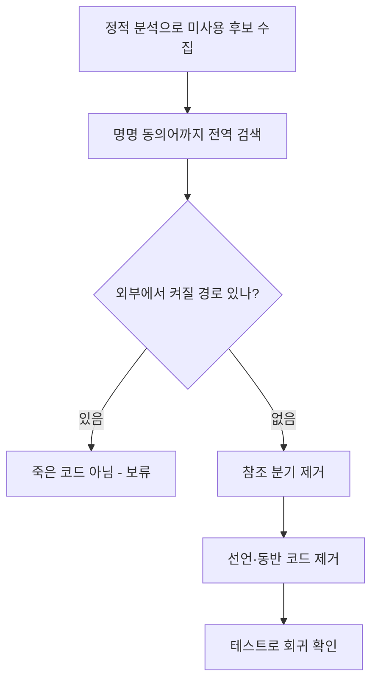

코드를 읽다 보면 아무도 안 쓰는 변수, 똑같은 의미인데 화면마다 다른 이름으로 흩어진 플래그가 보인다. "지우면 깔끔할 텐데"라는 충동은 옳다. 다만 죽은 코드는 종종 **다른 코드와 결합**돼 있어, 잘못 지우면 멀쩡한 동작을 깬다. 핵심은 "정말 죽었는가"를 증명하고 안전한 순서로 걷어내는 절차다.

## 핵심 개념 — 죽은 코드는 두 종류다

하나는 **선언되었지만 읽히지 않는 변수**다. 컴파일러나 정적 분석기가 잡아준다. 다른 하나는 더 까다로운 **결합된 죽은 코드**다. 변수 자체는 어딘가에서 읽히지만, 그 읽는 쪽도 사실상 죽었거나, 항상 같은 값으로 고정돼 분기가 무의미해진 경우다. 후자는 도구가 "사용됨"으로 표시하므로 사람이 의미를 따져야 한다.

명명 불일치는 이 문제를 키운다. 같은 개념을 `isActive`, `useFlag`, `enabled`로 제각각 부르면, 전역 검색으로 참조를 모으기 어렵고 중복이 숨는다. 그래서 **명명 일관성은 미관 문제가 아니라, 죽은 코드를 찾아낼 수 있느냐의 문제**다.

## 안전한 제거 절차

원칙은 하나다. **참조를 끊은 다음 선언을 지운다.** 반대로 하면 컴파일 에러가 나거나 런타임에 NPE가 터진다.

```java
// Before — 어디서도 분기에 영향을 안 주는 플래그
public class OrderService {
    private boolean legacyMode = false;  // 항상 false

    public void process(Order o) {
        if (legacyMode) {        // 죽은 분기
            legacyProcess(o);
        }
        normalProcess(o);
    }
}
```

1. **사용처 전수 조사**: `legacyMode`, 그리고 흩어진 동의어(`legacy_flag` 등)까지 전역 검색한다. 명명이 통일돼 있지 않으면 먼저 이름을 한 표현으로 모은 뒤 검색한다.
2. **상수성 확인**: 값이 항상 false인지(설정·DB·런타임에서 true가 되는 경로가 없는지) 확인한다. 외부 설정으로 켜질 수 있으면 죽은 게 아니다.
3. **참조 제거**: 죽은 분기를 먼저 들어낸다.
4. **선언 제거**: 그다음 변수와, 그것만 쓰던 `legacyProcess` 같은 동반 코드를 지운다.

```java
// After
public class OrderService {
    public void process(Order o) {
        normalProcess(o);
    }
}
```



## 운영 함정

**함정 1 — 리플렉션·문자열 참조는 도구가 못 잡는다.** 필드명을 문자열로 참조하는 매핑(직렬화 키, 설정 바인딩, 화면 파라미터 이름)은 "미사용"으로 보여도 런타임에 쓰인다. 정적 분석 결과를 맹신하지 말고, 문자열로 된 이름까지 검색한다.

**함정 2 — 한 커밋에 너무 많이 지운다.** 청소를 한꺼번에 몰아 하면 회귀가 났을 때 원인 추적이 어렵다. 의미 단위로 쪼개 커밋하고, 각 단계마다 테스트를 돌린다. 동작을 바꾸지 않는 순수 제거 커밋과 명명 통일 커밋을 섞지 않는다.

## 핵심 요약

- 죽은 코드엔 단순 미사용과 결합된 죽은 코드가 있다. 후자는 도구가 못 잡으니 의미로 판단한다.
- 명명 일관성은 중복·죽은 코드를 검색으로 찾을 수 있게 하는 품질 지표다.
- 항상 참조를 먼저 끊고 선언을 지운다. 리플렉션·문자열 참조를 확인하고, 작은 단위로 커밋하며 테스트로 회귀를 막는다.

**면접 한 줄 Q&A** — Q. "안 쓰는 필드 같은데 IDE가 사용됨으로 표시한다." 무엇을 의심하나? A. 리플렉션·직렬화·설정 바인딩 같은 문자열 기반 참조. 정적 분석이 못 잡는 경로다.
