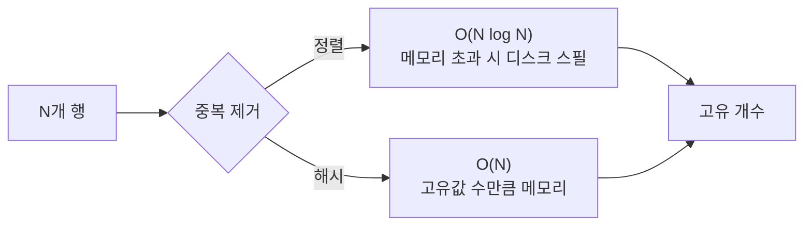

"고유 방문자 수", "주문한 사용자 수"처럼 중복을 뺀 개수를 세는 집계를 다루다 보면, 단순 `COUNT(*)`와 달리 `COUNT(DISTINCT col)`이 유독 느린 걸 만난다. 이건 두 연산이 **하는 일의 양이 본질적으로 다르기** 때문이다.

## COUNT(*) vs COUNT(DISTINCT) — 무엇이 다른가

`COUNT(*)`는 그냥 행 수를 센다. 조건에 맞는 행을 지나가며 카운터를 1씩 올리면 끝, 메모리 거의 안 든다.

`COUNT(DISTINCT col)`은 다르다. "지금까지 본 값인가?"를 매 행마다 판단해 **중복을 제거**해야 한다. 본 적 없는 값만 세려면 본 값들을 **기억**해야 한다. DB 엔진은 둘 중 하나로 처리한다.

- **정렬 방식**: 값을 전부 정렬해 인접한 같은 값을 한 덩어리로 묶고, 덩어리 경계를 센다. 정렬 비용 `O(N log N)`. 메모리를 넘치면 디스크 임시 테이블로 스필(spill)한다 — 여기서 급격히 느려진다.
- **해시 방식**: 해시 테이블에 값을 넣어 중복을 흡수하고, 마지막에 버킷 수를 센다. 평균 `O(N)`이지만 **고유 값 수(cardinality)에 비례하는 메모리**가 필요하다.

핵심은 **고유 값이 많을수록(고 카디널리티)** 기억해야 할 게 많아져 비용이 커진다는 점이다.



## 정확값을 살리는 방법

먼저 정확한 값을 빠르게 얻을 수 있는지 본다.

```sql
-- 느린 형태: GROUP BY마다 distinct 집합을 따로 유지
SELECT category_id, COUNT(DISTINCT user_id) AS buyers
FROM orders
GROUP BY category_id;
```

- **인덱스 활용**: `(category_id, user_id)` 인덱스가 있으면, 이미 정렬돼 있으니 distinct를 위한 별도 정렬을 건너뛸 수 있다(루스 인덱스 스캔 등). distinct 대상 컬럼이 인덱스 정렬 순서에 포함되는지가 관건이다.
- **사전 집계**: 일·시간 단위로 고유 집합을 미리 요약 테이블에 적재해 두면, 조회 시점의 distinct 부담이 사라진다.

## 근사 집계 — 정확도를 약간 포기하고 메모리를 크게 아낀다

수억 행에서 "대략 몇 명"이면 충분하다면, 정확한 distinct는 과하다. **HyperLogLog** 같은 확률적 카운팅은 고유 값을 전부 기억하지 않는다. 값의 해시에서 나타나는 패턴(예: 앞쪽 0의 최대 개수)으로 카디널리티를 **추정**한다. 메모리는 고유 값 수와 무관하게 **수 KB로 고정**되고, 오차는 보통 2% 안쪽이다.

```sql
-- 근사 distinct (엔진에 따라 함수명 다름: approx_count_distinct 등)
SELECT approx_count_distinct(user_id) AS approx_buyers
FROM orders;
```

대시보드의 "고유 방문자 수"처럼 추세만 보면 되는 지표에 이상적이다. 과금·정산처럼 정확성이 필수면 쓰지 않는다.

## 운영 함정

**함정 1 — 메모리 스필로 인한 절벽.** `COUNT(DISTINCT)`가 작업 메모리 한도를 넘으면 디스크 임시 파일로 떨어지며 수십 배 느려진다. 평소 빠르던 쿼리가 데이터가 늘자 갑자기 느려졌다면 스필을 의심하라.

**함정 2 — 여러 컬럼 distinct의 곱셈 폭발.** `COUNT(DISTINCT a, b)`나 한 쿼리 안 여러 개의 `COUNT(DISTINCT)`는 각각 별도의 distinct 집합을 유지해 메모리가 합산된다. 가능하면 쿼리를 나누거나 사전 집계로 분산하라.

## 핵심 요약

- `COUNT(*)`는 세기만 하지만, `COUNT(DISTINCT)`는 중복 제거를 위해 본 값을 기억해야 한다 — 정렬 또는 해시로.
- 비용은 고유 값 수(카디널리티)에 비례한다. 고 카디널리티 + 부족한 메모리 = 디스크 스필 = 절벽.
- 정확성이 필수면 인덱스/사전 집계로, "대략"이면 충분하면 HyperLogLog 류 근사 집계로 메모리를 고정한다.

> **면접 한 줄 Q&A**
> Q. `COUNT(DISTINCT)`는 왜 `COUNT(*)`보다 느린가?
> A. 중복을 제거하려면 지나온 값을 기억해야 하므로 정렬(O(N log N)) 또는 해시(고유값 수만큼 메모리)가 필요하다. 고유 값이 많을수록 비싸지고, 메모리를 넘으면 디스크로 스필돼 급격히 느려진다.
