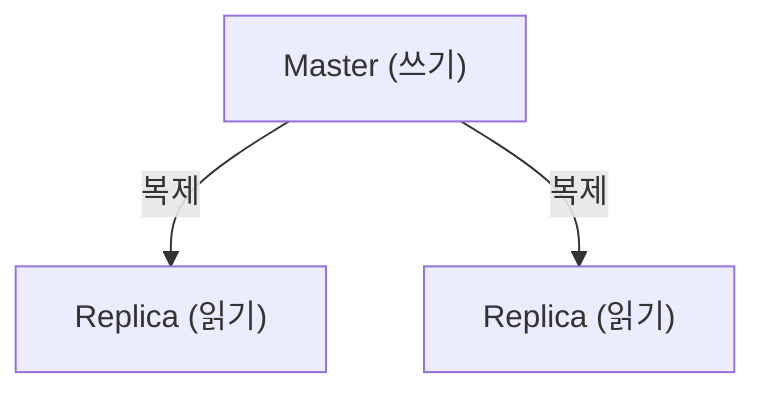
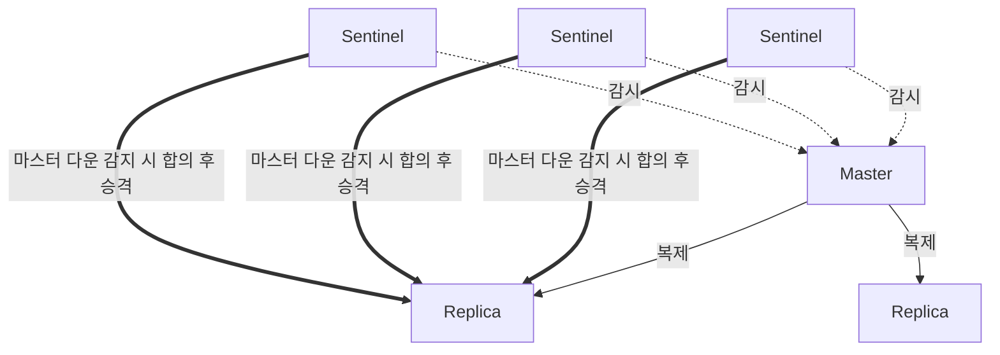
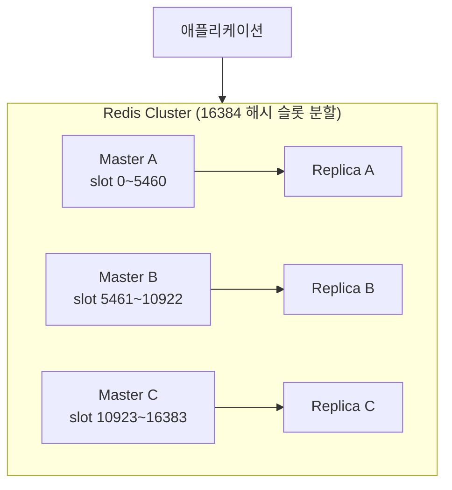

## "Redis 죽으면 서비스도 죽나요?"

캐시·세션을 Redis에 의존하기 시작하면, 자연스럽게 "이 Redis가 죽으면?"이 걱정됩니다. Redis는 규모와 가용성 요구에 따라 여러 구성을 단계적으로 선택할 수 있습니다. 네 가지를 순서대로 보겠습니다.

## 1. Single Instance

가장 단순. 하지만 이 노드가 죽으면 **전체 장애**(SPOF)이고, 메모리도 한 대 한계입니다. 로컬/개발용.

## 2. Replication (복제)

마스터의 데이터를 복제본(replica)에 비동기 복제합니다.

- **읽기 분산**: 읽기를 복제본으로 보내 부하 분산.
- 한계: 마스터가 죽으면 **자동 승격이 안 됩니다.** 수동으로 복제본을 마스터로 올려야 함 → 진정한 HA는 아님.

## 3. Sentinel (자동 장애 조치)

Sentinel은 마스터/복제본을 **감시**하다가, 마스터가 죽으면 복제본 하나를 **자동으로 마스터로 승격**합니다.

- Sentinel은 보통 **홀수(3개 이상)** 로 띄워 다수결(quorum)로 장애를 판정합니다.
- 클라이언트는 Sentinel에 "현재 마스터가 누구냐"를 물어 접속합니다.
- **주의**: Sentinel은 **자동 failover**를 해주지만 **샤딩(분산 저장)은 안 합니다.** 데이터는 여전히 한 마스터에 다 들어갑니다(메모리 한계 동일).

## 4. Cluster (샤딩 + HA)

데이터를 여러 마스터에 **나눠 저장(샤딩)** 하고, 각 마스터에 복제본을 둬 가용성까지 확보합니다.

- 키를 **16384개 해시 슬롯**에 나눠 분산합니다(`CRC16(key) % 16384`). → [다음 글에서 자세히](/posts/redis-docker-cluster/)
- 마스터가 죽으면 그 복제본이 자동 승격(HA).
- **메모리·처리량을 수평 확장** 가능. 대규모에 적합.

## 어떻게 고를까

| 구성 | 자동 failover | 샤딩(확장) | 용도 |
|------|:---:|:---:|------|
| Single | ✗ | ✗ | 개발/로컬 |
| Replication | ✗ | ✗ | 읽기 분산 |
| Sentinel | ✓ | ✗ | HA만 필요(데이터 한 대 분량) |
| Cluster | ✓ | ✓ | HA + 대용량/고처리량 |

데이터가 한 대 메모리에 들어가고 **가용성만** 필요하면 **Sentinel**, 데이터가 한 대를 넘거나 **수평 확장**이 필요하면 **Cluster**입니다.

## 정리

- Single(SPOF) → Replication(읽기 분산, 수동) → **Sentinel(자동 failover)** → **Cluster(샤딩+HA)**.
- Sentinel = 가용성, Cluster = 가용성 **+ 확장**.
- 선택 기준은 "데이터가 한 대에 들어가는가"와 "자동 장애 조치가 필요한가".
