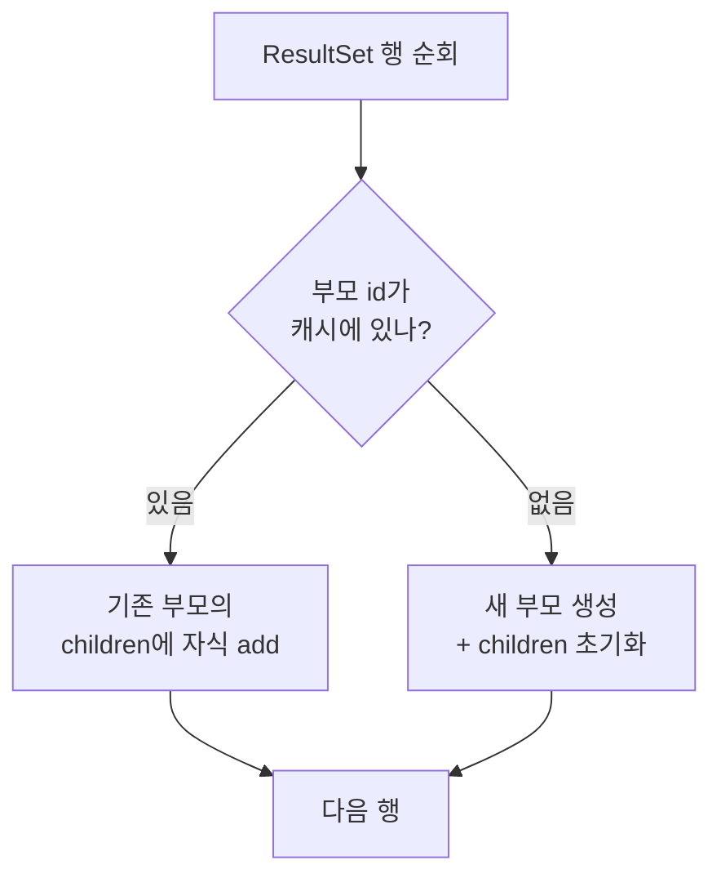

1:N 관계의 데이터를 한 번의 조회로 끌어오는 일은 흔하다. 주문 하나에 여러 주문 항목, 게시글 하나에 여러 댓글. 이때 JOIN을 쓰면 결과는 부모 행이 자식 수만큼 복제된다. 이 평평한 결과를 다시 "부모 1건 + 자식 N건"의 객체 그래프로 접어 올리는 일이 ORM/매퍼의 핵심 책무다. MyBatis는 이를 `resultMap`의 `<collection>`으로 처리한다.

## 핵심 개념 — MyBatis는 어떻게 행을 접는가

MyBatis는 JDBC `ResultSet`을 한 행씩 순회하며 객체를 만든다. `<collection>`이 있는 `resultMap`을 만나면, MyBatis는 각 행마다 **부모의 식별자(id)를 키로 캐시를 조회**한다.

- 이미 같은 id의 부모 객체가 만들어져 있으면, 새 부모를 만들지 않고 **기존 객체의 자식 컬렉션에 이번 행의 자식만 추가**한다.
- 처음 보는 id면 부모 객체를 새로 만들고 자식 컬렉션을 초기화한다.

즉 그룹핑의 전제는 "MyBatis가 같은 부모인지 아닌지를 판별할 수 있어야 한다"는 것이다. 그 판별 기준이 바로 `<id>` 태그다. `<result>`는 단순 값 매핑이지만, `<id>`는 **객체의 동일성 비교에 쓰이는 키**라는 의미를 추가로 가진다.



## 코드 예시

주문(Order)과 주문 항목(OrderItem)을 한 번에 조회한다.

```sql
SELECT o.id        AS order_id,
       o.customer  AS customer,
       i.id        AS item_id,
       i.product   AS product,
       i.quantity  AS quantity
FROM orders o
JOIN order_item i ON i.order_id = o.id
WHERE o.id = #{orderId}
```

```xml
<resultMap id="orderMap" type="Order">
  <id     property="id"       column="order_id"/>
  <result property="customer" column="customer"/>
  <collection property="items" ofType="OrderItem">
    <id     property="id"       column="item_id"/>
    <result property="product"  column="product"/>
    <result property="quantity" column="quantity"/>
  </collection>
</resultMap>
```

부모에 `order_id`, 자식에 `item_id`를 각각 `<id>`로 지정했다. MyBatis는 `order_id`가 같은 연속 행을 한 부모로 묶고, 그 안에서 `item_id`로 자식을 구분한다.

## 운영 함정

**1) `<id>`를 빠뜨리면 중복이 안 접힌다.** 부모에 `<id>` 없이 `<result>`만 쓰면, MyBatis는 부모 동일성 판별 키를 잃는다. 이 경우 자식 수만큼 부모 객체가 중복 생성되거나, 매핑 규칙에 따라 자식이 제대로 누적되지 않는다. 1:N에서 `<id>`는 선택이 아니라 필수다.

**2) 정렬되지 않은 결과의 위험.** MyBatis의 그룹핑 캐시는 같은 매핑 컨텍스트 안에서 id 기준으로 동작하므로 행 순서가 흩어져도 묶이긴 한다. 그러나 페이징(`LIMIT`)을 1:N JOIN 결과에 직접 걸면 **자식 행 수 기준으로 잘려 부모가 누락**된다. 페이징은 부모 PK를 먼저 끊어낸 뒤(서브쿼리/2단계 조회) 자식을 붙여야 한다.

## 핵심 요약

- JOIN의 중복 부모 행을 객체 그래프로 접는 것은 매퍼의 책무다.
- MyBatis는 부모 `<id>`를 키로 행을 그룹핑한다 — `<id>` 누락 시 그룹핑이 깨진다.
- 1:N 결과에 `LIMIT`을 직접 걸면 안 된다. 부모 단위로 끊어라.

> **면접 한 줄 Q&A**
> Q. `<id>`와 `<result>`의 차이는?
> A. 둘 다 컬럼을 프로퍼티에 매핑하지만, `<id>`는 객체 식별자로서 행 그룹핑·캐싱의 비교 키 역할을 한다. 1:N collection 매핑에서 부모 `<id>`가 없으면 중복 행이 하나의 부모로 접히지 않는다.
