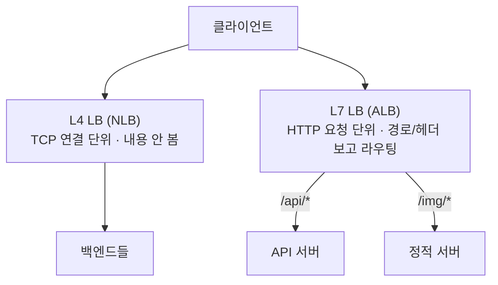

## "서버 한 대로는 못 버틴다, 그래서 앞에 분배기를 둔다"

트래픽이 한 대의 처리 한계를 넘으면 서버를 여러 대로 늘립니다. 그런데 클라이언트는 IP 하나만 압니다. 이 둘을 잇는 게 **로드 밸런서(LB)** — 들어온 요청을 뒤의 여러 서버(백엔드)에 나눠줍니다.

문제는 "어떻게 나누느냐"가 단순하지 않다는 것입니다. **연결 단위로 나눌지 요청 단위로 나눌지(L4 vs L7)**, **어떤 서버가 살아있는지 어떻게 알지(헬스체크)**, **서버를 뺄 때 진행 중인 요청은 어쩔지(드레이닝)** — 이 세 가지를 잘못 다루면 LB가 트래픽을 살리는 게 아니라 **멀쩡한 서비스를 통째로 죽입니다.** AWS의 ALB/NLB도 정확히 이 축 위에 있습니다.

## L4 vs L7: 어느 계층에서 결정하나

가장 근본적인 갈림길입니다. **L4 로드 밸런서**는 전송 계층(TCP/UDP)에서 **연결(4-tuple)** 만 보고 백엔드를 정합니다 — 패킷 내용은 안 봅니다. **L7 로드 밸런서**는 애플리케이션 계층까지 올라가 HTTP **요청 하나하나**를 보고(경로·헤더·쿠키) 라우팅합니다.



| | L4 (전송 계층) | L7 (애플리케이션 계층) |
|---|---|---|
| 분배 단위 | TCP/UDP **연결** | HTTP **요청** |
| 보는 것 | IP·포트(4-tuple) | 경로·헤더·쿠키·메서드 |
| 라우팅 | 단순·초고속·낮은 지연 | 경로/호스트 기반, 콘텐츠 라우팅 |
| TLS | 통과(passthrough) | 보통 **종료**(복호화 후 검사) |
| 백엔드가 보는 클라 IP | **원본 그대로** | LB IP (원본은 `X-Forwarded-For`) |
| AWS | **NLB** | **ALB** |
| 적합 | 극한 성능·비HTTP·고정 IP | 마이크로서비스 경로 라우팅·WAF |

> **왜 둘 다 존재하나.** L4는 패킷을 거의 그대로 흘려보내 **수백만 연결을 낮은 지연으로** 처리하지만, "URL `/api`는 A그룹, `/img`는 B그룹" 같은 판단은 못 합니다. L7은 그걸 하지만 매 요청을 파싱·복호화하니 비싸죠. 그래서 실무에선 **둘을 겹쳐** 씁니다 — NLB로 받아 들이고, 뒤에서 L7(ALB/Envoy)이 콘텐츠 라우팅.

## 어떻게 나눌까: 분배 알고리즘

| 알고리즘 | 동작 | 언제 |
|----------|------|------|
| 라운드로빈 | 순서대로 한 대씩 | 백엔드 성능 균일 |
| 가중 라운드로빈 | 성능 비례 가중치 | 사양이 섞인 경우 |
| 최소 연결(least-conn) | 활성 연결 가장 적은 곳 | 요청 처리시간 들쭉날쭉 |
| IP 해시 | 클라 IP 해시 → 고정 백엔드 | 세션 고정 필요 |
| **일관 해시(consistent)** | 링 위 해시, 노드 증감 시 **이동 최소화** | 캐시 친화(같은 키→같은 노드) |

아래는 요청들이 LB를 거쳐 가중치(2:1:1)대로 백엔드에 분배되는 모습입니다. 굵은 백엔드가 더 많이 받습니다.

<div class="lb-dist" markdown="0">
<style>
.lb-dist{margin:1.4rem 0;overflow-x:auto}
.lb-dist svg{width:100%;max-width:700px;height:auto;display:block;margin:0 auto;font-family:inherit}
.lb-dist .bx{fill:none;stroke:currentColor;stroke-width:1.6;opacity:.55}
.lb-dist .lbl{fill:currentColor;font-size:11.5px;font-weight:600}
.lb-dist .sub{fill:currentColor;font-size:9.5px;opacity:.6}
.lb-dist .wire{stroke:currentColor;opacity:.22;stroke-width:1.4;fill:none}
.lb-dist .r{fill:#1971c2}
.lb-dist .ra{animation:lbra 3.6s linear infinite}
.lb-dist .rb{animation:lbrb 3.6s linear infinite 1.2s}
.lb-dist .rc{animation:lbrc 3.6s linear infinite 2.4s}
.lb-dist .rd{animation:lbra 3.6s linear infinite 1.8s}
@keyframes lbra{0%{transform:translate(0,0);opacity:0}10%{opacity:1}45%{transform:translate(250px,0);opacity:1}90%{transform:translate(470px,-55px);opacity:1}100%{opacity:0}}
@keyframes lbrb{0%{transform:translate(0,0);opacity:0}10%{opacity:1}45%{transform:translate(250px,0);opacity:1}90%{transform:translate(470px,0);opacity:1}100%{opacity:0}}
@keyframes lbrc{0%{transform:translate(0,0);opacity:0}10%{opacity:1}45%{transform:translate(250px,0);opacity:1}90%{transform:translate(470px,55px);opacity:1}100%{opacity:0}}
</style>
<svg viewBox="0 0 700 200" role="img" aria-label="요청들이 로드 밸런서를 거쳐 가중치에 따라 세 백엔드로 분배되는 애니메이션">
  <text class="lbl" x="40" y="95" text-anchor="middle">요청</text>
  <rect class="bx" x="250" y="70" width="90" height="56" rx="8"/>
  <text class="lbl" x="295" y="94" text-anchor="middle">LB</text>
  <text class="sub" x="295" y="110" text-anchor="middle">가중 2:1:1</text>
  <rect class="bx" x="540" y="22" width="120" height="40" rx="8"/>
  <text class="lbl" x="600" y="46" text-anchor="middle">백엔드 A (w2)</text>
  <rect class="bx" x="540" y="78" width="120" height="40" rx="8" style="stroke-width:1.6"/>
  <text class="lbl" x="600" y="102" text-anchor="middle">백엔드 B (w1)</text>
  <rect class="bx" x="540" y="134" width="120" height="40" rx="8"/>
  <text class="lbl" x="600" y="158" text-anchor="middle">백엔드 C (w1)</text>
  <line class="wire" x1="340" y1="98" x2="540" y2="42"/>
  <line class="wire" x1="340" y1="98" x2="540" y2="98"/>
  <line class="wire" x1="340" y1="98" x2="540" y2="154"/>
  <rect class="r ra" x="60" y="91" width="14" height="14" rx="2"/>
  <rect class="r rb" x="60" y="91" width="14" height="14" rx="2"/>
  <rect class="r rc" x="60" y="91" width="14" height="14" rx="2"/>
  <rect class="r rd" x="60" y="91" width="14" height="14" rx="2"/>
</svg>
</div>

## 헬스체크: 서비스를 살리기도, 통째로 죽이기도

LB는 죽은 백엔드로 트래픽을 보내면 안 됩니다. 그래서 주기적으로 **헬스체크**를 합니다.

- **Active**: LB가 주기적으로 `/health`를 찔러 200이면 정상.
- **Passive**: 실제 트래픽의 실패(연결 거부·타임아웃)를 보고 판단.

unhealthy로 판정된 백엔드는 풀에서 빠지고, 회복되면 다시 들어옵니다.

<div class="lb-hc" markdown="0">
<style>
.lb-hc{margin:1.4rem 0;overflow-x:auto}
.lb-hc svg{width:100%;max-width:640px;height:auto;display:block;margin:0 auto;font-family:inherit}
.lb-hc .bx{fill:none;stroke:currentColor;stroke-width:1.6;opacity:.55}
.lb-hc .lbl{fill:currentColor;font-size:11.5px;font-weight:600}
.lb-hc .sub{fill:currentColor;font-size:9.5px;opacity:.6}
.lb-hc .wire{stroke:currentColor;opacity:.22;stroke-width:1.4}
.lb-hc .ok{stroke:#2f9e44}
.lb-hc .down{stroke:#e03131}
.lb-hc .x{stroke:#e03131;stroke-width:2.4;opacity:0;animation:lbx 4s ease-in-out infinite}
.lb-hc .t{fill:#1971c2}
.lb-hc .t1{animation:lbt1 4s linear infinite}
.lb-hc .t2{animation:lbt2 4s linear infinite}
@keyframes lbx{0%{opacity:0}35%{opacity:0}45%{opacity:1}100%{opacity:1}}
@keyframes lbt1{0%{transform:translate(0,0);opacity:0}10%{opacity:1}100%{transform:translate(330px,-40px);opacity:0}}
@keyframes lbt2{0%{transform:translate(0,0);opacity:0}50%{opacity:0}60%{opacity:1}100%{transform:translate(330px,40px);opacity:0}}
</style>
<svg viewBox="0 0 640 190" role="img" aria-label="로드 밸런서가 헬스체크로 한 백엔드를 unhealthy로 감지해 트래픽 대상에서 제외하고 나머지로 우회시키는 애니메이션">
  <rect class="bx" x="190" y="68" width="90" height="50" rx="8"/>
  <text class="lbl" x="235" y="98" text-anchor="middle">LB</text>
  <rect class="bx" x="460" y="30" width="150" height="42" rx="8"/>
  <text class="lbl" x="535" y="50" text-anchor="middle">백엔드 1</text>
  <text class="sub" x="535" y="64" text-anchor="middle" style="fill:#2f9e44">healthy</text>
  <rect class="bx" x="460" y="116" width="150" height="42" rx="8"/>
  <text class="lbl" x="535" y="136" text-anchor="middle">백엔드 2</text>
  <text class="sub" x="535" y="150" text-anchor="middle" style="fill:#e03131">unhealthy (제외)</text>
  <line class="wire ok"   x1="280" y1="90" x2="460" y2="51"/>
  <line class="wire down" x1="280" y1="96" x2="460" y2="137"/>
  <line class="x" x1="355" y1="103" x2="385" y2="133"/>
  <line class="x" x1="385" y1="103" x2="355" y2="133"/>
  <circle class="t t1" cx="210" cy="92" r="6"/>
  <circle class="t t2" cx="210" cy="92" r="6"/>
</svg>
</div>

> **양날의 검 — 헬스체크 오설정이 전체를 죽인다.** 헬스체크 경로가 DB까지 호출하는 무거운 엔드포인트면, DB가 잠깐 느려질 때 **모든 백엔드가 동시에 unhealthy**로 찍혀 풀이 비고 503이 터집니다(정작 앱은 멀쩡한데). 반대로 임계치가 너무 느슨하면 죽은 서버로 계속 보내 일부 요청이 실패합니다. 헬스체크는 **앱 자체의 생존만 가볍게** 확인하고(의존성 점검은 분리), 임계치(연속 실패 횟수·간격)를 트래픽 특성에 맞춰야 합니다.

## 연결 드레이닝: 서버를 뺄 때 502를 안 내는 법

배포·스케일인으로 백엔드를 풀에서 뺄 때, **진행 중인 요청**을 그냥 끊으면 클라이언트는 502/504를 받습니다. **연결 드레이닝(graceful deconnection)** 은 "새 요청은 그만 받되, 진행 중인 건 끝까지 처리할 시간을 준다"는 것입니다(AWS ALB의 *deregistration delay*, 기본 300초).

> **함정**: 드레이닝 타임아웃이 **요청 최대 처리시간보다 짧으면** 그 사이 긴 요청이 잘립니다. 또 배포 시 새 인스턴스가 헬스체크를 통과하기 *전에* 옛 인스턴스를 빼면 순간적으로 풀이 비어 5xx가 납니다 → **새 것 healthy 확인 후 옛 것 드레이닝**(롤링) 순서가 핵심입니다.

## 클라 IP는 어디로 갔나 — X-Forwarded-For

L7 LB가 TLS를 종료하고 요청을 다시 맺으면, 백엔드 입장에서 출발지 IP는 **LB의 IP**가 됩니다. 원본 클라 IP는 `X-Forwarded-For` 헤더로 전달됩니다.

```bash
# 백엔드 접근 로그에서 진짜 클라이언트 IP
# X-Forwarded-For: 203.0.113.7, 70.41.3.18 (왼쪽이 최초 클라)
curl -I https://example.com   # 응답 헤더로 LB/캐시 동작 확인
```

> 신뢰 함정: `X-Forwarded-For`는 **클라이언트가 위조**할 수 있습니다. **신뢰하는 프록시가 추가한 값만** 채택해야 합니다(앱은 맨 오른쪽의 신뢰 경계부터 거꾸로 신뢰). L4(NLB)는 연결을 그대로 넘겨 원본 IP가 보존되거나 Proxy Protocol로 전달됩니다.

## AWS로 매핑

- **NLB(L4)**: 초고성능·고정 IP·비HTTP·TLS passthrough. 원본 IP 보존.
- **ALB(L7)**: 경로/호스트 라우팅, WAF 연동, HTTP/2·gRPC, 컨테이너 동적 포트.
- 백엔드 = **타깃 그룹**, 헬스체크·*deregistration delay*(드레이닝)가 타깃 그룹 속성.

LB 앞단에서 IP를 나눠주는 [DNS](), LB가 다루는 연결의 본질인 [TCP](), 더 바깥에서 캐싱·분산하는 [프록시·CDN](), LB가 사는 [VPC](), 그리고 사이드카가 LB 역할을 내재화하는 [서비스 메시]()와 이어집니다.

## 면접/리뷰 단골 질문

- **Q. L4와 L7 LB의 차이는?** → L4는 TCP **연결** 단위로 내용을 안 보고 빠르게, L7은 HTTP **요청** 단위로 경로·헤더를 보고 라우팅(+TLS 종료, X-Forwarded-For).
- **Q. 헬스체크가 멀쩡한 서비스를 죽일 수 있나?** → 그렇다. 무거운(DB 의존) 헬스체크는 의존성 흔들릴 때 전 백엔드를 동시에 unhealthy로 만들어 풀을 비운다. 가볍게, 임계치 신중히.
- **Q. 배포 시 502를 막으려면?** → 새 인스턴스 healthy 확인 후 옛 인스턴스 **연결 드레이닝**(deregistration delay ≥ 최대 요청시간), 롤링 순서 보장.
- **Q. 일관 해시를 왜 쓰나?** → 백엔드 증감 시 키 재배치를 최소화 → 캐시 적중률·세션 안정. 단순 모듈러 해시는 한 대만 늘어도 거의 전부 재배치.

## 정리

- **L4(연결·NLB)** vs **L7(요청·ALB)** — 성능과 콘텐츠 라우팅의 트레이드오프, 실무는 겹쳐 쓴다.
- 분배 알고리즘은 백엔드 균질성·세션·캐시 친화에 따라 고른다(일관 해시가 캐시에 강함).
- **헬스체크**는 서비스를 살리지만, 무겁게 짜면 전체를 동시에 죽인다 — 가볍게·임계치 신중히.
- **연결 드레이닝**으로 백엔드 제거 시 진행 요청을 보호, 롤링 순서로 5xx를 막는다.

> 다음 글: LB보다 더 바깥, 사용자 가까이에서 캐싱·분산하는 [프록시·리버스 프록시·CDN]()으로 이어집니다.
