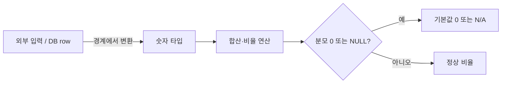

목표 대비 달성률 같은 지표가 화면에서 이상하게 나온다. 값이 두 배가 되거나, 정렬이 1, 10, 2 순으로 뒤죽박죽이거나, 합계가 터무니없이 크다. 추적해 보면 거의 항상 **수치가 문자열로 들고 다녀진** 게 원인이다. 비교 단계가 아니라 **집계·연산 단계**에서 타입 불일치가 터지는 경우다.

## 핵심 개념 — 문자열에 +는 연결이고, 정렬은 사전순이다

수치를 문자열로 다루면 두 연산이 의미를 바꾼다.

첫째, **덧셈이 연결(concatenation)이 된다.** JavaScript에서 `"10" + "5"`는 `15`가 아니라 `"105"`다. 화면단에서 합계를 만들 때 이게 가장 흔하다. 둘째, **정렬이 사전순이 된다.** 문자열 `"2"`는 `"10"`보다 크다. 첫 글자 `'2'`가 `'1'`보다 뒤이기 때문이다. 그래서 "100, 20, 3"을 문자열로 정렬하면 "100, 20, 3"이 아니라 "100"이 가장 앞에 오는 식의 결과가 나온다.

DB도 마찬가지다. VARCHAR 컬럼에 숫자를 넣고 `SUM`을 시도하면 엔진이 암묵 캐스팅을 하거나(느리고 위험), `ORDER BY`가 사전순으로 정렬한다.

## 경계에서 타입을 못박는다

해법은 **데이터가 들어오는 경계에서 숫자로 변환하고, 그 이후로는 숫자로만 다루는** 것이다. 외부 입력, DTO 바인딩, 쿼리 결과 매핑 지점에서 타입을 확정한다.

```java
// 경계에서 한 번만 변환. 이후 계층은 숫자 타입만 본다.
public class Goal {
    private final long target;   // String 아님
    private final long actual;

    public double achievementRate() {
        if (target == 0) return 0.0;       // 0 분모 방어
        return (double) actual / target * 100.0;
    }
}
```

집계는 가능하면 DB에서 숫자 타입으로 수행한다. 문자열 컬럼이라면 캐스팅을 명시한다.

```sql
-- 컬럼이 수치형이면 그냥
SELECT SUM(amount) FROM sales;

-- 부득이 문자열 컬럼이면 명시적 캐스트 (인덱스는 못 탐)
SELECT SUM(CAST(amount AS DECIMAL(15,2))) FROM sales;
```

비율 계산에선 **분모의 0과 NULL을 항상 방어**한다. SQL에서는 `NULLIF`로 0을 NULL로 바꿔 0 나눗셈 에러를 피한다.

```sql
SELECT actual * 100.0 / NULLIF(target, 0) AS rate
FROM goal;
```



## 운영 함정

**함정 1 — 정수 나눗셈으로 비율이 0이 된다.** `actual / target`을 정수끼리 나누면 소수점이 버려져 달성률이 0%나 100%로만 나온다. 한쪽을 실수로 승격(`(double) actual`)한 뒤 나눈다. SQL에서도 `* 100.0`처럼 실수 리터럴로 강제한다.

**함정 2 — 문자열 컬럼에 CAST를 걸면 인덱스가 죽는다.** `WHERE CAST(amount AS DECIMAL) > 1000`은 컬럼을 함수로 감싸 인덱스를 못 탄다. 근본 해법은 컬럼 타입을 수치형으로 고치는 것이고, 그게 어려우면 함수 기반 인덱스나 정규화된 별도 컬럼을 둔다.

## 핵심 요약

- 수치를 문자열로 다루면 덧셈이 연결이 되고 정렬이 사전순이 된다 — 합계·랭킹이 조용히 틀어진다.
- 데이터 경계에서 숫자 타입으로 못박고, 이후 계층은 숫자만 다룬다.
- 비율은 정수 나눗셈과 0/NULL 분모를 항상 방어한다(`(double)`, `NULLIF`).

**면접 한 줄 Q&A** — Q. 화면 합계가 "105"처럼 나온다. 무엇을 의심하나? A. 수치가 문자열이라 `+`가 연결로 동작한 것. 경계에서 숫자로 변환해야 한다.
