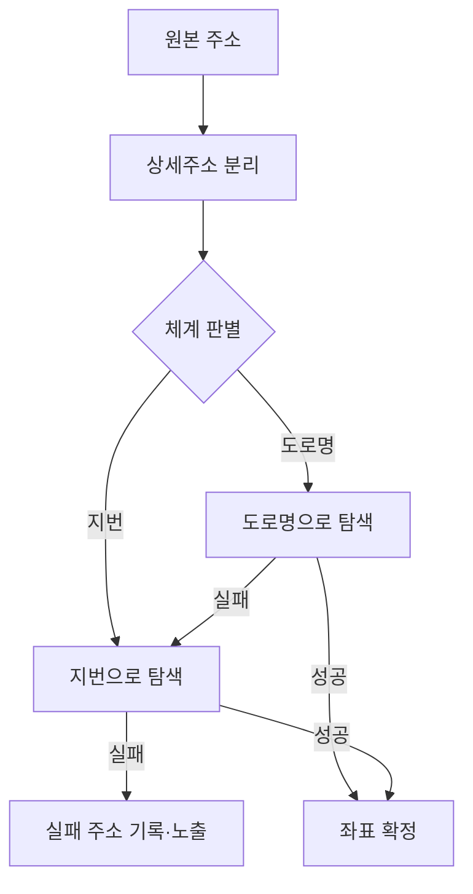

주소를 좌표(위경도)로 바꾸는 지오코딩은 멀쩡해 보이다가 데이터 앞에서 무너진다. 사용자가 입력한 주소 문자열을 그대로 외부 API에 던지면 실패가 잦다. 도로명과 지번이 한 칸에 섞여 있거나, 동·호수 같은 상세주소가 붙어 좌표 탐색을 방해하기 때문이다. 핵심은 **주소를 도로명과 지번으로 갈라 각각 탐색하고, 실패를 숨기지 않는 것**이다.

## 한국 주소는 두 체계가 공존한다

한국 주소는 도로명("○○로 12")과 지번("○○동 34-5")이라는 두 체계를 함께 쓴다. 지오코딩 API는 둘 다 받지만, 한 체계로는 못 찾아도 다른 체계로는 찾는 경우가 흔하다. 그래서 입력을 분석해 어느 체계인지 판별하고, 안 되면 다른 체계로 재시도하는 fallback이 정확도를 끌어올린다.



## 정규화 — 잡음을 먼저 걷어낸다

좌표 탐색을 방해하는 건 대개 뒤에 붙은 상세주소다. "○○로 12, 3층 301호" 같은 입력에서 건물 단위까지만 남기고 층·호수를 떼면 매칭률이 오른다. 도로명 패턴(`...로/길 + 숫자`)과 지번 패턴(`...동/리 + 숫자-숫자`)을 정규식으로 식별한다.

```java
public record ParsedAddress(String base, AddressType type, String detail) {}

public ParsedAddress parse(String raw) {
    String s = raw.trim().replaceAll("\\s+", " ");
    // 도로명: '...로' 또는 '...길' 뒤 숫자
    Matcher road = Pattern
        .compile("^(.*?(?:로|길)\\s*\\d+(?:-\\d+)?)\\s*(.*)$").matcher(s);
    if (road.matches()) {
        return new ParsedAddress(road.group(1), AddressType.ROAD, road.group(2));
    }
    // 지번: '...동/리' 뒤 번지
    Matcher jibun = Pattern
        .compile("^(.*?(?:동|리)\\s*\\d+(?:-\\d+)?)\\s*(.*)$").matcher(s);
    if (jibun.matches()) {
        return new ParsedAddress(jibun.group(1), AddressType.JIBUN, jibun.group(2));
    }
    return new ParsedAddress(s, AddressType.UNKNOWN, "");
}
```

탐색은 판별된 체계를 먼저 시도하고, 실패하면 다른 체계로 넘긴다.

```java
public Optional<Coordinate> geocode(ParsedAddress a) {
    Optional<Coordinate> primary = client.search(a.base());
    if (primary.isPresent()) return primary;
    // 도로명↔지번 변환 후 재시도, 또는 원본 일부로 재시도
    return client.search(toAlternate(a));
}
```

## 실패를 축약하지 말고 드러내라

흔한 유혹은 실패한 주소를 "시·구까지만" 잘라 대충 좌표를 잡는 것이다. 이러면 통계상 성공률은 오르지만 좌표가 엉뚱한 곳을 가리킨다. 더 나쁜 건 **틀렸다는 사실 자체가 가려진다**는 점이다. 차라리 실패 주소 목록을 그대로 노출해 사람이 손보게 하는 편이 정확하다. 정확도가 중요한 도메인에서 "그럴듯한 추정"은 침묵의 버그를 만든다.

## 운영 함정

**외부 키 만료·쿼터.** 지오코딩은 보통 외부 API다. 키가 만료되거나 일일 한도를 넘기면 전부 실패로 떨어진다. 실패 사유를 "주소 못 찾음"과 "API 호출 실패"로 구분해 로깅하지 않으면, 멀쩡한 주소까지 실패로 오인한다. 호출 실패는 재시도·알림 대상이고, 매칭 실패는 데이터 보정 대상이다.

**좌표 캐싱.** 같은 주소를 매번 외부로 던지면 비용·지연이 쌓인다. 정규화된 base 주소를 키로 좌표를 캐시한다. 단, 정규화 규칙이 바뀌면 키 체계도 바뀌므로 캐시 무효화를 함께 본다.

## 핵심 요약

- 한국 주소는 도로명·지번 두 체계를 오가며 fallback해야 매칭률이 오른다.
- 상세주소를 걷어내는 정규화가 좌표 탐색의 잡음을 줄인다.
- 실패를 축약하지 말고 드러내라. 추정 좌표는 침묵의 오류다.
- API 실패와 매칭 실패를 구분해 로깅해야 원인을 가른다.
