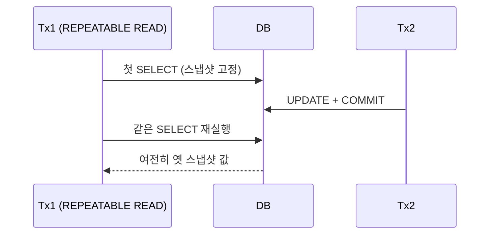

여러 트랜잭션이 같은 행을 동시에 읽고 쓰면 정합성이 깨질 수 있다. 격리수준은 "동시성을 얼마나 희생해 일관성을 얻을 것인가"의 다이얼이다. 어떤 이상현상까지 허용하느냐로 네 단계가 정의된다.

## 핵심 개념 — 이상현상과 격리수준

세 가지 대표 이상현상이 있다.

- **더티 리드(Dirty Read)**: 아직 커밋되지 않은 다른 트랜잭션의 변경을 읽음. 그 트랜잭션이 롤백하면 존재한 적 없는 값을 본 셈.
- **논리피터블 리드(Non-repeatable Read)**: 같은 행을 두 번 읽었는데 그 사이 다른 트랜잭션이 커밋해 값이 달라짐.
- **팬텀 리드(Phantom Read)**: 같은 조건으로 범위를 두 번 조회했는데, 그 사이 다른 트랜잭션이 행을 삽입/삭제해 결과 행 수가 달라짐.

| 격리수준 | 더티 | 논리피터블 | 팬텀 |
|---|---|---|---|
| READ UNCOMMITTED | 허용 | 허용 | 허용 |
| READ COMMITTED | 차단 | 허용 | 허용 |
| REPEATABLE READ | 차단 | 차단 | 허용(이론) |
| SERIALIZABLE | 차단 | 차단 | 차단 |

## 왜 그렇게 동작하는가 — MVCC 스냅샷

현대 RDBMS는 읽기를 위해 행을 잠그지 않는다. 대신 **MVCC(다중 버전 동시성 제어)**로, 각 행의 여러 버전을 유지하고 트랜잭션마다 "어느 시점의 버전을 볼지"를 스냅샷으로 정한다.

- **READ COMMITTED**: 매 SQL 문마다 새 스냅샷을 찍는다. 그래서 문장 사이에 다른 트랜잭션이 커밋하면 다음 읽기에 반영된다 → 논리피터블 리드 발생.
- **REPEATABLE READ**: 트랜잭션 시작(첫 읽기) 시점의 스냅샷을 트랜잭션 끝까지 유지한다. 중간에 누가 커밋해도 내가 보는 스냅샷은 고정 → 같은 읽기는 항상 같은 결과.



팬텀은 까다롭다. 표준상 REPEATABLE READ에서 팬텀이 허용되지만, InnoDB 같은 엔진은 갭 락(gap lock)을 더해 잠금 읽기에서 팬텀까지 상당 부분 차단한다.

## 코드 예시

```java
@Transactional(isolation = Isolation.REPEATABLE_READ)
public Report buildReport(long accountId) {
    long opening = balanceRepo.sumBefore(accountId);  // 스냅샷 A
    // ... 다른 트랜잭션이 입금을 커밋하더라도
    long closing = balanceRepo.sumBefore(accountId);  // 같은 스냅샷 A
    return new Report(opening, closing); // 두 합계가 일관됨
}
```

## 운영 함정

**1) 격리수준을 올리면 락 경합과 데드락이 는다.** SERIALIZABLE은 범위 락을 광범위하게 잡아 처리량이 급락한다. 대부분의 OLTP는 READ COMMITTED로 충분하며, 정합성이 꼭 필요한 구간만 격리를 높이거나 명시적 잠금(`SELECT ... FOR UPDATE`)을 쓴다.

**2) 긴 트랜잭션 + REPEATABLE READ.** 스냅샷을 오래 붙들면 MVCC가 옛 버전을 회수하지 못해 언두 로그가 부풀고 성능이 나빠진다. 읽기 트랜잭션을 짧게 유지하라.

> **면접 한 줄 Q&A**
> Q. READ COMMITTED와 REPEATABLE READ의 본질 차이는?
> A. 스냅샷을 찍는 단위다. 전자는 문장마다, 후자는 트랜잭션 시작 시점에 한 번 찍어 끝까지 유지한다. 그래서 후자만 논리피터블 리드를 막는다.
