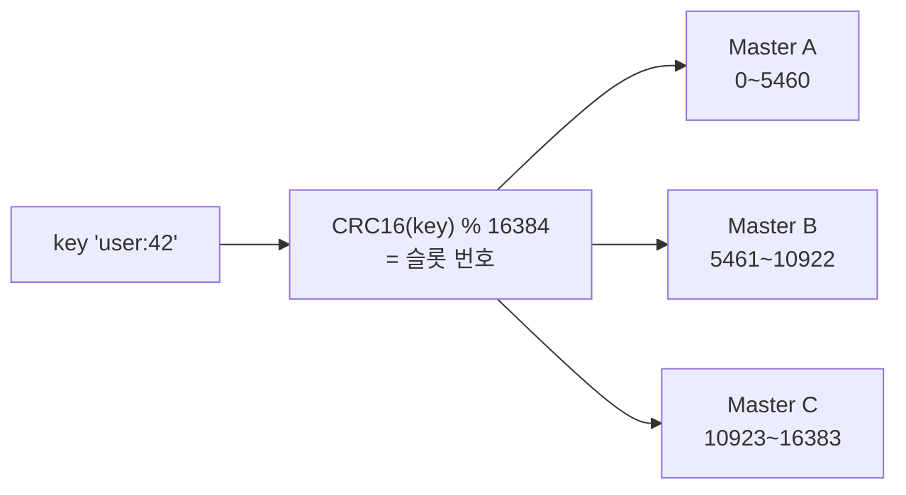

## 클러스터, 일단 로컬에서 띄워보자

[Redis Cluster](/posts/redis-ha-sentinel-cluster/)의 개념을 봤으니 직접 띄워봅니다. Docker로 **마스터 3 + 복제본 3 = 6노드** 클러스터를 구성해보겠습니다.

## 해시 슬롯 복습

Redis Cluster는 키를 **16384개의 해시 슬롯**에 나눠 담고, 슬롯을 마스터들이 나눠 갖습니다.



어떤 키가 어느 노드로 갈지는 이 계산으로 결정됩니다. 클라이언트가 엉뚱한 노드에 요청하면 `MOVED` 응답으로 올바른 노드를 안내받습니다.

## docker-compose로 6노드 띄우기

각 노드는 `cluster-enabled yes`로 떠야 합니다.

```yaml
# docker-compose.yml (요지)
services:
  redis-node-1:
    image: redis:7.4
    command: redis-server --cluster-enabled yes --cluster-config-file nodes.conf
             --cluster-node-timeout 5000 --appendonly yes --port 6379
    ports: ["6379:6379"]
  # redis-node-2 ~ 6 도 포트만 바꿔 동일하게 (6380~6384)
```

> 도커 네트워크에서는 노드 간 통신 IP/포트 광고(announce) 설정이 필요할 수 있습니다. 로컬 테스트는 `--network host`나 announce-ip 옵션으로 맞춰주세요.
{: .prompt-tip }

## 클러스터 생성

6개 노드를 띄운 뒤, 한 번의 명령으로 클러스터를 구성합니다. `--cluster-replicas 1`은 마스터당 복제본 1개를 의미합니다.

```bash
redis-cli --cluster create \
  127.0.0.1:6379 127.0.0.1:6380 127.0.0.1:6381 \
  127.0.0.1:6382 127.0.0.1:6383 127.0.0.1:6384 \
  --cluster-replicas 1
```

이러면 자동으로 마스터 3 / 복제본 3을 배치하고 슬롯을 나눠줍니다.

## 확인하기

```bash
redis-cli -c -p 6379 cluster info      # cluster_state:ok 확인
redis-cli -c -p 6379 cluster nodes     # 노드/슬롯 분배 확인
```

클러스터 모드 접속은 **`-c` 플래그**가 중요합니다. 이게 있어야 `MOVED` 리다이렉트를 따라가 올바른 노드로 자동 이동합니다.

```bash
redis-cli -c -p 6379
> set user:42 "park"     # 슬롯 계산 후 해당 마스터로 자동 이동
-> Redirected to slot [Y] located at 127.0.0.1:6381
OK
```

## 멀티키 연산과 해시 태그

클러스터에선 키가 여러 노드에 흩어지므로, `MSET`이나 트랜잭션 같은 **멀티키 연산이 같은 슬롯**에 있어야 동작합니다. 같은 슬롯에 모으려면 **해시 태그 `{}`** 를 씁니다.

```bash
# {} 안의 값으로만 슬롯을 계산 → 같은 노드에 모임
MSET {order:100}:item "A" {order:100}:price "5000"
```

## 정리

- Redis Cluster는 **16384 해시 슬롯**을 마스터들이 나눠 갖는 샤딩 구조.
- Docker로 6노드(마스터3·복제본3) 띄우고 `redis-cli --cluster create`로 구성.
- 접속은 **`-c`** 플래그로 `MOVED` 리다이렉트 자동 추적.
- 멀티키 연산은 **해시 태그 `{}`** 로 같은 슬롯에 모아야 한다.
- 다음 글에서 Spring Boot로 이 클러스터에 붙습니다.
