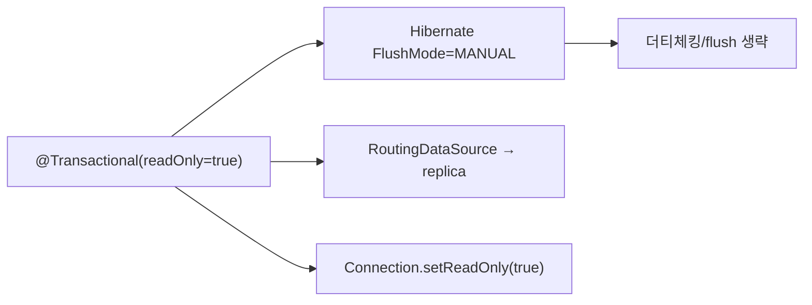

조회 전용 서비스 메서드에 `@Transactional(readOnly = true)`를 붙이는 것은 관례처럼 쓰인다. 그런데 이 플래그가 실제로 어떤 동작을 끄고 켜는지는 의외로 정확히 설명하기 어렵다. "읽기만 하니 빠르겠지"라는 막연한 기대 뒤에 구체적 메커니즘이 있다.

## 핵심 개념 — readOnly는 힌트다

`readOnly = true`는 명령이 아니라 **힌트**다. 받는 쪽이 무시할 수도 있고, 계층마다 다른 의미로 받아들인다. 크게 세 갈래로 작동한다.

**1) JPA/Hibernate: flush 모드를 MANUAL로 바꾼다.**
일반 트랜잭션에서 영속성 컨텍스트(1차 캐시)는 관리 중인 엔티티의 변경을 추적(더티 체킹)하고, 커밋 직전 자동으로 flush해 UPDATE를 날린다. `readOnly = true`면 Spring이 Hibernate 세션의 `FlushMode`를 `MANUAL`로 설정한다. 그러면:

- 자동 flush가 일어나지 않는다.
- 실수로 엔티티를 수정해도 DB에 반영되지 않는다(쓰기 방지).
- 더티 체킹을 위한 **스냅샷 보관 비용**이 줄어 메모리·CPU가 절약된다.

**2) DataSource 라우팅: 읽기 복제본으로 보낸다.**
`AbstractRoutingDataSource`로 읽기/쓰기 DB를 분리한 구성에서, 현재 트랜잭션이 readOnly인지를 라우팅 키로 삼아 **읽기 전용 복제본(replica)**으로 커넥션을 보낼 수 있다. 이건 프레임워크가 자동으로 해주는 게 아니라 직접 구현해 연결하는 패턴이다.

**3) JDBC 드라이버 힌트.** `Connection.setReadOnly(true)`가 호출되어 일부 드라이버/DB는 최적화에 활용한다(보장되진 않음).



## 코드 예시

```java
@Service
public class ProductQueryService {

    @Transactional(readOnly = true) // 조회 전용
    public List<ProductView> search(String keyword, Pageable page) {
        return productRepo.search(keyword, page); // flush 없음
    }
}
```

라우팅을 직접 붙인다면 트랜잭션 동기화에서 readOnly 여부를 읽어 키를 결정한다.

```java
public class RoutingDataSource extends AbstractRoutingDataSource {
    @Override
    protected Object determineCurrentLookupKey() {
        return TransactionSynchronizationManager.isCurrentTransactionReadOnly()
                ? "replica" : "primary";
    }
}
```

## 운영 함정

**1) 라우팅 키 결정 시점.** `determineCurrentLookupKey`는 커넥션을 가져오는 시점에 평가된다. 트랜잭션 동기화 정보가 아직 세팅되기 전에 커넥션을 잡으면 readOnly가 반영되지 않는다. 트랜잭션 어드바이저보다 라우팅이 늦게 평가되도록 순서를 맞춰야 한다.

**2) 복제 지연(replication lag).** 쓰기 직후 같은 데이터를 읽기 복제본에서 조회하면 **아직 반영 안 된 옛 값**을 볼 수 있다. "내 글 쓰고 바로 목록 갱신했는데 안 보임" 류 버그의 전형이다. 쓰기 직후 즉시 일관성이 필요한 읽기는 primary로 강제하라.

## 핵심 요약

- `readOnly = true`는 힌트이며, 주 효과는 Hibernate flush/더티체킹 생략이다.
- 복제본 라우팅은 자동이 아니라 RoutingDataSource로 직접 연결해야 한다.
- 복제 지연으로 쓰기 직후 읽기가 옛 값을 볼 수 있으니, 그 구간은 primary로 보낸다.
