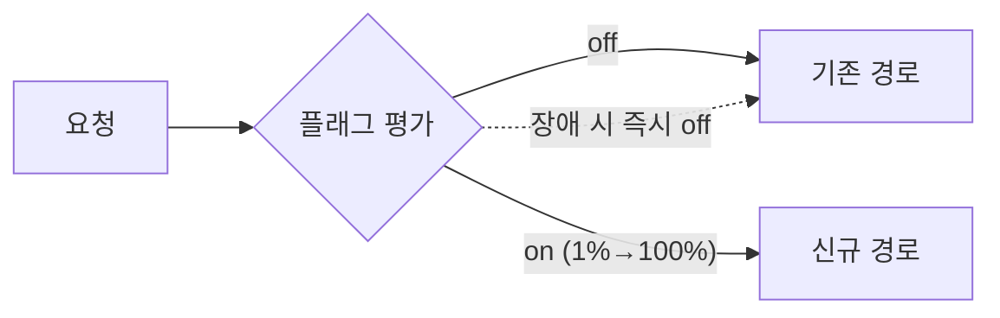

배포와 릴리스를 분리하고 싶을 때가 있다. 코드는 이미 운영에 올라가 있지만 사용자에게는 아직 보이면 안 되는 기능, 혹은 문제가 생기면 코드 롤백 없이 즉시 꺼야 하는 기능. 이 통제를 가능하게 하는 것이 피처 플래그(feature flag)다.

## 핵심 개념 — 배포 ≠ 릴리스

피처 플래그의 본질은 **"코드 경로를 런타임 설정값으로 분기"**하는 것이다. 기능을 새 브랜치에 숨겨 두는 대신, 이미 메인에 병합된 코드를 조건문으로 감싼다. 플래그가 꺼져 있으면 사용자는 기능을 못 본다.

이로써 세 가지가 가능해진다.

- **트렁크 기반 개발**: 미완성 기능도 플래그 뒤에 숨기고 매일 메인에 병합 → 거대한 장기 브랜치 머지 지옥 회피.
- **점진 노출(canary/percentage rollout)**: 사용자의 1% → 10% → 100%로 단계적으로 켜며 지표를 관찰.
- **킬 스위치**: 장애 발생 시 재배포 없이 플래그만 꺼서 즉시 차단.

플래그는 성격에 따라 수명이 다르다. **릴리스 토글**(기능 출시 후 제거)은 단명해야 하고, **운영 토글/킬스위치**는 오래 산다. 이 둘을 구분하지 않으면 코드가 죽은 분기로 뒤덮인다.



## 코드 예시

평가 로직을 한 군데로 모은다. 호출부는 단순 boolean만 본다.

```java
public interface FeatureFlags {
    boolean isEnabled(String key, UserContext ctx);
}

@Service
public class CheckoutService {
    private final FeatureFlags flags;

    public Receipt checkout(Cart cart, UserContext ctx) {
        if (flags.isEnabled("new-pricing-engine", ctx)) {
            return newPricing.process(cart);   // 신규
        }
        return legacyPricing.process(cart);    // 기존(폴백)
    }
}
```

퍼센트 노출은 사용자 식별자를 해싱해 안정적으로 버킷팅한다. 같은 사용자는 항상 같은 그룹에 들어가야 깜빡임이 없다.

```java
boolean inRollout(long userId, int percent) {
    int bucket = Math.floorMod(Long.hashCode(userId * 2654435761L), 100);
    return bucket < percent;
}
```

## 운영 함정

**1) 평가 실패 시 기본값.** 플래그 저장소(설정 서버/캐시)가 응답하지 않을 때 무엇을 반환할지 정해야 한다. 신규 기능은 **실패 시 off(기존 경로)**가 안전한 기본값이다. 예외를 그대로 던지면 플래그 장애가 전체 장애로 번진다.

**2) 플래그 부채.** 출시 후 영영 안 지운 릴리스 토글이 쌓이면, 켜질 일 없는 분기와 죽은 코드가 늘어 테스트 조합이 폭발한다. 릴리스 토글에는 만료/제거 일정을 함께 관리하라.

## 핵심 요약

- 피처 플래그는 배포와 릴리스를 분리해, 숨기기·점진 노출·즉시 차단을 가능케 한다.
- 평가 로직은 한곳에 모으고, 저장소 장애 시 안전한 기본값(보통 off)으로 폴백한다.
- 릴리스 토글은 단명시키고 제거 일정을 관리해 플래그 부채를 막는다.
