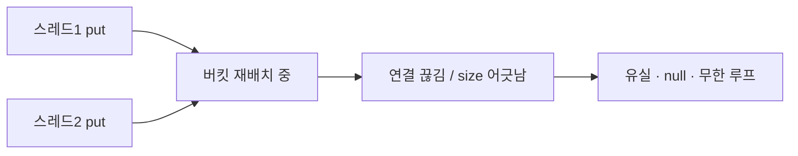

비동기 작업 여러 개가 같은 `HashMap`을 동시에 건드리다 이상한 증상이 나왔다. 어떤 값은 사라지고, 최악의 경우 스레드가 `get()`에서 무한 루프에 빠져 CPU를 100% 먹었다. `HashMap`은 **스레드 세이프하지 않다**. 이게 왜 단순한 "동기화 깜빡함"을 넘어 자료구조 자체가 깨지는 문제인지 들여다본다.

## 왜 HashMap은 동시 접근에 무너지나

`HashMap`은 버킷 배열과 연결 리스트(또는 트리)로 구성된다. 원소가 많아지면 **리사이즈(resize)**가 일어나 더 큰 배열로 옮긴다. 이 이동 중에 두 스레드가 동시에 들어오면, 옛 자바(8 이전)에선 연결 리스트에 순환 참조가 생겨 이후 `get()`이 영원히 도는 무한 루프가 발생했다. 자바 8에서 리사이즈 방식이 바뀌어 무한 루프 가능성은 줄었지만, **여전히 데이터 유실과 깨진 size, 잘못된 null 반환**은 남는다.

핵심은 이렇다. `put`은 하나의 원자적 연산이 아니다. 해시 계산 → 버킷 탐색 → 노드 연결 → size 증가가 이어지는 복합 동작이고, 중간에 다른 스레드가 끼어들면 구조가 어긋난다. 동기화 없는 동시 쓰기는 정의되지 않은 동작이다.



## 세 가지 선택지

**1) ConcurrentHashMap** — 가장 흔한 답이다. 내부적으로 버킷 단위 락(자바 8부터는 CAS + 버킷 헤드 synchronized)으로 동시 쓰기를 허용하면서 구조를 보호한다. 읽기는 대체로 락 없이 동작해 처리량이 높다.

```java
private final Map<String, Integer> counts = new ConcurrentHashMap<>();

void increment(String key) {
    // get-then-put은 원자적이지 않다 → 원자 메서드를 써야 한다
    counts.merge(key, 1, Integer::sum);
}
```

여기서 함정. `ConcurrentHashMap`을 써도 `if (!map.containsKey(k)) map.put(k, v)` 같은 **복합 동작은 여전히 경쟁 조건**이다. 각 메서드만 원자적일 뿐이다. `merge`, `compute`, `putIfAbsent` 같은 원자 메서드로 묶어야 한다.

**2) Collections.synchronizedMap** — 모든 메서드를 단일 락으로 감싼다. 간단하지만 읽기까지 직렬화돼 경합이 심하면 느리다. 게다가 순회(iterator)는 바깥에서 직접 동기화해야 한다.

**3) 불변 스냅샷 전달** — 가장 안전한 길일 때가 많다. 공유 가변 상태를 아예 없앤다. 한 스레드에서 Map을 다 만든 뒤 `Map.copyOf`로 불변화해 다른 스레드에 넘기면, 받는 쪽은 동기화를 고민할 필요가 없다.

```java
Map<String, Integer> result = build();          // 한 스레드에서 완성
Map<String, Integer> frozen = Map.copyOf(result); // 불변 스냅샷
publish(frozen);                                  // 안전하게 전달
```

## 메서드 간에 자료구조를 어떻게 넘길까

가변 Map을 여러 스레드가 참조하도록 넘기는 순간 문제가 시작된다. 원칙은 **"공유하려면 동시성 컬렉션, 넘기려면 불변 사본"**이다. 작업 단위 안에서만 쓰는 로컬 Map은 동기화가 필요 없고(스레드 한정), 경계를 넘어갈 때만 위 선택을 적용한다.

## 운영 함정

**테스트에선 안 터지고 운영에서 터진다.** 경쟁 조건은 타이밍에 의존해 재현이 어렵다. 단위 테스트는 단일 스레드라 멀쩡하다. 부하가 오르고 스레드가 겹치는 운영에서야 유실·깨짐이 드러난다. 그래서 "지금까진 괜찮았다"는 안전의 근거가 못 된다. 공유 가변 컬렉션을 본 순간 의심한다.

**원자 메서드를 쓰고도 방심.** `ConcurrentHashMap`이라며 `get` 결과를 보고 분기한 뒤 `put`하면 그 사이 다른 스레드가 끼어든다. 읽고-판단하고-쓰는 흐름은 반드시 `compute` 계열로 한 번에 처리한다.

## 핵심 요약

- `HashMap` 동시 쓰기는 유실·깨진 size·(구버전)무한 루프를 부른다.
- 공유 가변이 필요하면 `ConcurrentHashMap` + 원자 메서드(`merge`/`compute`).
- 경계를 넘겨 전달할 땐 `Map.copyOf` 불변 스냅샷이 가장 안전하다.
- 경쟁 조건은 테스트를 통과해도 운영에서 터진다. 공유 가변을 보면 의심한다.
