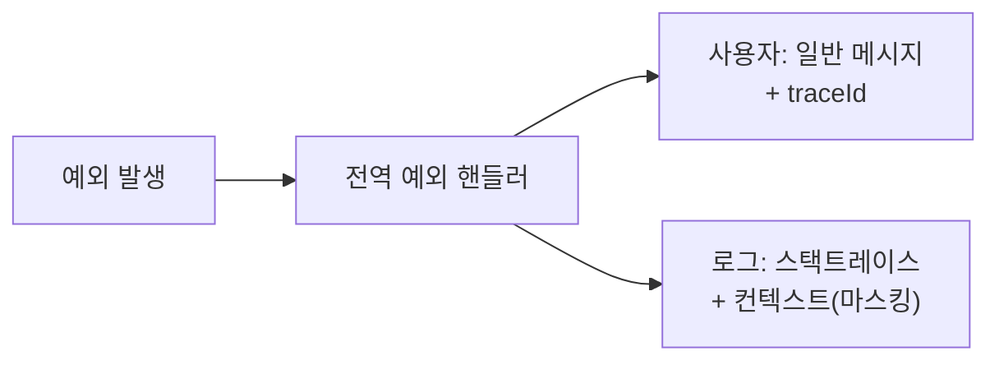

예외가 터졌을 때 화면에 그대로 노출되는 스택트레이스는 개발 중엔 편하지만 운영에선 정보 누출 경로다. 에러 응답 하나가 프레임워크 버전, 내부 경로, DB 구조, 인증 로직의 작동 방식까지 알려줄 수 있다. 에러 처리는 기능이자 보안 표면이다.

## 핵심 개념 — 두 청중을 분리하라

에러 정보에는 청중이 둘이다. **사용자**는 "무엇이 잘못됐고 어떻게 해야 하는지"만 알면 된다. **운영자/개발자**는 "어디서 왜 터졌는지"라는 진단 정보가 필요하다. 이 둘을 한 채널에 섞으면 사용자에게 줄 게 없거나, 공격자에게 너무 많이 준다.

원칙은 단순하다.

- **사용자 응답**: 일반화된 메시지 + 추적용 상관관계 ID(correlation id). 내부 세부정보 0.
- **서버 로그**: 전체 스택트레이스, 입력값, 컨텍스트. 단, 비밀번호·토큰·개인정보는 마스킹.

누출이 위험한 이유는 단서의 누적이다. 스택트레이스는 사용 중인 라이브러리와 버전을 노출해 알려진 취약점 탐색을 돕는다. SQL 오류 메시지는 테이블/컬럼 구조를 알려 SQL 인젝션을 정교화한다. "이메일이 존재하지 않습니다" vs "비밀번호가 틀렸습니다"의 차이는 **사용자 열거(enumeration)**를 허용한다 — 로그인 실패는 항상 동일 문구여야 한다.



## 코드 예시

전역 핸들러에서 응답과 로그를 갈라낸다.

```java
@RestControllerAdvice
public class GlobalExceptionHandler {

    private static final Logger log = LoggerFactory.getLogger(GlobalExceptionHandler.class);

    @ExceptionHandler(Exception.class)
    public ResponseEntity<ErrorResponse> handle(Exception ex) {
        String traceId = UUID.randomUUID().toString();
        // 내부 로그: 전부 남긴다
        log.error("unhandled error traceId={}", traceId, ex);
        // 사용자 응답: 최소한만
        var body = new ErrorResponse(
            "요청 처리 중 오류가 발생했습니다.",
            traceId);
        return ResponseEntity.status(500).body(body);
    }
}
```

사용자는 `traceId`만 받아 문의 시 전달하고, 운영자는 그 id로 로그를 즉시 찾는다.

## 운영 함정

**1) 기본 에러 페이지 노출.** 핸들러가 못 잡은 예외나 컨테이너 단의 5xx는 프레임워크 기본 에러 페이지(스택트레이스 포함)를 그대로 보여줄 수 있다. 운영 프로파일에서 스택트레이스 노출 옵션을 끄고, 정적 에러 페이지로 대체하라.

**2) 검증 메시지의 과다 노출.** "id는 BIGINT여야 하며 user_account.id를 참조합니다" 같은 친절한 검증 메시지가 스키마를 누출한다. 검증 실패도 일반화된 문구로 응답하고, 상세는 로그로만.

## 핵심 요약

- 사용자 응답과 내부 로그는 청중이 다르다 — 분리하라.
- 사용자에겐 일반 메시지 + traceId만, 스택트레이스/스키마/버전은 절대 노출 금지.
- 로그인 실패는 단서를 주지 않도록 항상 동일 문구로 응답한다(사용자 열거 방지).
