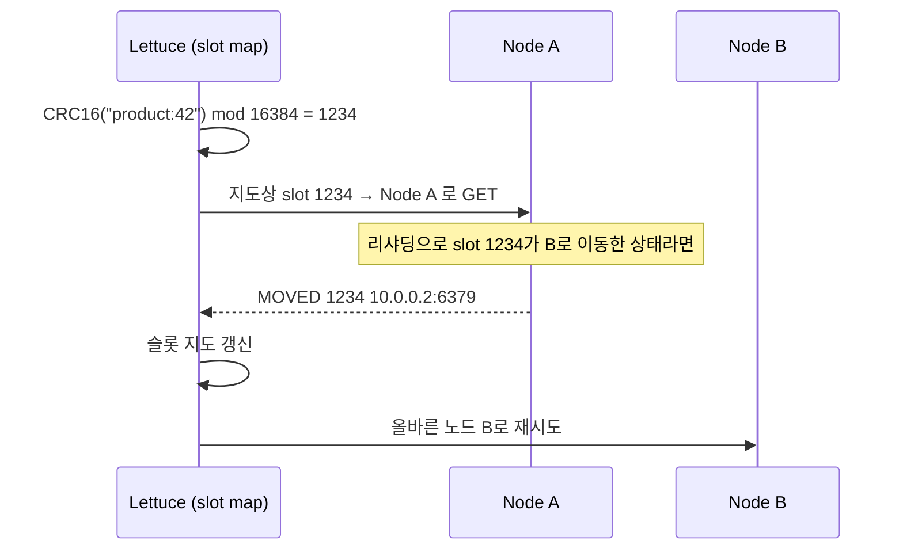

## 클러스터는 띄웠고, 이제 애플리케이션에서 쓰자

[Docker로 Redis 클러스터](/posts/redis-docker-cluster/)를 구성했으니 Spring Boot에서 연결합니다. 그런데 단일 노드를 쓰던 코드를 그대로 클러스터에 붙이면 십중팔구 두 가지에서 터집니다 — **`CROSSSLOT` 에러**와 **`redis-cli`에서 안 보이는 깨진 값**. 둘 다 "클러스터가 키를 어떻게 노드로 보내는가"와 "값을 어떻게 직렬화하는가"를 모르면 못 피합니다. 이 글은 `application.yml` 복붙을 넘어서, **키 → 슬롯 → 노드** 라우팅과 직렬화·커넥션 동작을 클라이언트(Lettuce) 레벨에서 설명합니다.

## 동작 한눈에: 키는 어떻게 노드를 찾는가

클러스터는 데이터를 **16384개의 해시 슬롯**으로 쪼개 마스터들이 나눠 가집니다. 어떤 키를 읽고 쓰든 클라이언트는 먼저 `CRC16(key) mod 16384`로 슬롯 번호를 구하고, 그 슬롯을 소유한 노드로 명령을 보냅니다. <span style="color:#2f9e44;font-weight:600">초록</span>은 올바른 노드로 직행하는 정상 경로, <span style="color:#e03131;font-weight:600">빨강</span>은 토폴로지가 바뀌어 엉뚱한 노드에 갔다가 `MOVED`로 재라우팅되는 경로입니다.

<div class="rc-route" markdown="0">
<style>
.rc-route{margin:1.4rem 0;overflow-x:auto}
.rc-route svg{width:100%;max-width:720px;height:auto;display:block;margin:0 auto;font-family:inherit}
.rc-route .lbl{fill:currentColor;font-size:12.5px;font-weight:600}
.rc-route .sub{fill:currentColor;font-size:9px;opacity:.55}
.rc-route .arr{stroke:currentColor;opacity:.3;stroke-width:1.4;fill:none}
.rc-route rect.box{fill:none;stroke:currentColor;stroke-width:1.5;opacity:.4}
.rc-route rect.owner{animation:rcpulse 5s ease-in-out infinite}
.rc-route .moved{fill:#e03131;font-size:11px;font-weight:700;opacity:0;animation:rcmlbl 5s linear infinite}
.rc-route circle.ok{fill:#2f9e44;animation:rcok 5s linear infinite}
.rc-route circle.mv{fill:#e03131;animation:rcmoved 5s linear infinite 1s}
@keyframes rcok{0%{transform:translate(0,0);opacity:0}8%{opacity:1}26%{transform:translate(185px,0)}34%{transform:translate(185px,0)}62%{transform:translate(540px,-64px)}85%{opacity:1}100%{transform:translate(540px,-64px);opacity:0}}
@keyframes rcmoved{0%{transform:translate(0,0);opacity:0}10%{opacity:1}24%{transform:translate(185px,0)}42%{transform:translate(540px,10px)}54%{transform:translate(540px,10px)}72%{transform:translate(540px,-64px)}90%{opacity:1}100%{transform:translate(540px,-64px);opacity:0}}
@keyframes rcmlbl{0%,42%{opacity:0}48%,60%{opacity:1}68%,100%{opacity:0}}
@keyframes rcpulse{0%,100%{opacity:.35}50%{opacity:.95}}
</style>
<svg viewBox="0 0 700 220" role="img" aria-label="키가 CRC16으로 슬롯이 되고 슬롯을 소유한 노드로 라우팅되며, 토폴로지가 바뀌면 MOVED로 올바른 노드를 다시 찾는 흐름 애니메이션">
  <rect class="box" x="8" y="84" width="112" height="48" rx="8"/>
  <text class="lbl" x="64" y="106" text-anchor="middle">GET</text>
  <text class="sub" x="64" y="121" text-anchor="middle">product:42</text>
  <rect class="box" x="168" y="78" width="152" height="60" rx="8"/>
  <text class="lbl" x="244" y="102" text-anchor="middle">CRC16 mod 16384</text>
  <text class="sub" x="244" y="120" text-anchor="middle">→ slot 1234</text>
  <rect class="box owner" x="520" y="24" width="170" height="40" rx="8"/>
  <text class="lbl" x="605" y="42" text-anchor="middle">Node A</text>
  <text class="sub" x="605" y="56" text-anchor="middle">slots 0–5460 ✓</text>
  <rect class="box" x="520" y="98" width="170" height="40" rx="8"/>
  <text class="lbl" x="605" y="116" text-anchor="middle">Node B</text>
  <text class="sub" x="605" y="130" text-anchor="middle">slots 5461–10922</text>
  <rect class="box" x="520" y="172" width="170" height="40" rx="8"/>
  <text class="lbl" x="605" y="190" text-anchor="middle">Node C</text>
  <text class="sub" x="605" y="204" text-anchor="middle">slots 10923–16383</text>
  <line class="arr" x1="120" y1="108" x2="168" y2="108"/>
  <line class="arr" x1="320" y1="100" x2="520" y2="46"/>
  <line class="arr" x1="320" y1="112" x2="520" y2="118"/>
  <text class="moved" x="470" y="150" text-anchor="middle">↩ MOVED 1234</text>
  <circle class="ok" cx="64" cy="108" r="7"/>
  <circle class="mv" cx="64" cy="108" r="7"/>
</svg>
</div>

이 그림의 모든 단계 — CRC16, 슬롯 소유, MOVED 재라우팅 — 는 비유가 아니라 클라이언트(Lettuce)가 실제로 하는 일입니다. 하나씩 내려가 봅니다.

## 클라이언트 선택: Lettuce vs Jedis

Spring Boot의 `spring-boot-starter-data-redis`는 기본 클라이언트로 **Lettuce**를 가져옵니다(`RedisAutoConfiguration` → `LettuceConnectionConfiguration`이 `RedisConnectionFactory`를 등록). 왜 Lettuce가 기본일까요?

| | **Lettuce** (기본) | **Jedis** |
|---|---|---|
| I/O 모델 | Netty 기반 **논블로킹** | 블로킹 소켓 |
| 스레드 안전성 | **하나의 커넥션을 여러 스레드가 공유** 가능 | 커넥션이 스레드 안전하지 않음 → **풀 필수** |
| 클러스터 토폴로지 | 자동 인식·갱신 내장 | 지원하나 설정이 더 수동적 |
| 리액티브 | 지원(`ReactiveRedisTemplate`) | 미지원 |

핵심은 **Lettuce는 멀티플렉싱된 단일 커넥션을 스레드끼리 공유**한다는 점입니다. 그래서 "동시 요청 수만큼 커넥션이 필요하다"는 풀 기반 사고가 Lettuce에선 대개 불필요합니다(뒤의 커넥션 풀 절 참고). Jedis로 바꾸려면 starter에서 `lettuce-core`를 빼고 `jedis`를 추가하면 자동 구성이 `JedisConnectionFactory`로 전환됩니다 — 이 "클래스패스에 무엇이 있느냐"로 갈리는 동작이 바로 [자동 구성]()의 `@ConditionalOnClass`입니다.

## 해시 슬롯과 MOVED/ASK — 라우팅의 핵심

클러스터에는 "전체를 아는 중앙 라우터"가 없습니다. 대신 **클라이언트가 슬롯→노드 지도(Lettuce의 `Partitions`)를 들고 직접 라우팅**합니다.



- **`MOVED`**: 슬롯이 **영구히** 다른 노드로 옮겨졌다는 응답. 클라이언트는 지도를 갱신하고 그 노드로 다시 보냅니다.
- **`ASK`**: 슬롯이 **마이그레이션 중**(일시적)이라는 응답. 이번 요청만 대상 노드로 보내되 지도는 바꾸지 않습니다.
- **`max-redirects`**: 이 리다이렉트를 몇 번까지 따라갈지. 기본 5, 초과하면 예외. 토폴로지가 요동칠 때 무한 추적을 막는 안전장치입니다.

정상 상황에선 Lettuce의 지도가 최신이라 **리다이렉트 없이 한 번에** 올바른 노드로 갑니다. `MOVED`가 자주 보인다면 토폴로지 갱신이 안 되고 있다는 신호입니다.

## 토폴로지 갱신: failover를 견디는 설정

마스터가 죽고 레플리카가 승격(failover)되면 슬롯 소유자가 바뀝니다. 클라이언트 지도가 옛날이면 죽은 노드를 계속 찌릅니다. Lettuce의 **adaptive refresh**는 `MOVED`/`ASK`/재연결 같은 트리거가 오면 지도를 자동 재조회하고, **periodic refresh**는 주기적으로 갱신합니다.

```yaml
spring:
  data:
    redis:
      cluster:
        nodes:                    # 시드 노드 — 가능하면 전부 나열(시작 안정성)
          - 127.0.0.1:6379
          - 127.0.0.1:6380
          - 127.0.0.1:6381
          - 127.0.0.1:6382
          - 127.0.0.1:6383
          - 127.0.0.1:6384
        max-redirects: 3
      lettuce:
        cluster:
          refresh:
            adaptive: true        # MOVED/재연결 트리거 시 토폴로지 자동 갱신
            period: 30s           # + 30초마다 주기 갱신
```

> `adaptive: true`가 핵심입니다. 이게 없으면 failover 후 클라이언트가 옛 마스터를 계속 호출해 타임아웃이 쌓입니다.
{: .prompt-tip }

## 커넥션 풀: Lettuce는 풀이 (대개) 필요 없다

Lettuce는 멀티플렉싱 단일 커넥션을 공유하므로 **명령 단위로 풀에서 빌리고 반납할 필요가 없습니다.** 풀(commons-pool2)이 의미 있는 경우는 블로킹 연산(`MULTI`/`EXEC` 트랜잭션, `WATCH`, 블로킹 명령)처럼 커넥션을 점유해야 할 때입니다. 풀을 쓰려면 `commons-pool2`를 클래스패스에 올려야 자동 구성이 풀을 활성화합니다.

```yaml
spring:
  data:
    redis:
      lettuce:
        pool:
          max-active: 16          # commons-pool2 의존성이 있어야 적용됨
          max-idle: 8
          max-wait: 200ms         # 풀 고갈 시 대기 한도(무한 대기 금지)
```

## RedisTemplate, 그리고 직렬화라는 진짜 함정

`RedisTemplate`은 키·값을 바이트로 바꿀 **serializer**가 필요합니다. 지정하지 않으면 기본이 `JdkSerializationRedisSerializer` — 자바 직렬화 바이트라 `redis-cli`에서 못 읽고, 클래스 구조가 바뀌거나 다른 서비스가 다른 클래스로 읽으면 깨집니다.

```java
@Configuration
public class RedisConfig {

    @Bean
    public RedisTemplate<String, Object> redisTemplate(RedisConnectionFactory cf) {
        RedisTemplate<String, Object> template = new RedisTemplate<>();
        template.setConnectionFactory(cf);
        template.setKeySerializer(new StringRedisSerializer());
        template.setHashKeySerializer(new StringRedisSerializer());
        template.setValueSerializer(new GenericJackson2JsonRedisSerializer());
        template.setHashValueSerializer(new GenericJackson2JsonRedisSerializer());
        return template;
    }
}
```

| Serializer | 저장 형태 | 비고 |
|---|---|---|
| `JdkSerializationRedisSerializer`(기본) | 바이너리 | 사람이 못 읽음·클래스 결합·이식성 최악 |
| `StringRedisSerializer` | 평문 문자열 | 키에 적합 |
| `GenericJackson2JsonRedisSerializer` | JSON(`@class` 타입 정보 포함) | 다형성 OK, `@class` 만큼 용량↑ |
| `Jackson2JsonRedisSerializer<T>` | JSON(타입 고정) | 타입 정보 없음, 단일 타입에 깔끔 |

> 키만 다룰 거면 `RedisTemplate` 대신 `StringRedisTemplate`(키·값 모두 String)을 쓰는 게 단순하고 안전합니다.

## 프로덕션에서 실제로 터지는 것들

**① 직렬화 불일치** — 쓸 땐 JSON, 읽을 땐 JDK(기본) serializer면 역직렬화가 깨집니다. **쓰는 쪽과 읽는 쪽의 serializer를 반드시 일치**시키세요. 여러 서비스가 같은 Redis를 공유하면 직렬화 포맷을 팀 표준으로 못박아야 합니다.

**② `CROSSSLOT` 에러** — 멀티키 명령(`MGET`, 파이프라인, 트랜잭션, Lua)은 **모든 키가 같은 슬롯**에 있어야 합니다. 클러스터는 한 명령이 여러 노드에 걸치는 걸 허용하지 않기 때문입니다. 해법은 **해시 태그** `{}` — 중괄호 안 부분만 CRC16에 쓰여, 같은 태그를 가진 키들이 같은 슬롯에 모입니다.

```text
user:{42}:profile   ┐ 둘 다 "{42}"로 해싱 → 같은 슬롯
user:{42}:cart      ┘ → MGET user:{42}:profile user:{42}:cart  OK
user:42:profile     ┐ 서로 다른 슬롯 → MGET 시
user:43:cart        ┘ CROSSSLOT Keys ... 에러
```

**③ 커넥션 타임아웃·풀 고갈** — `max-wait`를 무한(`-1`)으로 두면 풀 고갈 시 스레드가 영원히 대기합니다. 명시적 한도 + 적절한 command timeout을 두세요.

## 디버깅

- **Lettuce 로그**: `logging.level.io.lettuce.core=DEBUG` 로 실제 어느 노드로 명령이 가고 `MOVED`가 오는지 추적.
- **클러스터 상태**: `redis-cli -c cluster slots` / `cluster nodes` 로 슬롯 분포·소유자 확인.
- **키→슬롯 직접 계산**: `redis-cli cluster keyslot "user:{42}:cart"` 로 해시 태그가 의도대로 묶이는지 검증.

## 캐시 추상화와 함께

[Spring 캐시 추상화]()(`@Cacheable`)의 저장소로 이 클러스터를 그대로 쓸 수 있습니다. `spring.cache.type: redis`면 `RedisCacheManager`가 자동 구성되어 애너테이션 캐싱이 클러스터에 저장됩니다. 이때도 `RedisCacheConfiguration`의 value serializer를 JSON으로 맞춰 두는 게 운영상 안전합니다.

## 면접/리뷰 단골 질문

- **Q. 클러스터에서 `MGET`이 왜 실패하나?** → 키들이 서로 다른 슬롯(다른 노드)이라 `CROSSSLOT`. 해시 태그 `{}`로 같은 슬롯에 모아야 한다.
- **Q. `MOVED`와 `ASK`의 차이는?** → MOVED는 슬롯이 영구 이동(지도 갱신), ASK는 마이그레이션 중 일시 리다이렉트(지도 미갱신).
- **Q. Lettuce가 Jedis와 달리 풀이 거의 필요 없는 이유는?** → Netty 기반 멀티플렉싱 단일 커넥션을 스레드끼리 공유하기 때문. 블로킹/트랜잭션 점유 시에만 풀이 의미.

## 정리

- 클러스터 라우팅 = **`CRC16(key) mod 16384` → 슬롯 → 소유 노드**. 토폴로지가 바뀌면 `MOVED`/`ASK`로 재라우팅된다.
- 기본 클라이언트 **Lettuce**는 Netty 논블로킹·스레드 공유 단일 커넥션 → 풀이 대개 불필요. **`refresh.adaptive: true`**로 failover에 대응한다.
- 멀티키 연산은 **해시 태그 `{}`**로 같은 슬롯에 모아 `CROSSSLOT`을 피한다.
- **직렬화는 쓰는 쪽·읽는 쪽을 일치**시키고, 기본 JDK 직렬화 대신 String/JSON serializer를 명시하자.

> 관련 글: 애너테이션 캐싱은 [캐시 추상화](), "클라이언트 클래스패스로 동작이 갈리는" 원리는 [자동 구성]()에서 다룹니다.
