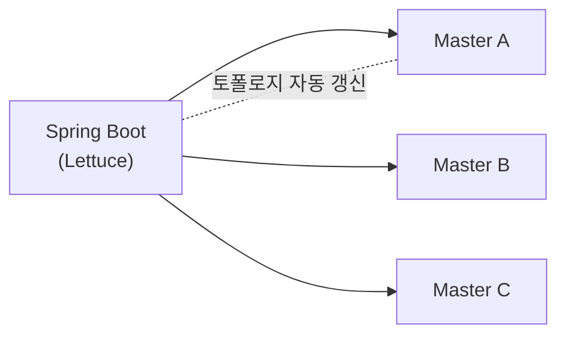

## 클러스터는 띄웠고, 이제 애플리케이션에서 쓰자

[Docker로 Redis 클러스터](/posts/redis-docker-cluster/)를 구성했으니, Spring Boot에서 연결해봅니다. 단일 노드와 설정이 조금 다릅니다.

## 의존성과 클라이언트

Spring Boot의 Redis 스타터는 기본 클라이언트로 **Lettuce**를 씁니다. Lettuce는 논블로킹·클러스터 토폴로지 자동 인식을 지원해 클러스터에 잘 맞습니다.

```gradle
implementation 'org.springframework.boot:spring-boot-starter-data-redis'
```



## 클러스터 노드 설정

`application.yml`에 클러스터 노드들을 나열합니다.

```yaml
spring:
  data:
    redis:
      cluster:
        nodes:
          - 127.0.0.1:6379
          - 127.0.0.1:6380
          - 127.0.0.1:6381
          - 127.0.0.1:6382
          - 127.0.0.1:6383
          - 127.0.0.1:6384
        max-redirects: 3        # MOVED/ASK 리다이렉트 추적 횟수
      lettuce:
        cluster:
          refresh:
            adaptive: true       # 토폴로지 변경(failover 등) 자동 감지
            period: 30s
```

> `refresh.adaptive: true`가 중요합니다. failover로 마스터가 바뀌어도 토폴로지를 자동 갱신해, 클라이언트가 옛 노드를 계속 찌르는 문제를 막아줍니다.
{: .prompt-tip }

## RedisTemplate으로 사용

```java
@Configuration
public class RedisConfig {

    @Bean
    public RedisTemplate<String, Object> redisTemplate(RedisConnectionFactory cf) {
        RedisTemplate<String, Object> template = new RedisTemplate<>();
        template.setConnectionFactory(cf);
        template.setKeySerializer(new StringRedisSerializer());
        template.setValueSerializer(new GenericJackson2JsonRedisSerializer());
        return template;
    }
}
```

직렬화(serializer)를 지정하는 게 중요합니다. 기본 JDK 직렬화는 읽기 어려운 바이트로 저장되니, 키는 `String`, 값은 JSON으로 두면 `redis-cli`에서도 사람이 읽을 수 있습니다.

```java
@Service
@RequiredArgsConstructor
public class ProductCache {
    private final RedisTemplate<String, Object> redisTemplate;

    public void put(Long id, Product product) {
        redisTemplate.opsForValue().set("product:" + id, product, Duration.ofMinutes(10));
    }

    public Product get(Long id) {
        return (Product) redisTemplate.opsForValue().get("product:" + id);
    }
}
```

## 캐시 추상화와 함께

[Spring 캐시 추상화](/posts/springboot-cache-abstraction/)(`@Cacheable`)의 저장소로 이 클러스터를 그대로 쓸 수 있습니다. `spring.cache.type: redis`로 두면 애너테이션 기반 캐싱이 클러스터에 저장됩니다.

## 운영 팁

- 멀티키 연산은 [해시 태그 `{}`](/posts/redis-docker-cluster/)로 같은 슬롯에 모으기.
- 타임아웃·커넥션 풀(`lettuce.pool`)을 트래픽에 맞게 설정.
- 클러스터 노드는 **가능한 전부 나열**(일부만 적어도 동작하지만, 시작 시 안정성을 위해).

## 정리

- Spring Boot Redis 스타터 + **Lettuce**로 클러스터 연결.
- `spring.data.redis.cluster.nodes` 나열 + **`refresh.adaptive: true`**(failover 대응).
- `RedisTemplate`은 **직렬화 설정**(키 String, 값 JSON)을 챙기자.
- `@Cacheable` 저장소로도 그대로 활용 가능.
