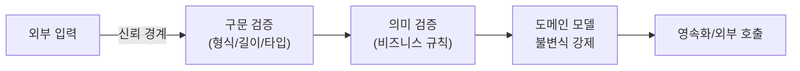

입력 경로가 늘어날수록 검증의 일관성이 무너지기 쉽다. 새 API, 새 파라미터, 새 외부 연동이 추가될 때마다 "이건 믿어도 되겠지"라는 가정이 슬그머니 끼어든다. 그 가정이 한 곳이라도 틀리면 시스템 깊숙한 곳까지 더러운 데이터가 흘러든다. 핵심 개념은 **신뢰 경계(trust boundary)**다.

## 핵심 개념 — 경계 밖은 모두 적대적이다

신뢰 경계는 "신뢰할 수 있는 코드"와 "신뢰할 수 없는 데이터"가 만나는 선이다. 시스템 외부(클라이언트, 외부 API, 큐 메시지, 파일 업로드, 심지어 다른 마이크로서비스)에서 들어오는 모든 데이터는 경계를 넘는 순간 **잠재적으로 적대적**이라고 본다.

검증을 경계에서 해야 하는 이유:

- 경계에서 한 번 정제하면, 내부 코드는 "값이 이미 유효하다"는 가정 위에서 단순해진다.
- 검증이 안쪽으로 흩어지면 어디서 어떤 검증이 됐는지 추적 불가 → 누락이 생긴다.
- 깊은 곳에서 터지는 오류는 진단 비용이 크다. 입구에서 빨리 거절(fail fast)하는 편이 싸다.

중요한 함정은 **내부 신뢰 가정**이다. "이 메서드는 컨트롤러에서만 호출되니 검증됐겠지"가 대표적이다. 호출 경로가 하나 추가되거나 리팩터링되는 순간 가정은 깨진다. 그래서 **다층 방어(defense in depth)**가 필요하다 — 경계 검증을 1차로 두되, 도메인 모델 자체도 불변식을 강제한다.



## 코드 예시

경계(컨트롤러)에서 선언적으로 검증하고, 도메인에서 한 번 더 불변식을 지킨다.

```java
public record CreateOrderRequest(
    @NotNull @Size(max = 64) String customerRef,
    @NotEmpty List<@Valid LineItem> items) {

    public record LineItem(
        @NotNull Long productId,
        @Min(1) @Max(999) int quantity) {}
}

@PostMapping("/orders")
public OrderView create(@Valid @RequestBody CreateOrderRequest req) {
    return orderService.place(req); // 여기 도달하면 구문은 유효
}
```

```java
// 도메인: 외부에서 어떻게 불려도 불변식을 스스로 지킨다
public final class Quantity {
    private final int value;
    public Quantity(int value) {
        if (value < 1 || value > 999)
            throw new IllegalArgumentException("invalid quantity");
        this.value = value;
    }
}
```

## 운영 함정

**1) 허용 목록 vs 차단 목록.** 무엇이 위험한지 나열(blocklist)하는 방식은 항상 빠지는 경우가 생긴다. **허용할 형식만 명시(allowlist)**하는 편이 견고하다. 예: "이 필드는 영숫자 1~32자만" 식으로 좁게 규정한다.

**2) 출력 시점 인코딩 망각.** 입력 검증은 저장의 무결성을 지키지만, 같은 데이터가 HTML/SQL/셸 등 다른 컨텍스트로 나갈 때는 **그 컨텍스트에 맞는 출력 인코딩/파라미터 바인딩**이 별도로 필요하다. 입력 검증 하나로 인젝션이 다 막히지 않는다.

## 핵심 요약

- 외부 입력은 신뢰 경계를 넘는 순간 적대적으로 간주하고 입구에서 검증한다.
- "내부에서만 호출되니 안전하다"는 가정은 깨진다 — 도메인 모델도 불변식을 강제하는 다층 방어로.
- 차단 목록보다 허용 목록, 그리고 입력 검증과 별개로 출력 컨텍스트별 인코딩을 적용하라.
