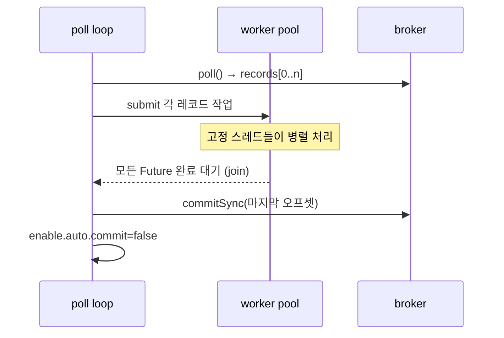

## 도입 — poll 루프가 직렬로 막히는 순간

메시지 큐 컨슈머의 기본형은 단순하다. 한 스레드가 `poll()`로 레코드 묶음을 받고, for 루프로 하나씩 처리한 뒤 오프셋을 커밋한다. 처리가 가벼우면 이걸로 충분하다. 문제는 레코드 하나당 처리가 **무거울 때**다. 메일 발송, 외부 API 호출처럼 수백 밀리초가 걸리는 작업을 직렬로 돌리면, 파티션에 메시지가 쌓이는 속도를 단일 스레드가 따라잡지 못한다. 컨슈머 랙(lag)이 끝없이 늘어난다.

이 주의 핵심은 **"처리는 워커 풀로 병렬화하되, 오프셋 커밋만은 안전선을 지키는 것"** 이다. 병렬화 자체보다 *언제 커밋하느냐*가 정합성의 전부다.

## 핵심 개념 — poll-처리-커밋의 불변식

컨슈머 그룹에서 오프셋 커밋은 "여기까지 처리 완료했다"는 약속이다. 만약 처리가 끝나기 전에 커밋하면, 그 직후 컨슈머가 죽었을 때 재시작한 컨슈머는 **이미 커밋된 오프셋 다음부터** 읽는다. 즉 아직 처리 안 끝난 메시지가 영영 유실된다.

따라서 멀티스레딩을 얹어도 불변식은 하나다.

> **한 묶음(poll batch)의 모든 워커 작업이 끝난 뒤에만 그 묶음의 마지막 오프셋을 커밋한다.**

이걸 지키면 at-least-once(최소 한 번)가 보장된다. 워커가 던지면 커밋을 보류하고 그 묶음을 재처리한다.



## 코드 — 고정 스레드 풀 + 완료 후 동기 커밋

```java
ExecutorService pool = new ThreadPoolExecutor(
    8, 8,                                   // 고정 크기: 코어=최대
    0L, TimeUnit.MILLISECONDS,
    new ArrayBlockingQueue<>(1000),         // 유계 큐: 무한 적재 방지
    new ThreadPoolExecutor.CallerRunsPolicy() // 포화 시 호출 스레드가 직접 처리 → 자연 백프레셔
);

while (running) {
    ConsumerRecords<String, String> records = consumer.poll(Duration.ofMillis(500));
    if (records.isEmpty()) continue;

    List<Future<?>> futures = new ArrayList<>();
    for (ConsumerRecord<String, String> r : records) {
        futures.add(pool.submit(() -> handle(r)));  // 무거운 처리 병렬화
    }

    // 핵심: 이 묶음의 모든 작업이 끝날 때까지 막는다
    for (Future<?> f : futures) {
        f.get();   // 워커 예외는 ExecutionException으로 여기서 터진다 — 삼키지 않는다
    }

    consumer.commitSync();  // 전부 성공한 뒤에만 커밋
}
```

`enable.auto.commit=false`는 전제다. 자동 커밋을 켜두면 poll 시점에 시간 기반으로 커밋되어 안전선이 깨진다.

**포화 정책**이 백프레셔 역할을 한다는 점이 중요하다. 큐가 가득 차면 `CallerRunsPolicy`가 제출하던 poll 스레드에게 그 작업을 직접 시킨다. 그러면 다음 `poll()`이 늦어지고, 자연스럽게 인입 속도가 처리 속도에 묶인다. 무계 큐(`LinkedBlockingQueue`)를 쓰면 메모리가 터질 때까지 쌓이므로 **유계 큐 + 거절 정책**이 정석이다.

## 운영 함정

**1) max.poll.interval.ms 초과로 리밸런싱 폭풍.** 한 묶음 처리가 너무 오래 걸리면 브로커는 이 컨슈머가 죽은 줄 알고 파티션을 회수한다. 그러면 재할당(리밸런싱)이 일어나고, 회수된 파티션의 미커밋 메시지가 다른 컨슈머에서 **재처리**된다. 처리 시간이 `max.poll.interval.ms`(기본 5분)를 넘지 않도록 한 묶음 크기(`max.poll.records`)와 워커 수를 맞춰야 한다.

**2) 파티션 내 순서 보장이 깨진다.** 워커 풀로 던지는 순간, 같은 파티션의 메시지가 동시에 처리되어 **순서가 뒤바뀐다**. 순서가 중요한 키(예: 같은 주문의 상태 변경)는 키별로 같은 워커로 보내야 한다. `key.hashCode() % poolSize`로 워커를 고정 매핑하면 키 단위 순서는 지키면서 병렬성은 얻는다.

## 핵심 요약 / 면접 Q&A

- **Q. 멀티스레드 컨슈머에서 커밋은 언제?** A. 한 poll 묶음의 모든 워커 작업이 끝난 뒤에만 동기 커밋한다. 그래야 중간에 죽어도 미처리 메시지가 재처리되어 at-least-once가 유지된다.
- **Q. 워커 풀 포화 시?** A. 유계 큐 + `CallerRunsPolicy`로 자연 백프레셔를 건다. 무계 큐는 OOM, 단순 거절은 유실 위험.
- **Q. 병렬화의 부작용은?** A. 파티션 내 순서가 깨진다. 순서가 필요하면 키 해시로 워커를 고정한다.
- **한 줄 정리:** 처리는 병렬로, 커밋은 묶음 완료 후 한 번. 안전선은 "끝나기 전엔 절대 커밋하지 않는다"이다.
