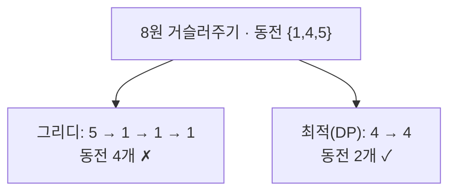

## 가장 단순한 전략, 가장 위험한 전략

그리디(greedy)는 알고리즘 중 가장 직관적입니다. **매 순간 그 자리에서 가장 좋아 보이는 선택**을 하고 절대 되돌아보지 않습니다. 거스름돈을 줄 때 큰 동전부터 집는 그 본능 그대로입니다. 빠르고(보통 정렬 + 한 번 훑기) 코드도 짧습니다.

문제는 **위험하다**는 것. 매 순간의 최선이 전체의 최선을 보장하지 않습니다. 그래서 그리디의 진짜 어려움은 "어떻게 푸느냐"가 아니라 "**이 문제에서 그리디가 정답을 주는가**"를 증명하는 데 있습니다.

## 그리디가 깨지는 순간 — 거스름돈 반례

동전이 `{1, 4, 5}`이고 8원을 거슬러 준다고 합시다. 큰 것부터 집는 그리디는 `5 + 1 + 1 + 1 = 4개`. 하지만 정답은 `4 + 4 = 2개`입니다. 그리디가 첫 선택(5)에 갇혀 더 나은 전체 해를 놓쳤습니다.

이처럼 그리디가 통할지 아닐지는 동전 체계에 달려 있습니다(원화·달러처럼 잘 설계된 체계는 그리디가 맞음). 그래서 그리디를 쓰려면 **반드시 정당성을 따져야** 하고, 안 되면 [동적계획법]()으로 모든 경우를 봐야 합니다.

## 언제 그리디가 통하는가 — 두 개의 증명 도구

그리디의 정당성은 보통 두 가지로 증명합니다.

- **탐욕적 선택 속성(greedy-choice property)**: 첫 그리디 선택을 포함하는 최적해가 반드시 존재한다.
- **교환 논법(exchange argument)**: 임의의 최적해를 가져와, 그리디 선택과 다른 부분을 그리디 쪽으로 **교환**해도 해가 나빠지지 않음을 보인다 → 그리디 해도 최적.

수학적으로 이 구조가 보장되는 대상이 **매트로이드(matroid)** 입니다. 문제가 매트로이드로 모델링되면 "가중치 큰 것부터 그리디"가 항상 최적임이 증명돼 있습니다 — [최소 신장 트리]()의 크루스칼이 그 대표 사례입니다.

## 활동 선택 — 끝나는 시간이 빠른 것부터

회의실 하나에 겹치지 않게 회의를 최대한 많이 넣는 문제. 정답 그리디는 **"가장 일찍 끝나는 회의부터"** 집는 것입니다. 직관: 빨리 끝낼수록 뒤에 남는 시간이 많아 더 많은 회의를 담을 여지가 생깁니다. 아래는 끝나는 시간 순으로 정렬한 회의들 중, 겹치지 않는 것을 차례로 채택(초록)하고 겹치는 것은 버리는(회색) 과정입니다.

<svg viewBox="0 0 640 240" role="img" aria-label="활동 선택 그리디에서 끝나는 시간이 빠른 회의부터 차례로 채택하고 겹치는 회의는 버리는 애니메이션">
  <text class="sub" x="20" y="20">끝나는 시간 순 정렬 → 겹치지 않으면 채택(초록), 겹치면 버림(회색)</text>
  <line class="ax" x1="40" y1="210" x2="620" y2="210"/>
  <text class="sub" x="40" y="228">시간 →</text>
  <rect class="bar" x="60"  y="40"  width="160" height="22" rx="4"/><rect class="pick p0" x="62" y="42" width="156" height="18" rx="3"/><text class="sub" x="140" y="55" text-anchor="middle">A 채택</text>
  <rect class="bar" x="120" y="72"  width="170" height="22" rx="4"/><rect class="drop d0" x="122" y="74" width="166" height="18" rx="3"/><text class="sub" x="205" y="87" text-anchor="middle">B 겹침</text>
  <rect class="bar" x="240" y="104" width="150" height="22" rx="4"/><rect class="pick p1" x="242" y="106" width="146" height="18" rx="3"/><text class="sub" x="315" y="119" text-anchor="middle">C 채택</text>
  <rect class="bar" x="300" y="136" width="140" height="22" rx="4"/><rect class="drop d1" x="302" y="138" width="136" height="18" rx="3"/><text class="sub" x="370" y="151" text-anchor="middle">D 겹침</text>
  <rect class="bar" x="430" y="168" width="160" height="22" rx="4"/><rect class="pick p2" x="432" y="170" width="156" height="18" rx="3"/><text class="sub" x="510" y="183" text-anchor="middle">E 채택</text>
</svg>

정렬에 $O(n\log n)$, 한 번 훑기에 $O(n)$. 교환 논법으로 "가장 일찍 끝나는 회의를 포함하는 최적해가 존재함"을 보이면 정당성이 끝납니다.

## 허프만 코딩 — 자주 나오는 글자에 짧은 비트를

그리디의 가장 우아한 승리는 **허프만 코딩**(데이터 압축)입니다. 모든 글자에 같은 비트 수를 쓰는 대신, **자주 나오는 글자엔 짧은 코드, 드문 글자엔 긴 코드**를 줍니다. 핵심 제약은 **접두부호(prefix code)** — 어떤 코드도 다른 코드의 접두사가 되면 안 됩니다(그래야 구분자 없이 디코딩 가능).

그리디 전략은 명쾌합니다. **빈도가 가장 작은 두 노드를 골라 합치기**를 반복합니다. 합친 노드의 빈도는 두 자식의 합이고, 이를 다시 후보에 넣습니다([우선순위 큐]()가 딱 맞는 자리). 아래는 빈도 `{A:5, B:2, C:1, D:1}`에서 트리가 아래에서 위로 자라는 모습입니다.

<svg viewBox="0 0 600 240" role="img" aria-label="허프만 코딩에서 빈도가 가장 작은 두 노드를 반복해서 병합하며 접두부호 트리가 아래에서 위로 자라는 애니메이션">
  <rect class="leaf" x="40"  y="190" width="40" height="34" rx="5"/><text class="lbl" x="60"  y="212" text-anchor="middle">C:1</text>
  <rect class="leaf" x="120" y="190" width="40" height="34" rx="5"/><text class="lbl" x="140" y="212" text-anchor="middle">D:1</text>
  <rect class="leaf" x="220" y="190" width="40" height="34" rx="5"/><text class="lbl" x="240" y="212" text-anchor="middle">B:2</text>
  <rect class="leaf" x="360" y="190" width="40" height="34" rx="5"/><text class="lbl" x="380" y="212" text-anchor="middle">A:5</text>
  <line class="edge m1" x1="100" y1="150" x2="60"  y2="190"/>
  <line class="edge m1" x1="100" y1="150" x2="140" y2="190"/>
  <circle class="inode m1" cx="100" cy="138" r="16"/><text class="lbl m1" x="100" y="142" text-anchor="middle">2</text>
  <line class="edge m2" x1="170" y1="98" x2="100" y2="124"/>
  <line class="edge m2" x1="170" y1="98" x2="240" y2="190"/>
  <circle class="inode m2" cx="170" cy="86" r="16"/><text class="lbl m2" x="170" y="90" text-anchor="middle">4</text>
  <line class="edge m3" x1="275" y1="46" x2="170" y2="72"/>
  <line class="edge m3" x1="275" y1="46" x2="380" y2="190"/>
  <circle class="inode m3" cx="275" cy="34" r="16"/><text class="lbl m3" x="275" y="38" text-anchor="middle">9</text>
  <text class="sub" x="470" y="90">합칠 때마다 최소</text>
  <text class="sub" x="470" y="104">빈도 두 개 선택</text>
  <text class="sub" x="470" y="118">→ 드문 글자가 깊이↑</text>
</svg>

트리에서 왼쪽 간선을 0, 오른쪽을 1로 읽으면 각 글자의 코드가 나옵니다. `A`는 얕아서 짧고(예: `1`), `C·D`는 깊어서 길죠(예: `000`, `001`). 평균 코드 길이 $\sum p_i \cdot \text{len}_i$가 최소가 되는 것이 허프만의 최적성이고, 이는 교환 논법으로 증명됩니다.

## 그리디는 도처에 있다

| 알고리즘 | 그리디 선택 기준 | 정당성 |
|----------|------------------|--------|
| [다익스트라]() | 미확정 중 최단 거리 정점 확정 | 음수 간선 없을 때 |
| [크루스칼/프림]() | 가장 가벼운 안전한 간선 | 매트로이드/컷 정리 |
| 허프만 | 최소 빈도 두 노드 병합 | 교환 논법 |
| 활동 선택 | 가장 일찍 끝나는 일정 | 교환 논법 |

> 다익스트라가 그리디인데 음수 간선에서 깨지는 것이 좋은 교훈입니다 — 그리디는 "되돌아보지 않음"이 전제라, 나중에 더 싼 경로가 나타날 수 있으면(음수 간선) 무너집니다.

## 프로덕션에서 마주치는 함정

| 함정 | 증상 | 해법 |
|------|------|------|
| 정당성 미검증 | 일부 입력에서 최적 아님 | 교환 논법으로 증명 or DP/완전탐색 |
| 정렬 기준 오류 | "가장 좋아 보이는"의 정의가 틀림 | 무엇을 최소/최대화하는지 명확히 |
| 동점 처리 | 같은 우선순위에서 임의 선택이 결과 좌우 | 2차 정렬 키 명시 |
| 그리디≠근사 혼동 | 최적인 줄 알았는데 근사일 뿐 | 근사비 보장 따로 확인 |

## 면접/리뷰 단골 질문

- **Q. 그리디가 통하는 조건?** → 탐욕적 선택 속성 + 최적 부분구조. 매트로이드로 모델링되면 보장.
- **Q. 그리디 정당성 증명법?** → 교환 논법: 최적해를 그리디 선택 쪽으로 교환해도 나빠지지 않음을 보임.
- **Q. 활동 선택에서 왜 '끝 시간'으로 정렬?** → 빨리 끝낼수록 뒤 자원이 많이 남아 더 많이 담을 수 있음. 시작/길이 기준은 반례 존재.
- **Q. 허프만이 최적인 이유?** → 최소 빈도 두 글자가 가장 깊은 형제가 되는 최적해가 존재(교환 논법). 접두부호라 디코딩 모호성 없음.
- **Q. 그리디 vs DP 선택 기준?** → 그리디 정당성이 증명되면 그리디(빠름). 안 되면 DP로 모든 경우.

## 정리

- 그리디는 **매 순간 국소 최선**을 집고 되돌아보지 않는다 — 빠르지만 항상 옳진 않다.
- 정당성은 **탐욕적 선택 속성 + 교환 논법**(또는 매트로이드 구조)으로 증명해야 한다.
- **허프만 코딩**은 최소 빈도 두 노드를 반복 병합해 최적 접두부호를 만든다 — 그리디의 우아한 승리.
- 다익스트라·MST도 그리디. 단 다익스트라는 음수 간선에서 깨진다(되돌아보지 않음의 대가).

> 다음 글은 [문자열 매칭(KMP·라빈-카프)]()입니다. 이전 글은 [동적계획법]() — 그리디로 안 되는 문제를 어떻게 표로 정복하는지 다뤘습니다.
