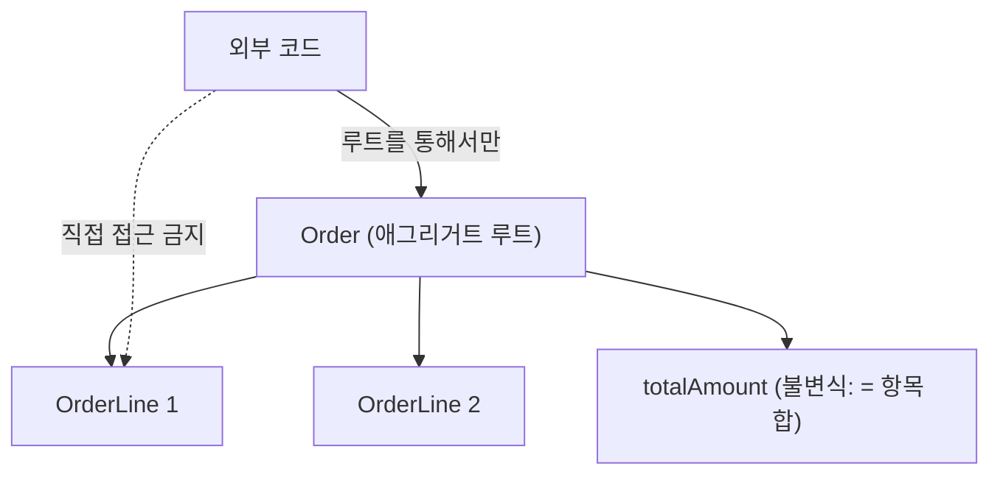

여러 엔티티가 함께 바뀌어야 하는 흐름을 작업한 적이 있다. 주문과 그 항목, 합계 금액이 한 번에 맞아떨어져야 하는데, 일부만 저장되면 데이터가 모순에 빠진다. 핵심은 "어디까지를 한 번에 지켜야 하는 한 덩어리로 볼 것인가"다. 이 경계를 도메인 주도 설계에서는 **애그리거트(aggregate)** 라 부른다.

## 일관성 경계란 무엇인가

애그리거트는 "항상 함께 일관성을 유지해야 하는 객체들의 묶음"이다. 그 묶음에는 외부에서 접근하는 단 하나의 입구인 **애그리거트 루트**가 있다. 외부는 루트를 통해서만 내부를 바꾼다. 왜 이런 제약이 필요한가? **불변식(invariant)** 을 한 곳에서 지키기 위해서다.

불변식이란 "언제나 참이어야 하는 규칙"이다. 예를 들어 "주문의 총액은 항상 항목 금액의 합과 같다"거나 "확정된 주문에는 항목을 추가할 수 없다". 이 규칙이 깨진 상태가 단 한순간이라도 DB에 저장되면 안 된다. 그래서 불변식이 걸린 데이터들은 **하나의 트랜잭션 안에서 함께 커밋**되어야 한다.



## 경계가 곧 트랜잭션 단위다

여기서 중요한 원칙이 나온다. **하나의 트랜잭션은 하나의 애그리거트만 변경한다.** 한 트랜잭션에서 여러 애그리거트를 바꾸려 하면, 그건 경계 설정이 잘못됐다는 신호이거나, 실제로는 별개의 일관성 단위를 억지로 묶고 있다는 뜻이다. 애그리거트 사이의 정합성은 트랜잭션이 아니라 **최종적 일관성(eventual consistency)** — 이벤트나 후속 처리로 맞춘다.

루트가 불변식을 책임지므로, 항목을 더하는 로직도 루트의 메서드 안에 둔다.

```java
public class Order {
    private final List<OrderLine> lines = new ArrayList<>();
    private long totalAmount;
    private OrderStatus status = OrderStatus.DRAFT;

    // 외부는 이 메서드로만 항목을 추가한다 — 불변식이 여기서 지켜진다
    public void addLine(Product product, int qty) {
        if (status != OrderStatus.DRAFT)
            throw new IllegalStateException("확정된 주문은 변경 불가");
        if (qty <= 0)
            throw new IllegalArgumentException("수량은 1 이상");
        lines.add(new OrderLine(product.id(), product.price(), qty));
        recalcTotal();                  // 총액 불변식 즉시 회복
    }

    private void recalcTotal() {
        this.totalAmount = lines.stream()
            .mapToLong(l -> l.price() * l.qty()).sum();
    }
}
```

서비스 계층은 루트 하나를 로드하고, 바꾸고, 저장한다. 한 트랜잭션, 한 애그리거트.

```java
@Transactional
public void addItem(Long orderId, Long productId, int qty) {
    Order order = orderRepository.findById(orderId);   // 루트 로드
    Product product = productRepository.findById(productId);
    order.addLine(product, qty);                        // 불변식은 루트가 보장
    orderRepository.save(order);                        // 통째로 커밋
}
```

## 운영 함정

**함정 1 — 너무 큰 애그리거트.** "관련 있어 보인다"는 이유로 사용자·주문·결제·배송을 한 루트에 묶으면, 사소한 변경에도 거대한 객체를 로드하고 락 경합이 심해진다. 경계는 **불변식을 기준**으로 최소화한다. 함께 깨지면 안 되는 것만 묶는다.

**함정 2 — 내부 엔티티 직접 노출.** 리포지토리가 `OrderLine`을 직접 조회·수정하게 열어 두면 루트를 우회해 불변식이 깨진다. 내부는 루트를 통해서만 변경한다.

## 면접 한 줄 Q&A

- **Q. 애그리거트 경계는 무엇을 기준으로 정하나?** A. 트랜잭션으로 함께 지켜야 하는 불변식. 함께 깨지면 안 되는 데이터만 한 경계로 묶고, 나머지는 최종적 일관성으로 맞춘다.
- **Q. 한 트랜잭션에서 여러 애그리거트를 바꾸면?** A. 경계 설계를 의심해야 한다. 원칙은 트랜잭션당 애그리거트 하나다.
