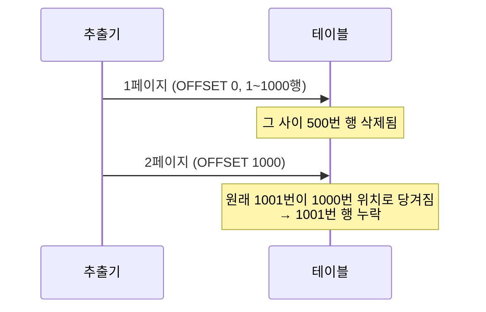

대량 데이터를 파일로 추출하는 작업을 한 적이 있다. 수십만 건을 한 번에 메모리에 올릴 수 없으니 페이지 단위로 끊어 읽는다. 그런데 여기엔 함정이 있다. **추출이 진행되는 수 분 동안 원본 데이터는 계속 바뀐다.** 이 시간 차가 중복과 누락을 만든다. 핵심은 "긴 추출 작업 전체가 동일한 시점의 데이터를 보게 하는 것"이다.

## OFFSET 페이징이 데이터를 어긋나게 하는 이유

가장 흔한 추출 방식은 `LIMIT ... OFFSET ...` 으로 페이지를 넘기는 것이다.

```sql
-- 1페이지
SELECT id, name FROM users ORDER BY id LIMIT 1000 OFFSET 0;
-- 2페이지
SELECT id, name FROM users ORDER BY id LIMIT 1000 OFFSET 1000;
```

문제는 OFFSET이 **"앞에서부터 N개를 세어 건너뛰라"** 는 위치 기반이라는 점이다. 추출 도중 앞쪽 행이 삭제되거나 추가되면, 세는 기준점이 통째로 밀린다.



앞에서 한 건이 지워지면 모든 후속 행이 한 칸씩 당겨지고, 다음 페이지의 첫 행을 건너뛰어 **누락**이 생긴다. 반대로 앞에 한 건이 추가되면 이미 읽은 행이 다시 밀려 내려와 **중복**된다. 게다가 OFFSET은 건너뛸 행을 실제로 스캔하므로 뒤 페이지로 갈수록 느려진다.

## 해법 1 — 스냅샷 일관성 (MVCC)

MVCC를 지원하는 DB(PostgreSQL, InnoDB)에서는 **REPEATABLE READ 이상의 트랜잭션**을 열면, 그 트랜잭션은 시작 시점의 스냅샷만 본다. 추출 도중 다른 세션이 데이터를 바꿔도 추출 트랜잭션에는 보이지 않는다. 즉, 추출 전체가 "한 시점의 사진"을 본다.

```java
// 한 트랜잭션 안에서 끝까지 읽으면 동일 스냅샷이 보장된다
@Transactional(readOnly = true, isolation = Isolation.REPEATABLE_READ)
public void exportAll(Writer out) {
    // 커서/스트리밍으로 끝까지 읽는다 — 전부 같은 스냅샷
}
```

단, 이 방법은 추출이 끝날 때까지 트랜잭션이 열려 있어야 한다. 추출이 길면 오래된 스냅샷을 유지하느라 DB가 죽은 행(dead tuple)을 회수하지 못해 부풀어 오를 수 있다. **길고 무거운 추출에는 부담**이다.

## 해법 2 — 키셋(커서) 페이징

위치가 아니라 **값**을 기준으로 다음 페이지를 가져온다. 마지막으로 읽은 키 이후부터 다시 읽는 방식이라, 앞쪽 행이 추가·삭제돼도 기준점이 흔들리지 않는다.

```sql
-- 첫 페이지
SELECT id, name FROM users
WHERE id > 0
ORDER BY id LIMIT 1000;

-- 다음 페이지: 직전 페이지의 마지막 id를 기준으로
SELECT id, name FROM users
WHERE id > #{lastSeenId}   -- 위치가 아니라 값 기준
ORDER BY id LIMIT 1000;
```

키셋은 인덱스를 타고 곧장 시작점으로 가므로 **뒤 페이지도 느려지지 않는다.** 다만 정렬 키는 안정적이고 유일해야 한다(보통 PK). 또한 키셋만으로는 이미 읽은 행이 추출 후 변경되는 것을 막지 못하므로, 강한 일관성이 필요하면 스냅샷과 결합한다.

## 운영 함정

**함정 1 — 스냅샷 없는 OFFSET 추출.** 위 두 기법 없이 OFFSET으로 대량 추출하면 거의 항상 미세한 중복·누락이 섞인다. 건수 검증에서야 뒤늦게 발견된다.

**함정 2 — 너무 긴 스냅샷 트랜잭션.** 수십 분짜리 추출을 REPEATABLE READ로 묶으면 VACUUM/purge가 막혀 테이블이 비대해진다. 이럴 땐 키셋으로 짧은 트랜잭션을 여러 번 끊되, 비즈니스가 허용하는 수준의 일관성을 택한다.

## 핵심 요약

- OFFSET 페이징은 위치 기반이라 추출 중 원본 변경 시 중복·누락이 생기고 뒤로 갈수록 느려진다.
- 강한 일관성이 필요하면 MVCC 스냅샷(REPEATABLE READ)으로 추출 전체를 한 시점에 고정한다.
- 성능과 확장성이 중요하면 키셋(커서) 페이징으로 값 기준 추출한다.
- 둘은 배타적이지 않다 — 짧은 키셋 + 적정 일관성으로 절충하는 게 실무의 답인 경우가 많다.
