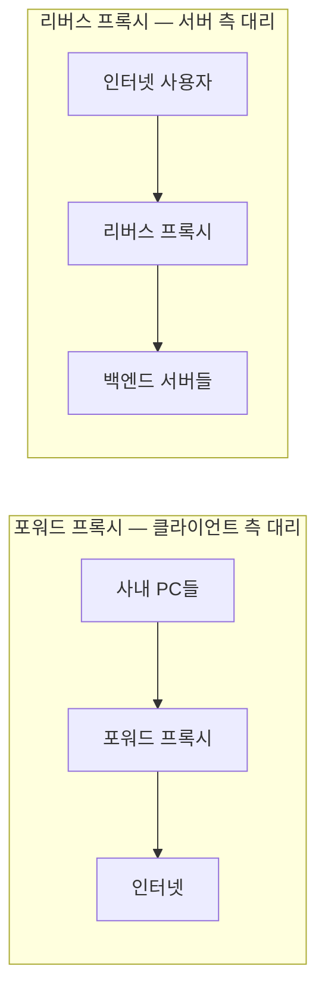

## "서버는 서울에 한 대인데, 사용자는 상파울루에 있다"

[첫 글]()에서 봤듯 전파 지연은 거리에 비례합니다 — 서울↔상파울루는 광속 한계상 편도만 ~90 ms. 회선을 아무리 넓혀도 줄지 않습니다. 답은 하나뿐입니다. **콘텐츠를 사용자 가까이로 옮긴다.** 그게 CDN이고, 그 앞에 깔리는 일반 기술이 프록시입니다.

프록시는 방향에 따라 완전히 다른 일을 합니다. 그리고 CDN은 "전 세계에 깔린 거대한 리버스 프록시 + 캐시"입니다. 이 글은 **포워드 vs 리버스 프록시**의 본질, **캐시가 신선도를 지키는 규칙**, 그리고 **Anycast로 가장 가까운 엣지를 찾는 마법**까지 내려갑니다. AWS CloudFront가 정확히 이 위에 있습니다.

## 포워드 vs 리버스: 누구를 대리하나



| | 포워드 프록시 | 리버스 프록시 |
|---|---|---|
| 대리 대상 | **클라이언트** | **서버** |
| 누가 존재를 아나 | 클라가 의식하고 설정 | 클라는 모름(서버인 줄) |
| 용도 | 사내 아웃바운드 통제·캐시·익명화 | TLS 종료·캐시·LB·WAF·압축 |
| 대표 | 기업 프록시, VPN 게이트웨이 | Nginx, Envoy, **CDN**, ALB |

아래는 **리버스 프록시**가 인터넷을 향한 단일 진입점이 되어, TLS를 종료하고 경로별로 여러 백엔드 앞에 서는 모습입니다. 백엔드는 바깥에 직접 노출되지 않습니다.

<div class="cdn-rp" markdown="0">
<style>
.cdn-rp{margin:1.4rem 0;overflow-x:auto}
.cdn-rp svg{width:100%;max-width:680px;height:auto;display:block;margin:0 auto;font-family:inherit}
.cdn-rp .bx{fill:none;stroke:currentColor;stroke-width:1.6;opacity:.55}
.cdn-rp .lbl{fill:currentColor;font-size:11.5px;font-weight:600}
.cdn-rp .sub{fill:currentColor;font-size:9.5px;opacity:.6}
.cdn-rp .wire{stroke:currentColor;opacity:.22;stroke-width:1.4}
.cdn-rp .r{fill:#1971c2}
.cdn-rp .r1{animation:cdnr1 4s linear infinite}
.cdn-rp .r2{animation:cdnr2 4s linear infinite 1.3s}
.cdn-rp .r3{animation:cdnr3 4s linear infinite 2.6s}
@keyframes cdnr1{0%{transform:translate(0,0);opacity:0}10%{opacity:1}45%{transform:translate(240px,0);opacity:1}90%{transform:translate(450px,-50px);opacity:1}100%{opacity:0}}
@keyframes cdnr2{0%{transform:translate(0,0);opacity:0}10%{opacity:1}45%{transform:translate(240px,0);opacity:1}90%{transform:translate(450px,0);opacity:1}100%{opacity:0}}
@keyframes cdnr3{0%{transform:translate(0,0);opacity:0}10%{opacity:1}45%{transform:translate(240px,0);opacity:1}90%{transform:translate(450px,50px);opacity:1}100%{opacity:0}}
</style>
<svg viewBox="0 0 680 200" role="img" aria-label="리버스 프록시가 단일 진입점에서 TLS를 종료하고 경로별로 세 백엔드 앞에 서는 애니메이션">
  <text class="lbl" x="40" y="100" text-anchor="middle">사용자</text>
  <rect class="bx" x="240" y="72" width="100" height="56" rx="8"/>
  <text class="lbl" x="290" y="94" text-anchor="middle">리버스 프록시</text>
  <text class="sub" x="290" y="110" text-anchor="middle">TLS 종료·라우팅</text>
  <rect class="bx" x="540" y="28" width="120" height="38" rx="8"/>
  <text class="lbl" x="600" y="52" text-anchor="middle">/api</text>
  <rect class="bx" x="540" y="82" width="120" height="38" rx="8"/>
  <text class="lbl" x="600" y="106" text-anchor="middle">/app</text>
  <rect class="bx" x="540" y="136" width="120" height="38" rx="8"/>
  <text class="lbl" x="600" y="160" text-anchor="middle">/static</text>
  <line class="wire" x1="340" y1="100" x2="540" y2="47"/>
  <line class="wire" x1="340" y1="100" x2="540" y2="101"/>
  <line class="wire" x1="340" y1="100" x2="540" y2="155"/>
  <rect class="r r1" x="58" y="93" width="14" height="14" rx="2"/>
  <rect class="r r2" x="58" y="93" width="14" height="14" rx="2"/>
  <rect class="r r3" x="58" y="93" width="14" height="14" rx="2"/>
</svg>
</div>

## 캐시: 무엇을, 얼마나 오래, 어떻게 검증하나

CDN의 힘은 **캐시**에서 나옵니다. HTTP 캐시는 세 가지 질문에 답합니다.

| 헤더 | 역할 |
|------|------|
| `Cache-Control: max-age=3600, public` | **얼마나 신선한가**(초). public이면 공유 캐시(CDN) 저장 가능 |
| `ETag: "v3-abc"` / `If-None-Match` | **바뀌었나** — 같으면 `304 Not Modified`(본문 0바이트) |
| `Last-Modified` / `If-Modified-Since` | 시간 기반 검증(ETag 보조) |
| `stale-while-revalidate=60` | 만료돼도 **일단 옛 것 주고 뒤에서 갱신**(체감 0 지연) |
| `s-maxage` | 공유 캐시(CDN) 전용 수명(브라우저와 분리) |

> **신선도와 정확성의 줄타기.** `max-age`가 길면 빠르지만 갱신이 늦고, 짧으면 신선하지만 origin 부하가 큽니다. 정답은 콘텐츠별 분리입니다 — 해시가 박힌 정적 자원(`app.3f9c.js`)은 **`max-age=31536000, immutable`**(1년, 영구), HTML은 짧게+검증(`no-cache` = 매번 ETag 검증). 파일명에 해시를 박으면 "영구 캐시 + 배포 시 새 URL"로 무효화 문제 자체가 사라집니다.

## Anycast: 같은 IP, 가장 가까운 곳으로

CDN의 진짜 마법은 **Anycast**입니다. 전 세계 수백 PoP(엣지)가 **같은 IP**를 [BGP]()로 광고하면, 라우팅이 **각 사용자를 네트워크상 가장 가까운 PoP로** 자동으로 보냅니다. 사용자는 한 IP에 접속할 뿐인데, 도쿄 사용자는 도쿄 엣지에, 상파울루 사용자는 상파울루 엣지에 닿습니다.

아래는 사용자가 가까운 엣지에 닿아 **캐시 히트면 즉시 응답**, 미스면 origin까지 갔다 와 채우는 흐름입니다. 첫 사용자(미스)는 멀리 가지만, 이후 사용자(히트)는 코앞에서 받습니다.

<div class="cdn-edge" markdown="0">
<style>
.cdn-edge{margin:1.4rem 0;overflow-x:auto}
.cdn-edge svg{width:100%;max-width:700px;height:auto;display:block;margin:0 auto;font-family:inherit}
.cdn-edge .bx{fill:none;stroke:currentColor;stroke-width:1.6;opacity:.55}
.cdn-edge .lbl{fill:currentColor;font-size:11px;font-weight:600}
.cdn-edge .sub{fill:currentColor;font-size:9px;opacity:.6}
.cdn-edge .wire{stroke:currentColor;opacity:.2;stroke-width:1.4;fill:none}
.cdn-edge .miss{fill:#f08c00;animation:cdnmiss 5.5s ease-in-out infinite}
.cdn-edge .hit{fill:#2f9e44;opacity:0;animation:cdnhit 5.5s ease-in-out infinite}
.cdn-edge .fill{fill:#1971c2;opacity:0;animation:cdnfill 5.5s ease-in-out infinite}
@keyframes cdnmiss{0%{transform:translate(0,0);opacity:0}4%{opacity:1}18%{transform:translate(170px,0);opacity:1}22%{opacity:0}100%{opacity:0}}
@keyframes cdnfill{0%{opacity:0}22%{opacity:0;transform:translate(170px,0)}26%{opacity:1}45%{transform:translate(480px,0);opacity:1}55%{transform:translate(170px,0);opacity:1}60%{opacity:0}100%{opacity:0}}
@keyframes cdnhit{0%{opacity:0}66%{opacity:0;transform:translate(0,60px)}70%{opacity:1}84%{transform:translate(170px,60px);opacity:1}90%{transform:translate(0,60px);opacity:1}100%{opacity:0}}
</style>
<svg viewBox="0 0 700 200" role="img" aria-label="첫 사용자는 캐시 미스로 origin까지 가서 엣지를 채우고, 이후 사용자는 가까운 엣지에서 캐시 히트로 즉시 응답받는 애니메이션">
  <rect class="bx" x="20"  y="40" width="100" height="44" rx="8"/>
  <text class="lbl" x="70" y="58" text-anchor="middle">사용자①</text>
  <text class="sub" x="70" y="72" text-anchor="middle">미스</text>
  <rect class="bx" x="20"  y="116" width="100" height="44" rx="8"/>
  <text class="lbl" x="70" y="134" text-anchor="middle">사용자②</text>
  <text class="sub" x="70" y="148" text-anchor="middle" style="fill:#2f9e44">히트</text>
  <rect class="bx" x="270" y="78" width="120" height="44" rx="8"/>
  <text class="lbl" x="330" y="98" text-anchor="middle">가까운 엣지(PoP)</text>
  <text class="sub" x="330" y="113" text-anchor="middle">Anycast로 도달</text>
  <rect class="bx" x="560" y="78" width="120" height="44" rx="8"/>
  <text class="lbl" x="620" y="98" text-anchor="middle">Origin</text>
  <text class="sub" x="620" y="113" text-anchor="middle">서울(멀다)</text>
  <line class="wire" x1="120" y1="62"  x2="270" y2="96"/>
  <line class="wire" x1="120" y1="138" x2="270" y2="104"/>
  <line class="wire" x1="390" y1="100" x2="560" y2="100"/>
  <rect class="miss" x="128" y="55" width="13" height="13" rx="2"/>
  <rect class="fill" x="128" y="55" width="13" height="13" rx="2"/>
  <rect class="hit"  x="128" y="55" width="13" height="13" rx="2"/>
</svg>
</div>

> **추가 최적화 — origin shielding**: 모든 엣지가 미스 때 origin을 직접 때리면 origin이 폭격당합니다(특히 새 콘텐츠·캐시 만료 동시 발생 = *cache stampede*). 그래서 엣지들 사이에 **상위 캐시 계층(shield PoP)** 을 둬 origin으로 가는 요청을 한 곳으로 모읍니다.

## 디버깅: 캐시가 정말 맞았나

```bash
# 응답 헤더로 캐시 적중·수명 확인
curl -sI https://cdn.example.com/app.3f9c.js
#  HTTP/2 200
#  cache-control: public, max-age=31536000, immutable
#  x-cache: Hit from cloudfront        ← Hit / Miss / RefreshHit
#  age: 842                            ← 캐시에 머문 초

# 어느 엣지로 갔는지(Anycast 도달 지점) — DNS/지연으로 추정
dig +short example.com
```

> **프로덕션 함정 모음.** ① **쿠키가 캐시를 무력화**: 응답에 `Set-Cookie`가 붙거나 캐시 키에 쿠키가 포함되면 적중률이 0에 수렴 → 정적 경로는 쿠키 제거. ② **캐시 키 누락**: `Vary: Accept-Encoding`을 안 주면 gzip/br이 섞여 깨진 응답이 캐시됨. ③ **무효화 지연**: 퍼지(invalidation)는 전 세계 PoP 전파에 시간이 걸림 → 급한 갱신은 퍼지보다 **버전 URL**이 확실.

## AWS로 매핑 / 시리즈 연결

- **CloudFront** = 글로벌 엣지(PoP) + 캐시 + Anycast. origin은 S3·ALB·임의 HTTP.
- 동작 단위 = *behavior*(경로 패턴별 캐시 정책·TTL·쿠키/헤더 전달 규칙).
- 엣지에서 코드 실행 = *CloudFront Functions / Lambda@Edge*(요청 가까이서 변형).

가장 가까운 엣지를 IP로 안내하는 [DNS](), 같은 IP를 여러 곳이 광고하는 토대인 [라우팅/BGP](), 엣지가 종료하는 [TLS](), origin 앞단의 [로드 밸런싱]()과 한 묶음입니다.

## 면접/리뷰 단골 질문

- **Q. 포워드와 리버스 프록시 차이?** → 포워드는 **클라이언트**를 대리(사내 아웃바운드), 리버스는 **서버**를 대리(TLS 종료·캐시·LB). 클라는 리버스 프록시를 서버로 안다.
- **Q. CDN이 어떻게 사용자를 가장 가까운 엣지로 보내나?** → **Anycast** — 여러 PoP가 같은 IP를 BGP로 광고하면 라우팅이 최단 경로 PoP로 보낸다(또는 DNS 기반 지리 라우팅 병행).
- **Q. 캐시 무효화를 안전하게?** → 정적 자원은 **파일명에 해시**(영구 캐시 + 새 URL), 급할 땐 퍼지보다 버전 URL. HTML은 `no-cache`로 매번 ETag 검증.
- **Q. CDN 적중률이 낮다, 원인은?** → 쿠키/`Set-Cookie`, 캐시 키 과다(쿼리스트링·헤더), `Vary` 오설정. 헤더로 `x-cache`·`age` 확인.

## 정리

- **포워드(클라 대리)** vs **리버스(서버 대리)** — CDN은 전 세계에 펼친 거대 리버스 프록시 + 캐시.
- 캐시는 `Cache-Control`(수명) + `ETag`(검증) + `stale-while-revalidate`로 신선도와 속도를 줄타기. 정적은 **해시 파일명 + immutable**.
- **Anycast**가 같은 IP로 사용자를 가장 가까운 PoP에 자동 연결 — 거리=지연 문제의 정공법.
- 함정은 대부분 **캐시 키**(쿠키·Vary)와 **무효화 전파 지연**. 헤더(`x-cache`·`age`)로 검증하라.

> 다음 글: 엣지·LB·서버를 드나드는 트래픽을 규칙으로 거르는 [방화벽·보안그룹·네트워크 ACL]()로 이어집니다.
