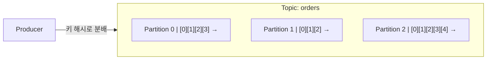
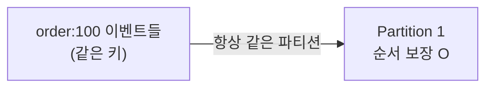

## 서비스가 커지면 "메시지"가 필요해진다

모놀리식에서 모든 걸 동기 호출로 처리하다 보면, 주문 하나에 결제·재고·알림·정산이 줄줄이 매달려 느려지고, 하나가 죽으면 전체가 흔들립니다. 이때 **"이벤트를 발행하고 각자 알아서 처리"** 하는 비동기 구조가 필요해지는데, 그 중심에 **Apache Kafka**가 있습니다.

Kafka는 단순 메시지 큐를 넘어선 **분산 이벤트 스트리밍 플랫폼**입니다. 핵심 개념 세 가지만 잡으면 됩니다: **토픽, 파티션, 오프셋**.

## 토픽과 파티션

- **토픽(Topic)**: 메시지(이벤트)가 쌓이는 카테고리. 예: `orders`, `payments`.
- **파티션(Partition)**: 토픽을 나눈 **append-only 로그**. 메시지는 끝에 계속 추가됩니다.
- **오프셋(Offset)**: 파티션 안에서 각 메시지의 **순번**. 0부터 1씩 증가.

메시지는 **삭제되지 않고 로그에 쌓입니다**(보존 기간/크기 정책에 따라 만료). 그래서 여러 소비자가 같은 데이터를 각자 다른 속도로 읽을 수 있습니다 — 큐와 가장 다른 점이죠.

## 왜 파티션으로 나누나

1. **병렬 처리**: 파티션이 여러 개면 여러 소비자가 동시에 나눠 읽어 처리량이 올라갑니다.
2. **확장성**: 파티션을 브로커(서버)들에 분산해 수평 확장.

## 순서 보장의 범위

아주 중요한 포인트: Kafka는 **파티션 내부에서만 순서를 보장**합니다. 토픽 전체의 전역 순서는 보장하지 않습니다.

그래서 "같은 주문에 대한 이벤트는 순서대로 처리돼야 한다"면, **같은 키(예: orderId)** 로 보내야 합니다. 같은 키는 항상 같은 파티션으로 가서 순서가 지켜집니다.

## 복제(Replication)로 안정성

각 파티션은 여러 브로커에 **복제**됩니다. 하나는 리더(leader), 나머지는 팔로워(follower). 리더 브로커가 죽으면 동기화된 팔로워(ISR) 중 하나가 리더로 승격돼 데이터 유실 없이 이어집니다.

## 구성 요소 정리

- **Producer**: 메시지를 토픽에 발행
- **Broker**: Kafka 서버(파티션 저장)
- **Consumer**: 메시지를 구독해 처리
- **Topic / Partition / Offset**: 위에서 설명

## 정리

- Kafka = **분산 이벤트 스트리밍 플랫폼**. 메시지는 로그에 쌓이고 지워지지 않는다(보존 정책까지).
- **토픽 → 파티션(append-only 로그) → 오프셋(순번)** 구조.
- 파티션으로 **병렬·확장**, 순서는 **파티션 내부에서만** 보장 → 순서 필요하면 **같은 키**로.
- 다음 글에서 Producer/Consumer와 컨슈머 그룹을 다룹니다.
