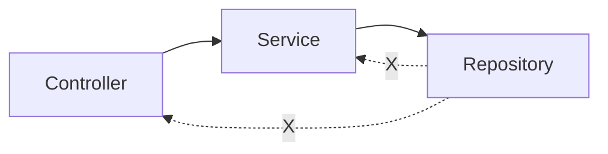

그 주엔 테스트 코드에 흩어진 하드코딩 값을 걷어내는 작업을 했다. 작업 자체는 단순했지만 한 가지 의문이 남았다. "리포지토리가 컨트롤러를 참조하는" 식의 역방향 의존이 왜 코드 리뷰에서만 걸러지고 빌드에서는 통과하는가. 컨벤션은 위키 문서에 적혀 있을 뿐 실행되지 않는다. 사람이 읽고 지키는 규칙은 결국 깨진다. 그래서 **아키텍처 규칙을 테스트로 박제**하는 ArchUnit을 도입했다.

## 컴파일러가 막아주지 못하는 의존

레이어드 아키텍처의 핵심은 의존 방향이다.



문제는 자바 컴파일러가 이 방향을 강제하지 못한다는 점이다. `repository` 패키지에서 `controller` 패키지의 클래스를 import해도 컴파일은 깔끔하게 통과한다. 패키지는 그저 네임스페이스일 뿐, 의존 방향에 대한 의미를 갖지 않는다. 모듈을 물리적으로 쪼개면(멀티 모듈) 막을 수 있지만, 단일 모듈 모놀리식에서는 그런 물리적 경계가 없다.

ArchUnit은 이 빈틈을 메운다. 바이트코드를 읽어 클래스 간 import 그래프를 만들고, 그 그래프에 대한 규칙을 **JUnit 테스트로** 검증한다. 규칙 위반은 테스트 실패가 되고, CI 게이트에서 머지를 막는다. 규칙이 "문서"가 아니라 "실행되는 코드"가 되는 것이다.

## 규칙을 코드로 쓴다

가장 기본은 계층 의존 방향이다. ArchUnit은 `layeredArchitecture()`로 이를 선언적으로 표현한다.

```java
@AnalyzeClasses(packages = "com.example.shop")
class LayerDependencyTest {

    @ArchTest
    static final ArchRule 계층_의존_방향 = layeredArchitecture()
        .consideringOnlyDependenciesInLayers()
        .layer("Controller").definedBy("..controller..")
        .layer("Service").definedBy("..service..")
        .layer("Repository").definedBy("..repository..")
        // 컨트롤러는 누구도 접근 못 함(최상단)
        .whereLayer("Controller").mayNotBeAccessedByAnyLayer()
        // 서비스는 컨트롤러만 접근 가능
        .whereLayer("Service").mayOnlyBeAccessedByLayers("Controller")
        // 리포지토리는 서비스만 접근 가능
        .whereLayer("Repository").mayOnlyBeAccessedByLayers("Service");
}
```

이 규칙 하나로 "리포지토리가 서비스를 참조"하는 역방향 의존, "컨트롤러가 리포지토리를 직접 호출"하는 우회 의존이 모두 테스트 실패로 잡힌다.

여기서 멈추지 않는다. 네이밍과 애너테이션도 규칙화한다.

```java
@ArchTest
static final ArchRule 서비스_네이밍 = classes()
    .that().resideInAPackage("..service..")
    .should().haveSimpleNameEndingWith("Service")
    .andShould().beAnnotatedWith(Service.class);

@ArchTest
static final ArchRule 컨트롤러는_엔티티를_반환하지_않는다 = noMethods()
    .that().areDeclaredInClassesThat().resideInAPackage("..controller..")
    .should().haveRawReturnType(resideInAPackage("..domain.entity.."));

// 순환 참조 금지 — 가장 강력한 안전망
@ArchTest
static final ArchRule 패키지_순환금지 = slices()
    .matching("com.example.shop.(*)..")
    .should().beFreeOfCycles();
```

마지막 `beFreeOfCycles()`는 슬라이스(패키지 단위) 간 순환 의존을 통째로 금지한다. 순환은 한번 생기면 풀기 어렵고 테스트·재사용을 망가뜨리는데, ArchUnit은 이를 그래프 탐색으로 즉시 검출한다.

## 운영 함정

**첫째, 도입 시점의 기존 위반 폭발.** 레거시에 처음 적용하면 수십 개의 위반이 한꺼번에 터진다. 전부 고치고 도입하려면 영원히 못 한다. ArchUnit은 `FreezingArchRule`을 제공한다. 기존 위반은 "동결"해 통과시키되, **새로운 위반만 실패**시킨다. 신규 위반을 막으면서 점진적으로 동결 목록을 줄여가는 전략이 현실적이다.

```java
@ArchTest
static final ArchRule 동결_규칙 = freeze(계층_의존_방향);
```

**둘째, 테스트 클래스 미포함.** `@AnalyzeClasses`의 기본은 테스트 클래스까지 스캔한다. 테스트 픽스처가 규칙을 위반하면 엉뚱하게 실패한다. `importOptions = ImportOption.DoNotIncludeTests.class`로 프로덕션 코드만 검사 대상으로 좁혀야 노이즈가 줄어든다.

## 핵심 요약

- 패키지는 의존 방향을 강제하지 못한다. ArchUnit은 바이트코드 import 그래프를 테스트로 검증해 그 빈틈을 메운다.
- 계층 방향·네이밍·애너테이션·순환 금지를 모두 `ArchRule`로 선언하면, 컨벤션이 CI 게이트에서 실행되는 코드가 된다.
- 레거시 도입은 `freeze`로 기존 위반을 동결하고 신규 위반만 막는 점진 전략을 쓴다.

**면접 한 줄 Q&A** — "레이어 의존 방향을 어떻게 강제하나?" → "멀티 모듈로 물리 분리하거나, 단일 모듈이면 ArchUnit으로 의존 그래프를 테스트해 CI에서 위반을 막는다."
