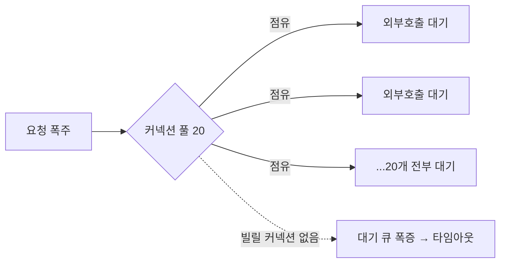

DB 저장과 외부 시스템 연동이 한 흐름에 섞인 작업을 한 적이 있다. 주문을 저장하면서 외부 결제·알림 API를 호출하는 식이다. 무심코 이 둘을 같은 `@Transactional` 메서드 안에 넣으면, 부하가 올라갈 때 시스템 전체가 멈춘다. 핵심은 "트랜잭션이 점유한 DB 커넥션을 느린 외부 호출에 묶어 두지 않는 것"이다.

## 트랜잭션은 시작과 동시에 커넥션을 잡는다

스프링에서 `@Transactional` 메서드가 시작되면 풀에서 DB 커넥션 하나를 빌려 와 **메서드가 끝날 때까지 붙들고 있는다.** 트랜잭션의 본질이 "이 작업이 끝날 때 함께 커밋/롤백한다"이므로, 같은 커넥션을 메서드 전체 동안 유지해야 하기 때문이다.

여기에 외부 HTTP 호출을 끼워 넣으면 어떤 일이 벌어지는가?

```java
// 안티패턴: 트랜잭션 안에서 외부 호출
@Transactional
public void placeOrder(OrderRequest req) {
    Order order = orderRepository.save(req.toEntity());   // DB 커넥션 점유 시작
    paymentClient.charge(order.getId(), req.amount());     // 네트워크 대기 (수백ms~수초)
    notificationClient.send(order.getUserId());            // 또 대기
    order.markPaid();                                      // 여기까지 커넥션 계속 점유
}
```

DB 작업 자체는 수 밀리초면 끝난다. 그러나 외부 호출은 수백 밀리초에서 수 초, 상대가 느려지면 타임아웃까지 멈춰 있다. **그 시간 내내 DB 커넥션은 아무 일도 안 하면서 점유된다.**

## 왜 시스템 전체가 멈추는가

커넥션 풀은 크기가 유한하다(예: 20개). 동시 요청 50개가 각각 트랜잭션 안에서 2초짜리 외부 호출을 기다린다고 하자. 커넥션 20개는 전부 "외부 응답 대기" 상태로 묶이고, 나머지 30개 요청은 커넥션을 못 빌려 대기 큐에 쌓인다. 외부 시스템 하나가 느려진 것뿐인데 **내 DB 커넥션이 고갈되고 무관한 모든 요청이 줄줄이 막힌다.** 장애가 전파된다.



## 해법 — 외부 호출을 경계 밖으로

원칙은 단순하다. **트랜잭션은 짧게, DB 작업만. 외부 호출은 트랜잭션 밖에서.**

```java
// DB 작업만 트랜잭션으로 짧게
@Transactional
public Order createOrder(OrderRequest req) {
    return orderRepository.save(req.toEntity());   // 커밋 후 즉시 커넥션 반납
}

// 외부 호출은 트랜잭션이 끝난 뒤
public void placeOrder(OrderRequest req) {
    Order order = orderService.createOrder(req);    // 트랜잭션 1: 저장 (짧음)
    paymentClient.charge(order.getId(), req.amount());  // 커넥션 안 잡힌 상태에서 대기
    orderService.markPaid(order.getId());           // 트랜잭션 2: 상태 갱신 (짧음)
}
```

쪼개면 "저장은 됐는데 결제 실패" 같은 중간 상태가 생긴다. 이건 트랜잭션으로 묶어 가릴 문제가 아니라 **명시적으로 설계할 문제**다. 결제 전이라면 PENDING 상태로 두고, 실패 시 보상 처리(취소·재시도)를 한다. 결과를 확실히 반영해야 하면 외부 호출 의도를 DB에 먼저 기록하고 별도 워커가 재시도하는 **아웃박스(outbox) 패턴**을 쓴다.

커밋 직후에만 외부 호출을 하고 싶다면 트랜잭션 동기화 콜백을 쓴다.

```java
TransactionSynchronizationManager.registerSynchronization(
    new TransactionSynchronization() {
        @Override public void afterCommit() {
            notificationClient.send(order.getUserId());  // 커밋 확정 후 발사
        }
    });
```

## 운영 함정

**함정 1 — 타임아웃 미설정.** 외부 클라이언트에 connect/read 타임아웃을 안 걸면, 상대가 응답을 영영 안 줄 때 호출 스레드가 무한 대기한다. 트랜잭션 밖이라도 스레드 풀이 고갈된다. 외부 호출에는 항상 타임아웃을 건다.

**함정 2 — afterCommit 호출의 실패.** 커밋 후 콜백에서 던진 예외는 이미 커밋된 트랜잭션을 롤백하지 못한다. 이 경로의 실패는 별도 재시도·로그로 다뤄야 한다.

## 면접 한 줄 Q&A

- **Q. 왜 트랜잭션 안에서 외부 API를 부르면 안 되나?** A. 트랜잭션이 DB 커넥션을 메서드 끝까지 점유하는데, 느린 외부 호출이 그 커넥션을 네트워크 대기에 묶어 풀을 고갈시키고 장애를 전파한다.
- **Q. 그럼 저장과 외부 호출의 정합성은?** A. 트랜잭션으로 묶지 말고 PENDING 상태·보상 처리·아웃박스로 명시 설계한다.
