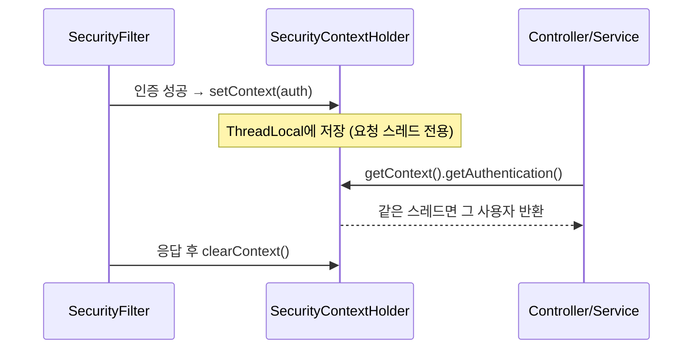

그 주엔 "현재 로그인한 사용자"를 여기저기서 필요로 하는 기능을 다뤘다. 컨트롤러가 받은 사용자 ID를 서비스로, 서비스가 다시 하위 서비스로 인자로 넘기는 코드가 줄줄이 이어졌다. 메서드 시그니처마다 `Long userId`가 따라다녔다. 이건 본질적으로 횡단 관심사인데 핵심 도메인 로직에 매개변수로 침투해 있었다. 해법은 **인증 주체를 SecurityContext에서 일관되게 조회**하는 것이다.

## SecurityContext는 어떻게 "현재"를 안다고 하는가

스프링 시큐리티는 인증 정보를 `SecurityContext`에 담고, 이를 `SecurityContextHolder`로 노출한다. 핵심은 기본 보관 전략이 **ThreadLocal**이라는 점이다.



서블릿 컨테이너는 요청 하나를 스레드 하나가 처리한다. 필터 체인에서 인증이 성공하면 `Authentication` 객체를 그 스레드의 ThreadLocal에 심는다. 이후 같은 스레드에서 실행되는 컨트롤러·서비스 어디서든 `SecurityContextHolder.getContext()`를 호출하면 그 사용자를 꺼낼 수 있다. 파라미터로 나를 필요가 없는 이유가 여기 있다. **요청 스레드 = 사용자 컨텍스트**이기 때문이다. 응답이 끝나면 필터가 컨텍스트를 비워 스레드 풀에 반납될 때 다음 요청에 누수되지 않게 한다.

## 조회 유틸을 한 곳에 모은다

`SecurityContextHolder`를 코드 전역에서 직접 호출하면 의존이 흩어진다. 조회 로직을 유틸 하나로 캡슐화한다.

```java
public final class CurrentUser {

    private CurrentUser() {}

    public static Optional<UserPrincipal> get() {
        Authentication auth = SecurityContextHolder.getContext().getAuthentication();
        if (auth == null || !auth.isAuthenticated()
                || auth instanceof AnonymousAuthenticationToken) {
            return Optional.empty();
        }
        Object principal = auth.getPrincipal();
        return (principal instanceof UserPrincipal p) ? Optional.of(p) : Optional.empty();
    }

    public static UserPrincipal require() {
        return get().orElseThrow(() ->
            new AuthenticationCredentialsNotFoundException("인증 정보 없음"));
    }

    public static boolean hasRole(String role) {
        return get().map(p -> p.getAuthorities().stream()
                .anyMatch(a -> a.getAuthority().equals("ROLE_" + role)))
            .orElse(false);
    }
}
```

권한 부가정보(사용자 타입, 소속 등)는 `UserPrincipal` 같은 커스텀 principal 객체에 담아 둔다. 매번 DB를 조회하지 않도록 인증 시점에 한 번 채워 넣는 것이 핵심이다. 컨트롤러에서는 `@AuthenticationPrincipal`로 주입받고, 서비스 깊은 곳에서는 `CurrentUser.require()`로 꺼낸다.

## 운영 함정 — 스레드가 바뀌면 컨텍스트가 끊긴다

ThreadLocal 기반의 최대 함정은 **다른 스레드로 작업이 넘어가는 순간 컨텍스트가 사라진다**는 점이다. `@Async`, 스레드 풀에 던지는 `CompletableFuture`, 병렬 스트림 안에서는 `SecurityContextHolder.getContext()`가 비어 있거나 엉뚱한 요청의 컨텍스트를 본다. 후자가 더 위험하다 — 풀에서 재사용된 스레드에 이전 요청의 컨텍스트가 남아 있으면 **다른 사용자로 행세**하게 된다.

대응은 컨텍스트를 명시적으로 전파하는 것이다.

```java
// 전략을 InheritableThreadLocal로? (위험: 풀 스레드엔 부적합)
// 권장: 작업 단위로 명시 전파
SecurityContext ctx = SecurityContextHolder.getContext();
executor.submit(() -> {
    SecurityContextHolder.setContext(ctx);
    try {
        doWork();              // 여기선 현재 사용자 보임
    } finally {
        SecurityContextHolder.clearContext();   // 반드시 정리
    }
});
```

스프링 시큐리티는 이 패턴을 감싼 `DelegatingSecurityContextExecutor`와 `DelegatingSecurityContextRunnable`을 제공한다. 비동기 경계에서는 직접 ThreadLocal을 만지지 말고 이 데코레이터로 풀을 감싸는 편이 안전하다. `finally`에서의 `clearContext()`를 빠뜨리면 풀 스레드에 컨텍스트가 잔류해 누수된다.

## 핵심 요약

- 인증 주체는 파라미터로 나르지 말고 SecurityContext에서 조회한다. 보관 전략은 요청 스레드 전용 ThreadLocal이다.
- 조회는 유틸 하나로 캡슐화하고, 권한 부가정보는 인증 시점에 커스텀 principal에 담아 DB 재조회를 피한다.
- 비동기·스레드 풀 경계에서는 컨텍스트가 끊기거나 누수된다. `DelegatingSecurityContext*` 데코레이터로 명시 전파하고 끝나면 반드시 비운다.

**면접 한 줄 Q&A** — "비동기 작업에서 현재 사용자가 null이 되는 이유는?" → "SecurityContext는 ThreadLocal에 저장되는데 작업이 다른 스레드로 넘어가면 그 스레드엔 컨텍스트가 없기 때문이다. 명시 전파가 필요하다."
